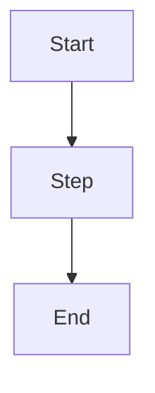

Create a new documentation page for the "R to the Cloud" MkDocs guide.

## Step 1 — Gather requirements

Ask the user for:
1. **Page title** — what it's called (e.g. "Setting Up renv")
2. **Nav section** — which section it belongs to (e.g. "Docker & Environments")
3. **One-sentence summary** — what the page covers (used for the opening paragraph)
4. **Filename slug** — e.g. `renv-setup` (becomes `docs/renv-setup.md`)

If the user provides all four upfront, skip asking and proceed directly.

## Step 2 — Create the page

Create `docs/<slug>.md` with this structure:

```markdown
# <Title>

<One-sentence plain-English overview of what this page covers and why it matters
to analysts moving from shared drives to the cloud. No jargon without explanation.>

## Overview

<2-3 paragraphs introducing the concept. Write for someone who has never heard
of this technology. Define every term on first use.>

!!! tip "Key takeaway"
    <One sentence summarising the main point in plain English.>

## <Main section heading>

<Content>



## <Second section if needed>

<Content>

!!! warning "Common mistake"
    <Describe a specific pitfall and how to avoid it.>

## Next steps

Move on to [<next page title>](<next-page-slug>.md) to <one-sentence description>.
```

**Style rules to follow:**
- Use `!!! tip`, `!!! warning`, `!!! important`, `!!! note` for callouts — never raw bold text
- Mermaid diagrams: `flowchart TD` or `flowchart LR` only (not `graph`), node labels use `<br/>` not `\n`
- No assumed DevOps knowledge — every term defined on first use
- Short sentences, active voice, plain English
- Do NOT include YAML frontmatter

## Step 3 — Add to mkdocs.yml nav

Open `mkdocs.yml` and insert the new page under the correct nav section:

```yaml
- "<Page Title>": <slug>.md
```

Match the exact indentation pattern of nearby entries.

## Step 4 — Validate

Run `mkdocs build --strict --quiet` from the project root. Fix any errors before
declaring the page complete. Common issues:
- Nav entry doesn't match the filename exactly
- Mermaid fence missing closing ` ``` `
- Admonition missing a blank line before content
