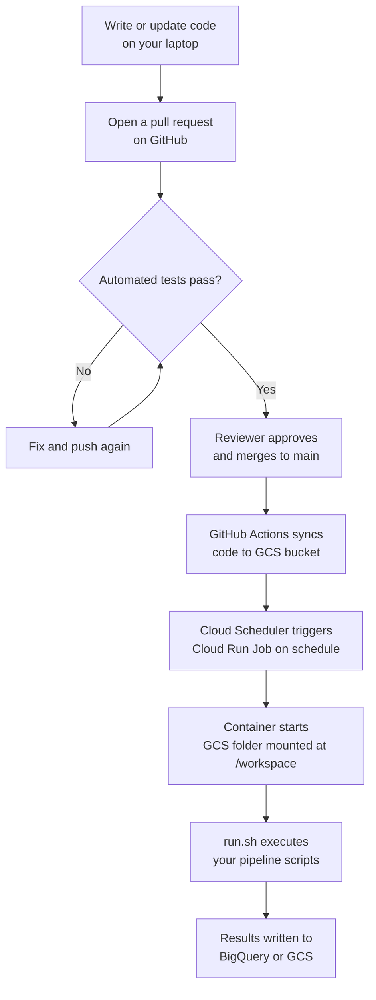
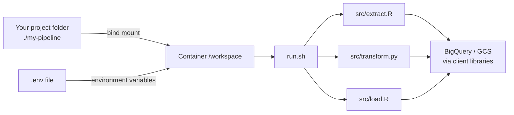
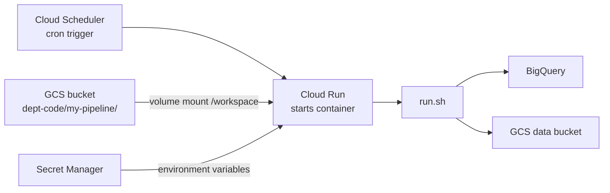

# How the Pipeline Infrastructure Works

This document explains the deployment architecture for analysts and data scientists
who are new to containers and cloud infrastructure. No prior cloud experience is assumed.

---

## The problem this solves

Data pipelines written on one machine often fail on another. A script that runs
perfectly on your laptop can fail in production because:

- The Python or R version is different
- A system library is missing
- The file paths are different
- A package version has changed

Containers solve this by packaging the entire environment — language runtimes,
system libraries, and packages — into a single, reproducible unit. The code runs
inside that environment regardless of what machine it lands on.

---

## What a container actually is

Think of a container like a standardised shipping container. The contents are
packed in a controlled way at origin and arrive exactly as packed, regardless of
what ship, lorry, or warehouse handles them along the way.

In software terms:

- The **image** is the blueprint — it describes what goes in the container
  (Ubuntu, Python 3.12, R 4.5, your packages)
- The **container** is a running instance of that image
- The **Dockerfile** is the recipe that builds the image

Your code does **not** live inside the image. The image contains only the tools
(runtimes and packages). Your code is mounted in separately at runtime — locally
as a folder from your machine, and in the cloud from a GCS bucket.

---

## The two base images

This repo provides two images:

| Image | Cloud Run type | Use for |
|---|---|---|
| `gcp-etl` | Job (runs and stops) | ETL pipelines, analysis scripts, reports |
| `gcp-app` | Service (always running) | Dash or Shiny dashboards |

Both images contain Python 3.12 and R 4.5 with the packages listed in this repo.
You do not rebuild these images when you change your pipeline code. They only
change when you need a new package or a runtime upgrade.

---

## The /workspace convention

All pipeline code runs from a directory called `/workspace` inside the container.

- **Locally**, your project folder is bind-mounted to `/workspace`
- **In Cloud Run**, a GCS bucket subfolder is mounted to `/workspace`

Your `run.sh` and all scripts reference `/workspace/src/...`. They never know
or care how the code got there. This is what makes local and cloud execution
identical.

```
Local machine                    Cloud Run Job
─────────────────────────────    ─────────────────────────────────────
/home/you/my-pipeline/      →    gs://dept-code/my-pipeline/
        │                                    │
        └──── mounted at /workspace ─────────┘
                    │
              run.sh executes
              /workspace/src/extract.R
              /workspace/src/transform.py
              /workspace/src/load.R
```

---

## How credentials work

Your pipeline code talks to BigQuery and GCS using client libraries
(`bigrquery`, `google-cloud-storage`). These libraries use
**Application Default Credentials (ADC)** — they automatically find and use
the right credentials based on the environment:

| Where code runs | Credentials source |
|---|---|
| Your laptop | `gcloud auth application-default login` (run once) |
| Cloud Run | Service account attached to the Cloud Run Job |

**You never write credentials into your code.** The libraries handle it.

Environment-specific values (project IDs, bucket names, dataset names) are
passed in as environment variables:

| Where code runs | How env vars are set |
|---|---|
| Your laptop | `.env` file (git-ignored, never committed) |
| Cloud Run | Secret Manager (injected automatically at runtime) |

Variable names are identical in both places, so your code reads
`os.environ["GCS_DATA_BUCKET"]` or `Sys.getenv("GCS_DATA_BUCKET")` without
knowing where the value came from.

---

## The full flow from code change to production



---

## Local development flow



---

## Cloud Run Job execution flow



---

## The separation of responsibilities

This architecture is designed so that two groups can work independently:

**Analysts and data scientists** (you):
- Write R and Python scripts in `src/`
- Define the execution order in `run.sh`
- Write unit tests in `tests/`
- Open pull requests for review
- Never touch infrastructure files

**Platform / infrastructure team**:
- Maintain the base images (`gcp-etl`, `gcp-app`)
- Manage the GCS code bucket and IAM permissions
- Create and schedule Cloud Run Jobs using `cloud-run-job.yml`
- Never touch pipeline business logic

The contract between them is: analysts deliver a repo with a `run.sh` at
the root and passing tests. Platform delivers a scheduled Cloud Run Job that
runs it.

---

## What happens when you need a new R or Python package

The base images contain a standard set of packages for GCP, data wrangling,
and visualisation. If your pipeline needs something not already included:

1. Open a pull request against **this repo** (the base image repo)
2. Add the package to `gcp-etl/requirements.txt` or `gcp-etl/install_base_packages.R`
3. Regenerate `renv.lock` if adding an R package (see README)
4. Once merged, the base image is rebuilt and the new package is available to all pipelines

This keeps package management centralised and auditable.
