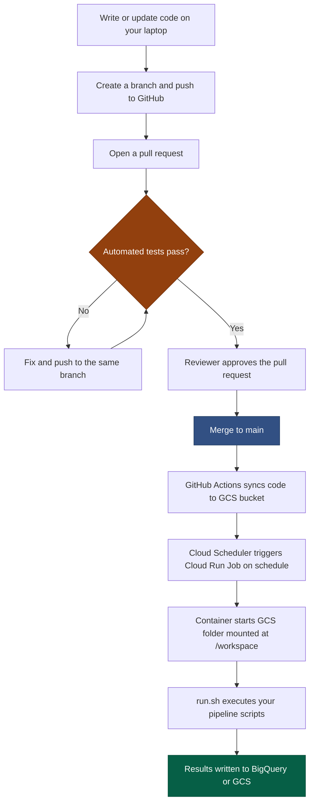
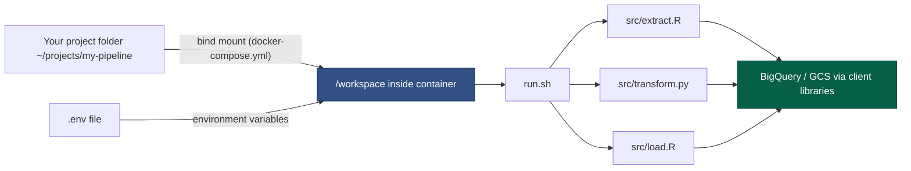
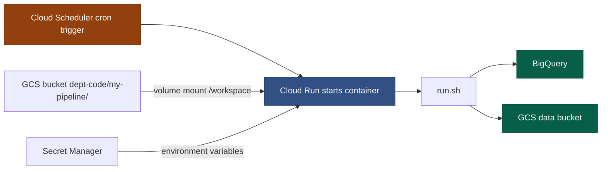

# How the Pipeline Works

By this point in the guide you understand version control, Linux, Docker containers, and R package structure. This page brings all of those together into the full picture — how your code gets from a commit on your laptop to a scheduled job running in Google Cloud Platform.

If you have arrived here directly, the preceding sections are worth reading in order. The concepts here build on [Docker & Environments](docker-containers.md) in particular.

---

## Contents

1. [The two base images](#the-two-base-images)
2. [The /workspace convention](#the-workspace-convention)
3. [How credentials work](#how-credentials-work)
4. [What GitHub Actions does](#what-github-actions-does)
5. [How secrets are managed](#how-secrets-are-managed)
6. [How package versions are controlled](#how-package-versions-are-controlled)
7. [The full flow: code change to production](#the-full-flow-code-change-to-production)
8. [A day in the life](#a-day-in-the-life)
9. [Who is responsible for what](#who-is-responsible-for-what)
10. [Checking your pipeline logs](#checking-your-pipeline-logs)
11. [Requesting a new package](#requesting-a-new-package)

---

## The two base images

This repo provides two images for different use cases:

| Image | Cloud Run type | Use for |
|---|---|---|
| `gcp-etl` | **Job** — starts, runs, and stops | ETL pipelines, analysis scripts, scheduled reports |
| `gcp-app` | **Service** — always running, responds to requests | Dash or Shiny dashboards |

**Cloud Run Job** is the right choice for almost all pipeline work. The job
starts when triggered (by a schedule or manually), runs `run.sh` from start to
finish, and stops. You are only charged for the time the container is actually
running. There is no server to maintain.

**Cloud Run Service** is for applications that need to respond to user requests
at any time — a dashboard someone opens in a browser, for example.

Both images contain the same Python and R environment. `gcp-app` extends
`gcp-etl` by adding the Dash and Shiny packages on top.

---

## The /workspace convention

All pipeline code runs from a directory called `/workspace` inside the container.

- **Locally**: your project folder is bind-mounted to `/workspace`
  (configured in `docker-compose.yml`)
- **In Cloud Run**: a GCS bucket subfolder is mounted to `/workspace`
  (configured in `cloud-run-job.yml`)

Your `run.sh` and all your scripts reference `/workspace/src/...`. The scripts
never know or care how the code got there. This is what makes local and cloud
execution identical.

```
Local machine                      Cloud Run Job
───────────────────────────────    ─────────────────────────────────────────
/home/you/my-pipeline/        →    gs://dept-code/my-pipeline/
        │                                       │
        └─────── mounted at /workspace ─────────┘
                         │
                   bash /workspace/run.sh
                         │
          ┌──────────────┼──────────────┐
          │              │              │
  src/extract.R  src/transform.py  src/load.R
```

The bind mount (local) and the GCS volume mount (cloud) are both configured in
infrastructure files — `docker-compose.yml` and `cloud-run-job.yml`. You do not
manage the mounts yourself; you just write code in `src/` and orchestrate it in
`run.sh`.

---

## How credentials work

Your pipeline code talks to BigQuery and GCS using client libraries
(`bigrquery`, `googleCloudStorageR` in R; `google-cloud-bigquery`,
`google-cloud-storage` in Python). These libraries use
**Application Default Credentials (ADC)** — they automatically find and use
the right credentials based on the environment they are running in.

The search order ADC uses:

1. The `GOOGLE_APPLICATION_CREDENTIALS` environment variable, if set
   (points to a service account key file)
2. Credentials from `gcloud auth application-default login`
   (stored in `~/.config/gcloud/` on your machine)
3. The service account attached to the Cloud Run Job (when running in GCP)

In practice this means:

| Where code runs | How credentials are provided | What you do |
|---|---|---|
| Your laptop | `gcloud auth application-default login` | Run this once |
| Cloud Run | Service account attached to the job | Nothing — it is automatic |

!!! important "Never write credentials into your code"
    You never pass a key file path or API token directly in your R or Python
    scripts. The GCP client libraries find credentials automatically based on
    the environment. This is what makes the same code work locally and in Cloud
    Run without modification.

This is why the same code works locally and in the cloud without modification.

> **Further reading**: [Google's ADC documentation](https://cloud.google.com/docs/authentication/application-default-credentials)

---

## What GitHub Actions does

GitHub Actions is an automation service built into GitHub. It runs workflows —
sequences of steps — in response to events in your repository.

In plain terms: when something happens to your code on GitHub (a pull request
is opened, a merge happens), GitHub automatically spins up a temporary Linux
machine, runs a series of commands defined in a YAML file, and reports whether
they passed or failed.

This repo uses three workflows:

| Workflow | When it runs | What it does |
|---|---|---|
| `test.yml` | Every pull request | Runs your pytest and testthat tests |
| `build-push.yml` | Merge to main (if Dockerfiles changed) | Builds new images and uploads them to Artifact Registry |
| `sync-to-gcs.yml` | Merge to main (in pipeline repos) | Copies your code to the GCS bucket so Cloud Run can use it |

The test workflow acts as an automated gate. Before any reviewer even looks at
your pull request, the tests have already run. If they fail, GitHub shows a red
cross and the reviewer knows not to merge until it is fixed.

The sync workflow is the mechanism that gets your code into production. When
your pull request is merged, GitHub Actions copies your repository to a GCS
bucket subfolder. The Cloud Run Job picks up the new code the next time it runs
— no manual deployment step required.

> **Further reading**: [GitHub Actions documentation](https://docs.github.com/en/actions)

---

## How secrets are managed

Pipelines need configuration that varies between environments and must not be
stored in code: GCP project IDs, BigQuery dataset names, GCS bucket names.
More sensitive values like API keys should also never appear in source code.

### Locally: `.env` files

You create a `.env` file by copying `.env.example` and filling in your values.
This file is listed in `.gitignore` and will never be committed to GitHub.
`docker compose` loads it automatically and injects the values as environment
variables into the container.

### In Cloud Run: Secret Manager

GCP's **Secret Manager** is a service that stores sensitive configuration
values securely and provides audited, permissioned access to them. When a
Cloud Run Job runs, the platform team configures it to pull specific secrets
from Secret Manager and inject them as environment variables — exactly as if
they had come from a `.env` file.

The variable names are identical in both cases. Your code reads:

```python
# Python
import os
bucket = os.environ["GCS_DATA_BUCKET"]
```

```r
# R
bucket <- Sys.getenv("GCS_DATA_BUCKET")
```

The code does not know or care whether the value came from a local `.env` file
or from Secret Manager. This is the key to environment parity.

!!! tip "The rule for environment variables"
    If a value would go in `.env.example`, it will go in Secret Manager in
    production. If a value is not in `.env.example`, it should not be
    referenced in your code.

> **Further reading**: [GCP Secret Manager documentation](https://cloud.google.com/secret-manager/docs)

---

## How package versions are controlled

One of the most common causes of pipeline failure is a package being updated
and changing its behaviour. We control this using lock files.

### Python: `requirements.txt`

`requirements.txt` lists Python packages with pinned version numbers:

```
pandas==2.2.3
google-cloud-bigquery==3.27.0
```

The Docker build installs exactly these versions. Nobody else on the team will
get a different version when they build the image.

### R: `renv.lock`

R's `renv` package serves the same purpose. `renv.lock` records the exact
version, source, and hash of every installed R package. When the Docker image
is built, `renv::restore()` installs exactly what is in the lock file.

You do not edit `renv.lock` by hand. It is regenerated by running
`install_base_packages.R` inside the container after changing the package list.
See the README for the exact commands.

!!! warning "Do not install packages at pipeline runtime"
    You cannot run `install.packages()` or `pip install` inside a container
    during a pipeline execution. The container is rebuilt from the lock file
    every time — any packages installed at runtime will not persist. Add new
    packages to the base image repo through a pull request.

> **Further reading**: [renv documentation](https://rstudio.github.io/renv/) | [pip requirements files](https://pip.pypa.io/en/stable/reference/requirements-file-format/)

---

## The full flow: code change to production



The key point: there is no manual deployment step. Once your pull request is
merged, the pipeline is updated. The next scheduled run will use the new code.

---

## Local development flow



---

## Cloud Run Job execution flow



---

## A day in the life

Here is what a typical day looks like for an analyst working on a pipeline
under this architecture.

**Morning: pick up a ticket**

You have been asked to add a new output table to an existing pipeline. The
pipeline runs nightly and loads data from BigQuery.

**Step 1: create a branch**

```bash
cd ~/projects/my-pipeline
git checkout main && git pull          # get the latest code
git checkout -b add-summary-table      # create a branch for your change
```

**Step 2: write the code**

You edit `src/load.R` to add the new table, and add a test for the new
function in `tests/testthat/test_pipeline.R`.

**Step 3: test locally**

```bash
docker compose run --rm pipeline bash  # open a shell inside the container
cd /workspace
Rscript -e "testthat::test_dir('tests/testthat')"
```

Everything passes. You exit the container.

**Step 4: push and open a pull request**

```bash
git add src/load.R tests/testthat/test_pipeline.R
git commit -m "add monthly summary output table"
git push -u origin add-summary-table
```

You open a pull request on GitHub. Tests run automatically. A colleague reviews
and approves. You merge.

**Step 5: production**

GitHub Actions syncs your code to GCS. The pipeline runs at its usual time
tonight and produces the new output table. No deployment action required from you.

---

## Who is responsible for what

This architecture creates a clear boundary between two groups:

**Analysts and data scientists**:
- Write pipeline logic in `src/`
- Define execution order in `run.sh`
- Write unit tests in `tests/`
- Document required environment variables in `.env.example`
- Open pull requests; respond to review comments
- Never modify Dockerfiles or CI/CD workflows

**Platform and infrastructure team**:
- Maintain the base images (`gcp-etl`, `gcp-app`) and their package sets
- Manage the GCS code bucket, Artifact Registry, and IAM permissions
- Create and schedule Cloud Run Jobs from analysts' `cloud-run-job.yml` files
- Set up Secret Manager entries from analysts' `.env.example` files
- Never modify pipeline business logic

The handover document between the two groups is the analyst's `cloud-run-job.yml`
and `.env.example`. These define everything the platform team needs to deploy
and schedule the pipeline.

---

## Checking your pipeline logs

When a Cloud Run Job runs — whether triggered by a schedule or manually — its
output is captured in **Cloud Logging**. This is where you look when something
goes wrong.

### In the Google Cloud Console

1. Go to [console.cloud.google.com](https://console.cloud.google.com)
2. Navigate to **Cloud Run > Jobs**
3. Click your job name
4. Click the **Executions** tab
5. Click on an execution to see its status and logs

### Via the gcloud CLI

```bash
# View logs for recent executions of a job
gcloud logging read \
  'resource.type="cloud_run_job" AND resource.labels.job_name="my-pipeline"' \
  --project=YOUR_PROJECT_ID \
  --limit=50 \
  --format="value(timestamp, textPayload)"
```

### What to look for

- `run.sh` prints timestamps at start and end — check whether the job completed
- R errors appear as `Error in ... : message` followed by a stack trace
- Python errors appear as a traceback ending in the exception type and message
- If a step fails, `set -euo pipefail` in `run.sh` means the job stops
  immediately and subsequent steps do not run

> **Further reading**: [Cloud Run Job logs documentation](https://cloud.google.com/run/docs/logging)

---

## Requesting a new package

The base images contain a standard set of packages for GCP integration, data
wrangling, and visualisation. If your pipeline needs something not already
included:

1. Check the existing package list in `gcp-etl/requirements.txt` and
   `gcp-etl/install_base_packages.R` — it may already be there
2. Open a pull request against this (the base image) repo adding the package
3. For R packages, regenerate `renv.lock` (see README for the exact commands)
4. Once merged, the base image rebuilds and the package is available to all pipelines

Packages are centralised deliberately. If every pipeline installed its own
packages at runtime, version conflicts would be unpredictable and build times
would grow. Centralising keeps the environment auditable and consistent.
