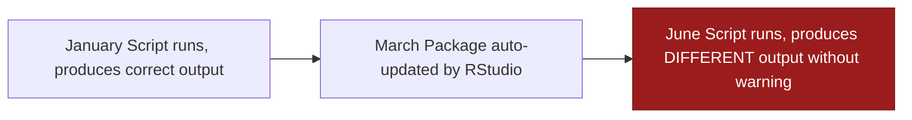
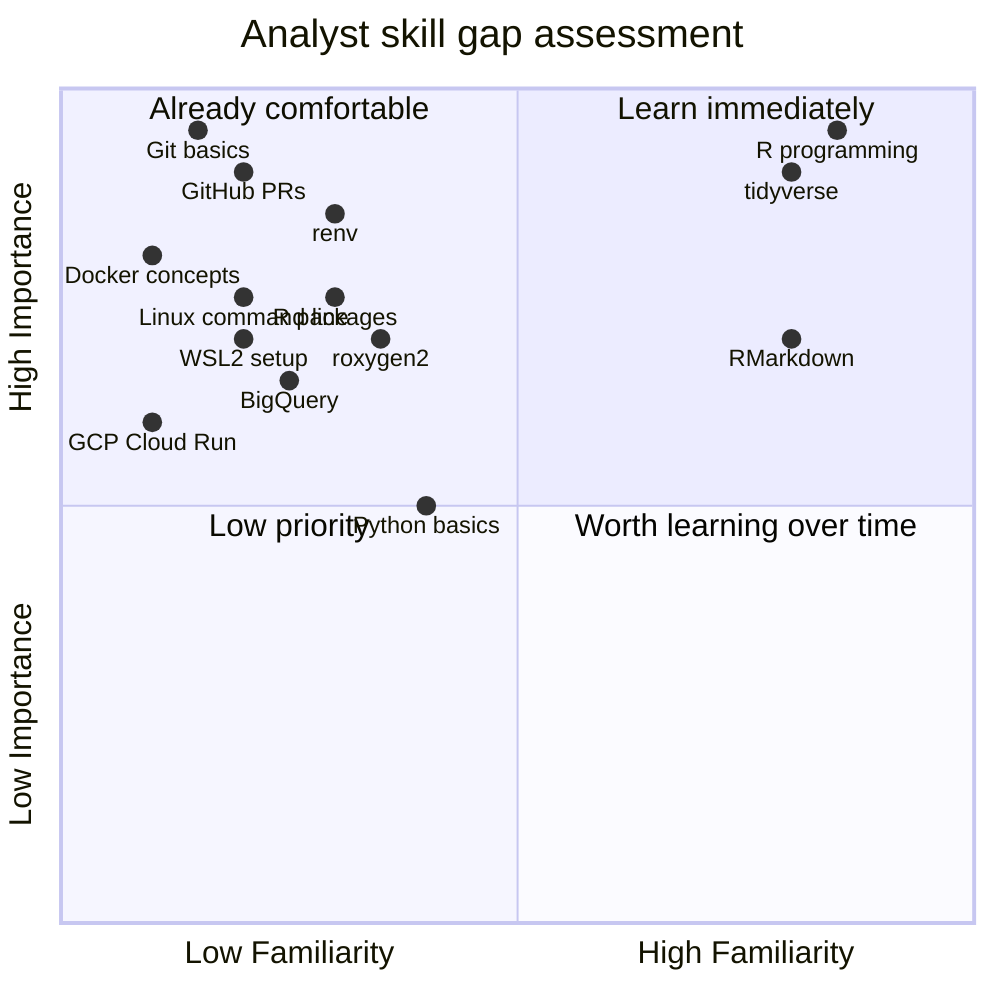
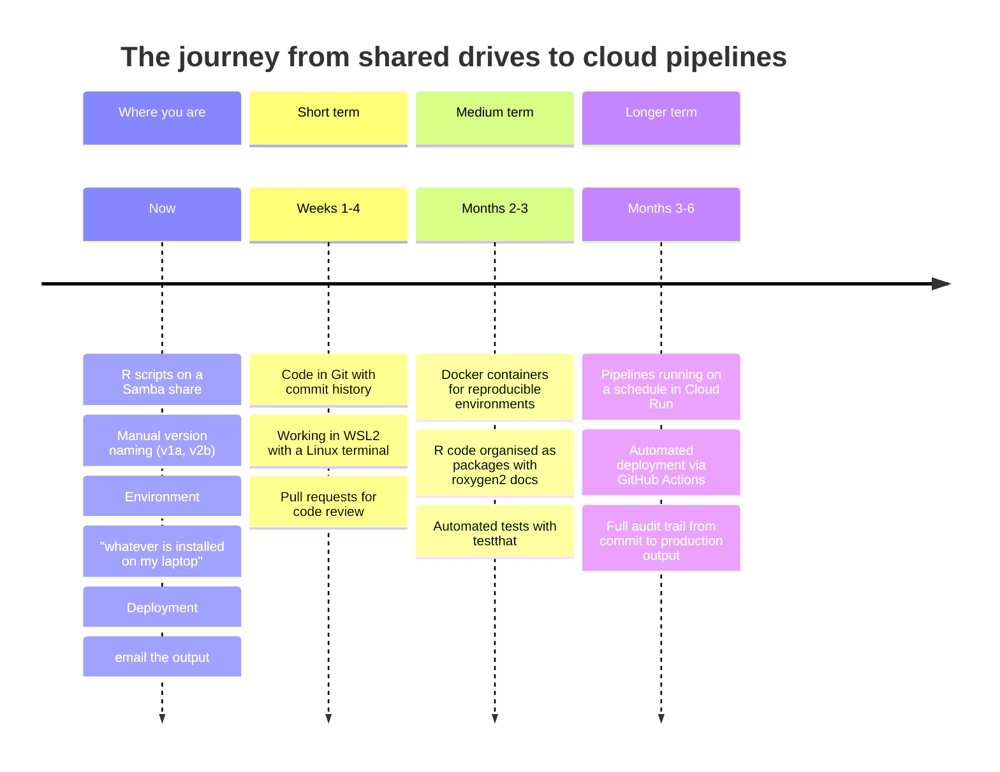

# The Case for Modern Workflows

Before diving into tools and commands, it is worth understanding *why* this change is happening and what problems it is designed to solve. The honest answer is not "because it is fashionable" — it is because the way most analytical teams currently work creates serious, concrete risks that grow over time.

---

## The problems we are solving

### 1. "It worked yesterday"

You have almost certainly experienced this: a script that ran fine last week produces different results today. Nobody changed the code. But someone updated R, or a package was updated automatically, or the file it depends on moved. There is no record of what changed, or when.

This is the **reproducibility problem**. Without a locked, consistent environment, your analysis is fragile. It works until it does not, and when it stops working, you often cannot tell why.



### 2. "It works on my machine"

Your pipeline runs perfectly on your laptop. You hand it to a colleague. It fails. They have a different version of R, a different version of `dplyr`, or a package you installed months ago and forgot about. Getting it running on their machine takes hours of trial and error.

This problem gets worse as teams grow. By the time four people are collaborating on an analysis, "setting up the environment" becomes a substantial task that has to be repeated every time someone joins the team.

### 3. "Who changed this?"

Your network share contains:

```
analysis_v1.R
analysis_v1b.R
analysis_v2_with_new_data.R
analysis_v2_FINAL.R
analysis_v2_FINAL_checked.R
analysis_v2_FINAL_checked_JS_edits.R
analysis_v2_FINAL_checked_JS_edits_USE_THIS_ONE.R
```

Which is the current version? What did the JS edits change? Why was the final version superseded? When did this happen? Good luck answering any of these questions six months later.

This is the **version control problem**. Without a system designed for tracking changes, you end up with file name archaeology — and you still cannot reliably answer "what did this do on the 14th of November?"

### 4. Governance and audit requirements

Public sector organisations face specific requirements around audit trails, data lineage, and change management. Regulators, internal audit, and data protection officers need to be able to answer:

- Who made this change to the pipeline, and when?
- What did the pipeline look like when it produced this output?
- Who approved this change before it went to production?

A shared network drive and a version audit table cannot reliably answer these questions. A Git repository with branch protection and pull request reviews can.

### 5. Knowledge silos

When analytical code lives only on one person's laptop or in a personal folder on the share, that knowledge is locked away. If that person is off sick, leaves the team, or simply cannot be reached, the analysis is inaccessible or unusable.

Code in a GitHub repository is accessible to the whole team, documented, reviewed, and not dependent on any single person's environment.

---

## What you gain

The tools and practices in this guide are not bureaucracy for its own sake. They provide concrete, tangible benefits:

### Reproducibility

A Docker container packages the *exact* environment your code needs — the operating system layer, the R version, every package version, down to the patch release. Your analysis will produce identical results on your laptop, a colleague's laptop, a CI server, and a cloud job running at 3am six months from now.

### Automatic version history

Every change you commit to Git is recorded permanently with:
- What changed (the exact diff)
- Who changed it
- When it changed
- Why it changed (the commit message)

You can compare any two versions, restore any previous state, and trace every bug back to the exact commit that introduced it.

### Peer review built into the workflow

The pull request process means no code reaches production without a second pair of eyes. Reviewers catch bugs, suggest improvements, and share knowledge. Over time this distributes expertise across the team rather than concentrating it in one person.

### Automated quality gates

Tests run automatically every time a change is proposed. If a change breaks something, it is caught before it is merged — not after it has run against production data.

### Automated deployment

Once merged to the main branch, your pipeline code is automatically copied to the cloud and will run at its next scheduled time. No manual deployment steps, no SSH sessions, no "remember to copy the file to the server".

### Onboarding new team members

A new analyst joins the team. They clone the repository, open it in Positron, and the entire environment — R version, all packages, all dependencies — is set up automatically. They can run the pipeline locally on their first day without asking for help.

---

## The skills gap



You are already strong in the areas that matter most: R programming, the tidyverse, and analytical thinking. The gaps are mostly in the tooling infrastructure that sits *around* your code. This guide fills those gaps.

---

## The transition in context

This change does not happen all at once, and it does not require you to become a software engineer. Think of it as a progression:



---

## Public sector context

If you work in a public sector organisation, several of the practices in this guide directly address requirements you may already be subject to:

**UK GDPR and data minimisation**: secrets, API keys, and connection strings should never appear in code. The patterns in this guide ensure sensitive values are always loaded from environment variables, not hardcoded — reducing the risk of accidental exposure in a code repository.

**Audit and accountability**: Git provides an immutable, tamper-evident audit trail of every change to analytical code. Pull request reviews create a documented sign-off process.

**Business continuity**: code in a GitHub repository is not lost when a team member leaves. The environment is reproducible from a Dockerfile and lock files, not from documentation about what someone once installed.

**Peer review and QA**: the pull request model enforces peer review before any change reaches production, addressing a common recommendation from internal audit and quality assurance teams.

---

## Further reading

- [The Turing Way — Guide for Reproducible Research](https://the-turing-way.netlify.app/reproducible-research/reproducible-research) — a comprehensive community-developed guide to reproducible data science, particularly relevant for public sector and academic contexts
- [Government Analysis Function — Reproducible Analytical Pipelines (RAP)](https://analysisfunction.civilservice.gov.uk/support/reproducible-analytical-pipelines/) — the UK government's own programme for modernising analytical workflows, which this guide supports
- [The RAP companion](https://ukgovdatascience.github.io/rap_companion/) — a practical guide to RAP from the Government Data Science community
- [Towards a principled workflow — Miles McBain](https://milesmcbain.xyz/posts/the-case-for-tidy-organisation/) — an accessible argument for structured R project organisation
