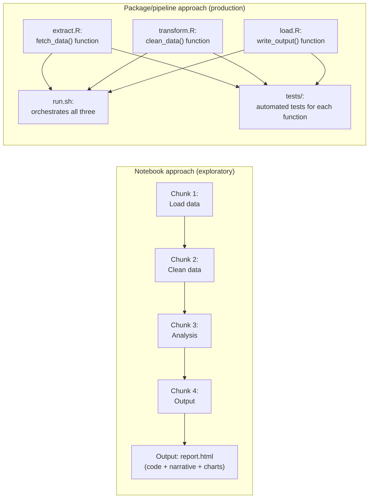
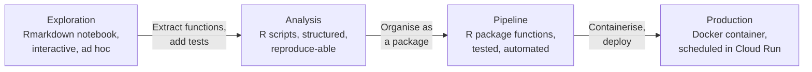

# Organising Your R Code

Most analytical R code starts in one of two places: a sprawling `.R` script or an Rmarkdown document. Both are excellent for exploration and communication. Neither is a good foundation for a production pipeline. This page explains why, and shows you a practical path from ad-hoc analysis to organised, automated code.

---

## Why code organisation matters

### The Rmarkdown notebook problem

Rmarkdown (and its successor Quarto) is wonderful for exploratory data analysis. You can mix narrative, code, and output in a single document. But it has structural properties that make it a poor choice for automated pipelines:

1. **Linear execution**: notebooks execute from top to bottom. They assume you are running them interactively, in order. Functions and variables from one chunk are implicitly available in the next.

2. **State accumulation**: if you run chunks out of order (which everyone does during exploration), the environment accumulates stale objects. The notebook may produce different results depending on what order you ran the chunks.

3. **Hard to test**: unit tests work by calling functions with known inputs and checking the output. If your logic is embedded in notebook chunks rather than functions, you cannot easily test it in isolation.

4. **Hard to modularise**: you cannot `source()` part of a notebook. You cannot import a function from a notebook in another script.

5. **Hard to review**: a 500-line notebook with embedded outputs is hard to review in a pull request. Code changes are mixed with output changes.



The notebook is great for getting to the answer. The pipeline package is what you build when the answer needs to run automatically, reproducibly, and be maintained over time.

---

## The spectrum: from analysis to pipeline

There is not a sharp line between "analysis" and "pipeline". Think of it as a spectrum:



Not every piece of analysis needs to reach the "Production" end. A one-off report for a specific request can stay as Rmarkdown. A pipeline that runs every month and feeds a dashboard should be at the right end.

---

## Project structure

A well-organised R project looks like this:

```
my-pipeline/
│
├── run.sh                      # orchestration: what runs and in what order
│
├── src/                        # pipeline scripts
│   ├── extract.R               # functions for getting data
│   ├── transform.R             # functions for processing data
│   └── load.R                  # functions for outputting data
│
├── R/                          # reusable functions (if building a package)
│   ├── extract_functions.R
│   ├── transform_functions.R
│   └── utils.R
│
├── tests/
│   └── testthat/
│       ├── setup.R
│       ├── test-extract.R
│       ├── test-transform.R
│       └── test-load.R
│
├── docs/
│   └── README.md               # explains what the pipeline does and how
│
├── renv.lock                   # pinned R package versions
├── .env.example                # required environment variables (no real values)
├── .gitignore
└── README.md
```

### The ETL split

The `extract`, `transform`, `load` pattern is a standard way to organise data pipelines:

| Phase | File | Responsibility |
|-------|------|---------------|
| **Extract** | `src/extract.R` | Fetch data from external sources (BigQuery, APIs, GCS) |
| **Transform** | `src/transform.R` | Clean, reshape, and process the data (pure functions, no I/O) |
| **Load** | `src/load.R` | Write results to the destination (BigQuery, GCS, email) |

The transform step is kept pure (no side effects, no I/O) because pure functions are easy to test: you call them with a data frame and check the output.

### The `run.sh` orchestrator

```bash
#!/usr/bin/env bash
set -euo pipefail   # stop on any error

echo "$(date): Starting pipeline"

Rscript /workspace/src/extract.R
python /workspace/src/transform.py
Rscript /workspace/src/load.R

echo "$(date): Pipeline completed successfully"
```

`set -euo pipefail` is critical:
- `-e`: exit immediately if any command fails
- `-u`: treat unset variables as errors
- `-o pipefail`: fail if any command in a pipe fails

Without these, your pipeline might silently produce partial output when a step fails.

---

## From scripts to functions

The key refactoring step is extracting logic from top-to-bottom scripts into **functions** — reusable, testable units of code.

### Before: a script

```r
# extract.R (script style)
library(bigrquery)
library(dplyr)

project <- Sys.getenv("GCP_PROJECT_ID")
dataset <- Sys.getenv("BQ_DATASET")

sql <- glue::glue("
  SELECT patient_id, date, diagnosis_code
  FROM `{project}.{dataset}.patient_records`
  WHERE date >= '2024-01-01'
")

bq_auth()
con <- dbConnect(bigrquery::bigquery(), project = project)
raw_data <- dbGetQuery(con, sql)

# Remove invalid dates
clean_data <- raw_data |>
  filter(!is.na(date)) |>
  filter(date <= Sys.Date())

# Standardise diagnosis codes
clean_data <- clean_data |>
  mutate(diagnosis_code = toupper(trimws(diagnosis_code)))

saveRDS(clean_data, "/workspace/data/extracted.rds")
```

### After: functions in `R/` with a thin script

```r
# R/extract_functions.R

#' Fetch patient records from BigQuery
#'
#' @param project GCP project ID
#' @param dataset BigQuery dataset name
#' @param start_date Earliest date to include (default: start of current year)
#' @return A data frame of patient records
#' @export
fetch_patient_records <- function(project, dataset, start_date = "2024-01-01") {
  sql <- glue::glue("
    SELECT patient_id, date, diagnosis_code
    FROM `{project}.{dataset}.patient_records`
    WHERE date >= '{start_date}'
  ")

  con <- DBI::dbConnect(bigrquery::bigquery(), project = project)
  on.exit(DBI::dbDisconnect(con), add = TRUE)

  DBI::dbGetQuery(con, sql)
}

#' Clean and standardise patient records
#'
#' Removes records with invalid dates and standardises diagnosis code format.
#'
#' @param df A data frame with columns: patient_id, date, diagnosis_code
#' @return A cleaned data frame
#' @export
clean_patient_records <- function(df) {
  df |>
    dplyr::filter(!is.na(date)) |>
    dplyr::filter(date <= Sys.Date()) |>
    dplyr::mutate(diagnosis_code = toupper(trimws(diagnosis_code)))
}
```

```r
# src/extract.R (thin orchestration script)
source("/workspace/R/extract_functions.R")

project <- Sys.getenv("GCP_PROJECT_ID")
dataset <- Sys.getenv("BQ_DATASET")

bigrquery::bq_auth()
raw  <- fetch_patient_records(project, dataset)
clean <- clean_patient_records(raw)

saveRDS(clean, "/workspace/data/extracted.rds")
message("Extracted ", nrow(clean), " records")
```

The key differences:
- `clean_patient_records()` takes a data frame as input and returns a data frame — no I/O
- This means you can write a test that calls it with a known data frame and checks the output
- The function has a roxygen2 documentation block (we cover this in [Building R Packages](r-packages.md))
- The thin script is just orchestration — calling functions and passing data between them

---

## The principle of pure functions

A **pure function** has two properties:
1. Given the same inputs, it always returns the same output
2. It has no side effects (does not read from or write to disk, databases, or the network)

Pure functions are:
- Easy to test (just call them with data, check the result)
- Easy to reason about (no hidden state)
- Composable (chain them together)

The goal is to write your *logic* as pure functions and confine your *I/O* to thin wrappers:

```r
# Pure function — fully testable
calculate_monthly_rate <- function(df, year, month) {
  df |>
    dplyr::filter(
      lubridate::year(date) == year,
      lubridate::month(date) == month,
      !is.na(value)
    ) |>
    dplyr::summarise(
      n = dplyr::n(),
      mean_value = mean(value),
      rate = sum(value > 0) / dplyr::n()
    )
}

# I/O wrapper — not tested directly (requires live BigQuery connection)
run_monthly_analysis <- function(project, dataset, year, month) {
  raw <- fetch_data(project, dataset)           # I/O: BigQuery
  result <- calculate_monthly_rate(raw, year, month)  # pure: testable
  write_result(project, dataset, result)         # I/O: BigQuery
  result
}
```

---

## Code style and naming conventions

Consistent style makes code easier to read and review. The tidyverse style guide is the standard for R:

### Names

```r
# Variables and functions: snake_case
patient_count <- 100
calculate_rate <- function(df) { }

# Constants: UPPER_SNAKE_CASE (though this is less common in R)
MAX_RETRY_COUNT <- 3

# Avoid single-letter names (except in very short loops)
# Bad
x <- df |> filter(y > 0) |> mutate(z = y * 2)

# Good
filtered_patients <- patient_df |>
  filter(age > 0) |>
  mutate(age_doubled = age * 2)
```

### Spacing and line length

```r
# Good: spaces around operators, before function args
mean(x, na.rm = TRUE)

# Limit lines to ~80 characters — long pipes should be broken across lines
result <- very_long_data_frame |>
  filter(!is.na(patient_id)) |>
  group_by(region, year) |>
  summarise(count = n(), .groups = "drop") |>
  arrange(desc(count))
```

### Explicit package references

In scripts that will be run by others, use explicit package prefixes:

```r
# In a script or package function — be explicit
df <- dplyr::filter(df, value > 0)

# In an interactive session — fine to use without prefix after library()
library(dplyr)
df <- filter(df, value > 0)
```

Explicit prefixes prevent confusion when two packages export functions with the same name (`dplyr::filter` vs `stats::filter`).

---

## README: the front door to your project

Every project must have a `README.md` that answers these questions:

1. **What does this pipeline do?** — One paragraph summary
2. **What are its inputs?** — What data sources does it read?
3. **What are its outputs?** — What does it produce and where?
4. **What environment variables does it need?** — Reference `.env.example`
5. **How do I run it locally?** — The exact commands
6. **How often does it run?** — Schedule and trigger
7. **Who maintains it?** — Contact for questions

A good README means a colleague (or future-you) can understand and run the pipeline without asking anyone for help.

```markdown
# Patient Records Monthly Pipeline

Extracts patient records from BigQuery, calculates monthly rates by region,
and writes the results to the `analytics.monthly_rates` table.

## Inputs

- BigQuery table: `{project}.{dataset}.patient_records`

## Outputs

- BigQuery table: `{project}.{dataset}.monthly_rates` (appended monthly)

## Required environment variables

See `.env.example` for the full list. Key variables:

- `GCP_PROJECT_ID` — GCP project ID
- `BQ_DATASET` — BigQuery dataset containing input and output tables

## Running locally

\```bash
cp .env.example .env
# Fill in .env with real values
docker compose run --rm pipeline
\```

## Schedule

Runs on the first working day of each month at 07:00.
```

---

## Further reading

- **[The tidyverse style guide](https://style.tidyverse.org)** — the definitive R code style reference, maintained by the tidyverse team
- **[What they forgot to teach you about R](https://rstats.wtf)** — Jenny Bryan and Jim Hester's guide to project-oriented workflows, highly recommended
- **[The pragmatic programmer approach to pipelines](https://analysisfunction.civilservice.gov.uk/policy-store/reproducible-analytical-pipelines-best-practice-and-guidance/)** — the UK Government Analysis Function's RAP guidance
- **[R for Data Science, 2nd edition](https://r4ds.hadley.nz)** — comprehensive coverage of the tidyverse and modern R workflows
