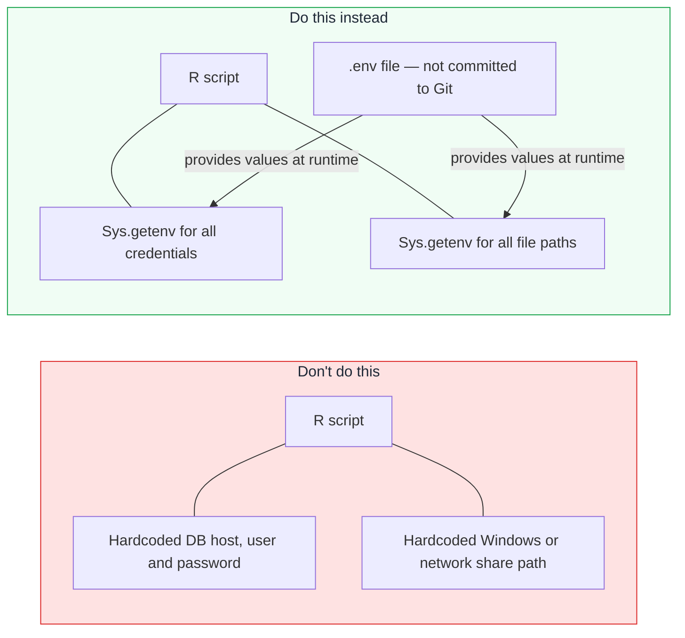

# Making Code GitHub-Ready

Moving code from a shared network drive to a public (or even private) GitHub repository requires a change in mindset. On a network drive behind a corporate firewall, you might have hardcoded file paths, database connection strings, and API keys directly in your scripts — because there was no way for anyone outside the network to see them. On GitHub, code is accessible to anyone who can view the repository.

This page covers the practical steps to make your code safe, portable, and ready for version control.

---

## The core principle: separate configuration from code

The single most important habit change is this: **your code should not contain any value that is specific to an environment, a person, or a machine**. Everything that varies — file paths, credentials, project IDs, bucket names — should be loaded from outside the code.



---

## The six things to remove before your first commit

### 1. Hardcoded Windows file paths

Windows paths are the most common problem when analysts first put R code into Git. A path like this:

```r
# Bad — specific to one machine, one person, one operating system
data <- read.csv("C:/Users/Sarah/Documents/ONS_data/population_2023.csv")
output_dir <- "//networkshare/team/analysis/outputs/"
```

...will not work on a Linux server, in a Docker container, or on a colleague's machine. Replace these with:

```r
# Good — path loaded from environment variable
data_path <- Sys.getenv("DATA_PATH")
data <- read.csv(data_path)

output_dir <- Sys.getenv("OUTPUT_DIR")
```

For paths to files *within the project itself* (not external data), use relative paths:

```r
# Good — relative to the project root, works anywhere
data <- read.csv("data/population_2023.csv")
source("src/helpers.R")
```

The convention in this architecture is that all project code lives at `/workspace` inside the container. So within-project paths like `src/extract.R` always resolve correctly.

### 2. Database connection strings and credentials

Database passwords, usernames, and hostnames must never appear in source code.

```r
# Bad — credentials in code
con <- DBI::dbConnect(
  RPostgres::Postgres(),
  host     = "10.0.1.45",
  port     = 5432,
  dbname   = "analytics",
  user     = "sa_read",
  password = "B3@rcat2023!"
)
```

```r
# Good — credentials from environment variables
con <- DBI::dbConnect(
  RPostgres::Postgres(),
  host     = Sys.getenv("DB_HOST"),
  port     = as.integer(Sys.getenv("DB_PORT", "5432")),
  dbname   = Sys.getenv("DB_NAME"),
  user     = Sys.getenv("DB_USER"),
  password = Sys.getenv("DB_PASSWORD")
)
```

### 3. API keys and tokens

```r
# Bad
response <- httr::GET(
  "https://api.example.gov.uk/v1/data",
  httr::add_headers(`X-API-Key` = "sk-abc123def456")
)

# Good
api_key <- Sys.getenv("API_KEY")
response <- httr::GET(
  "https://api.example.gov.uk/v1/data",
  httr::add_headers(`X-API-Key` = api_key)
)
```

In Python:

```python
# Bad
import requests
response = requests.get(
    "https://api.example.gov.uk/v1/data",
    headers={"X-API-Key": "sk-abc123def456"}
)

# Good
import os, requests
api_key = os.environ["API_KEY"]
response = requests.get(
    "https://api.example.gov.uk/v1/data",
    headers={"X-API-Key": api_key}
)
```

### 4. GCP project IDs and resource names

```r
# Bad — hardcoded GCP resources
bq_project_query(
  project  = "dept-analytics-prod",
  query    = "SELECT * FROM `dept-analytics-prod.my_dataset.my_table`"
)

# Good — from environment variables
project_id <- Sys.getenv("GCP_PROJECT_ID")
dataset    <- Sys.getenv("BQ_DATASET")
bq_project_query(
  project = project_id,
  query   = glue::glue("SELECT * FROM `{project_id}.{dataset}.my_table`")
)
```

### 5. Personally identifiable information (PII)

Never commit data files, test fixtures with real data, or any output that contains real personal information. This applies even to "anonymised" data — Git history is permanent, and if a commit ever contained PII, it can be recovered even after the file is deleted.

The `.gitignore` patterns for data files:

```gitignore
# Data files — never commit these
data/
*.csv
*.xlsx
*.parquet
*.json        # also covers GCP key files!
raw/
outputs/
```

### 6. Usernames, organisation-specific identifiers

```r
# Bad — reveals internal organisational structure
df <- df |>
  filter(region == "SE-NHS-BARTS") |>
  mutate(reviewer = "jsmith@nhs.net")

# Good — use generic terms or configuration
reviewer_email <- Sys.getenv("REVIEWER_EMAIL")
```

---

## The `.env` file pattern

The `.env` file is a plain text file that lists environment variables and their values. It lives in your project root, is **never committed to Git**, and is loaded automatically by `docker compose` for local development.

### `.env.example` (committed to Git)

This file is your documentation. It lists every variable the project needs, with placeholder values:

```bash
# .env.example — commit this to Git
# Copy to .env and fill in real values (do not commit .env)

# GCP configuration
GCP_PROJECT_ID=your-project-id-here
GCS_DATA_BUCKET=your-data-bucket-name

# BigQuery
BQ_DATASET=your_dataset_name

# External API
API_KEY=your-api-key-here
API_BASE_URL=https://api.example.gov.uk/v1

# Database (if applicable)
DB_HOST=
DB_PORT=5432
DB_NAME=
DB_USER=
DB_PASSWORD=
```

### `.env` (never committed)

This is the real file with actual values:

```bash
# .env — DO NOT COMMIT — listed in .gitignore

GCP_PROJECT_ID=my-dept-analytics-prod
GCS_DATA_BUCKET=dept-data-outputs
BQ_DATASET=population_analysis
API_KEY=sk-abc123def456...
API_BASE_URL=https://api.example.gov.uk/v1
DB_HOST=10.0.1.45
DB_PORT=5432
DB_NAME=analytics
DB_USER=sa_read
DB_PASSWORD=B3@rcat2023!
```

---

## Configuring `.gitignore`

A `.gitignore` file tells Git which files and folders to completely ignore. Ignored files will never be staged, committed, or pushed — even if you run `git add .`.

Place this file in the root of your project:

```gitignore
# Environment files — NEVER commit these
.env
*.env
.env.*
!.env.example    # Exception: .env.example should be committed

# GCP credential files
*.json
key.json
service-account*.json
*-credentials.json

# Data files — use GCS or a proper data store instead
data/
raw/
outputs/
*.csv
*.xlsx
*.parquet
*.feather
*.rds           # R data files (may contain PII from analysis sessions)

# R session artefacts
.RData
.Rhistory
.Rproj.user/
*.Rproj

# Python
__pycache__/
*.pyc
.venv/
*.egg-info/
dist/
.pytest_cache/

# OS and editor files
.DS_Store
Thumbs.db
.vscode/
*.swp
*~
```

### Testing your `.gitignore`

```bash
# Check whether a specific file is ignored
git check-ignore -v path/to/file.env

# See all currently ignored files
git status --ignored

# See what git add . would stage (useful check before committing)
git add --dry-run .
```

---

## Loading environment variables in R

### Reading individual variables

```r
# Get a variable (returns empty string if not set)
project_id <- Sys.getenv("GCP_PROJECT_ID")

# Get a variable with a default
port <- Sys.getenv("DB_PORT", unset = "5432")

# Raise an error if a required variable is not set
get_required_env <- function(name) {
  value <- Sys.getenv(name)
  if (nchar(value) == 0) {
    stop(paste("Required environment variable not set:", name))
  }
  value
}

project_id <- get_required_env("GCP_PROJECT_ID")
```

### Validating at startup

A good pattern is to validate all required environment variables at the top of your `run.sh` or main script, so the pipeline fails immediately with a clear message if something is missing — rather than failing silently halfway through a run:

```r
# config.R — source this at the top of each script
required_vars <- c(
  "GCP_PROJECT_ID",
  "GCS_DATA_BUCKET",
  "BQ_DATASET"
)

missing <- required_vars[!nchar(Sys.getenv(required_vars)) > 0]
if (length(missing) > 0) {
  stop("Missing required environment variables: ", paste(missing, collapse = ", "))
}

# Assign to named variables for use throughout the script
GCP_PROJECT_ID <- Sys.getenv("GCP_PROJECT_ID")
GCS_DATA_BUCKET <- Sys.getenv("GCS_DATA_BUCKET")
BQ_DATASET <- Sys.getenv("BQ_DATASET")
```

### Using the `dotenv` package for local development

If you are running R outside of Docker (directly in RStudio), you can load a `.env` file using the `dotenv` package:

```r
# Install once
install.packages("dotenv")

# At the top of your script (for local development only)
if (file.exists(".env")) {
  dotenv::load_dot_env()
}
```

Inside Docker, `docker compose` loads the `.env` file automatically — you do not need `dotenv` in production code.

---

## Loading environment variables in Python

```python
import os

# Get a variable (returns None if not set)
project_id = os.environ.get("GCP_PROJECT_ID")

# Get a variable with a default
port = int(os.environ.get("DB_PORT", "5432"))

# Raise if not set
project_id = os.environ["GCP_PROJECT_ID"]  # raises KeyError if missing
```

For local Python development outside Docker, use the `python-dotenv` package:

```python
from dotenv import load_dotenv
import os

load_dotenv()  # loads .env from the current directory
project_id = os.environ["GCP_PROJECT_ID"]
```

---

## Scanning for secrets before committing

Before pushing code for the first time, scan it for secrets:

### Manual scan

```bash
# Search for common secret patterns
grep -rn "password\s*=" src/
grep -rn "api_key\s*=" src/
grep -rn "sk-" src/
grep -rn "10\.0\." src/       # internal IP addresses
grep -rn "/Users/" src/        # macOS/Windows home directories
grep -rn "C:/Users" src/       # Windows paths
grep -rn "//networkshare" src/ # network share paths
```

### Using `git diff` before committing

```bash
# Review everything staged for the next commit
git diff --staged
```

Read through every line of the diff before committing. This is a good habit that catches both secrets and unintended changes.

### Pre-commit hooks (automated)

A pre-commit hook runs automatically before every commit and can reject commits that match secret patterns. Install `pre-commit`:

```bash
pip install pre-commit
```

Create `.pre-commit-config.yaml` in your project root:

```yaml
repos:
  - repo: https://github.com/gitleaks/gitleaks
    rev: v8.18.0
    hooks:
      - id: gitleaks
  - repo: https://github.com/pre-commit/pre-commit-hooks
    rev: v4.5.0
    hooks:
      - id: check-added-large-files   # no files over 500kB
      - id: check-json
      - id: check-yaml
      - id: detect-private-key
      - id: end-of-file-fixer
      - id: trailing-whitespace
```

```bash
pre-commit install    # install the hooks into this repo
```

After this, `git commit` will run these checks automatically and refuse to commit if any fail.

---

## What to do if you accidentally commit a secret

If you have committed something sensitive and not yet pushed:

```bash
# Undo the last commit (keeps your changes, removes the commit)
git reset HEAD~1

# Remove the sensitive value from the file
# Re-commit without it
git add src/my_script.R
git commit -m "Remove hardcoded credentials"
```

If you have already pushed to GitHub:

1. **Immediately revoke the secret** — rotate the API key, change the password, or invalidate the token. Assume it has been compromised.
2. Remove the secret from the code and commit the fix
3. Contact your platform team to discuss whether the history needs to be rewritten (`git filter-repo`)
4. If the repository is public, GitHub automatically scans for common secret patterns and notifies you — but act before that notification arrives

!!! danger "Deleting a file does not remove it from Git history"
    If you commit a file containing a password, then delete the file in a later commit, the password is still in the repository's history and can be recovered. The only safe options are: (a) rotate the credential immediately, or (b) rewrite the history with `git filter-repo`.

---

## Summary checklist

Before committing code for the first time, go through this list:

- [ ] No Windows-style paths (`C:/Users/...`, `//networkshare/...`)
- [ ] No database hostnames, usernames, or passwords in code
- [ ] No API keys or tokens in code
- [ ] No GCP project IDs hardcoded (use `Sys.getenv("GCP_PROJECT_ID")`)
- [ ] `.env` file is in `.gitignore`
- [ ] `.env.example` exists with placeholder values
- [ ] No data files committed (`.csv`, `.xlsx`, `.rds`, etc.)
- [ ] `renv.lock` or `requirements.txt` is present (so dependencies are reproducible)
- [ ] `README.md` explains what the project does and what environment variables it needs
