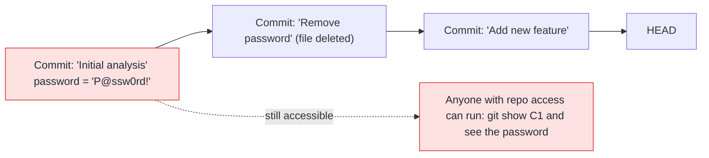

# Sanitising Code for GitHub

You have a body of working R code that has lived on a network share, on your laptop, or in a personal OneDrive folder. Now you want to move it into a GitHub repository. Before you commit anything, you need to audit it carefully. Code written for a private, local environment often contains things that must never appear in a repository.

This page is a systematic guide to that audit — working through the most common issues in R analytical code, with before/after examples for each.

---

## Why this matters more than you think

### The permanent nature of Git history

When you commit something to Git, that information is not just in the current files — it is in the commit history, permanently. Even if you later delete the file or overwrite the value, the original content is retrievable by anyone with access to the repository.



!!! danger "You cannot un-commit a secret"
    Once a password, API key, or sensitive data is committed and pushed to GitHub, treat it as compromised. Rotate the credential immediately. History rewriting (`git filter-repo`) can remove it from the repository, but if the repo was public even briefly, the secret should be considered exposed.

---

## The audit checklist

Before committing any existing code, work through this checklist systematically:

- [ ] No Windows or network share paths
- [ ] No database connection strings (host, user, password)
- [ ] No API keys, tokens, or passwords
- [ ] No GCP project IDs, bucket names, or other infrastructure identifiers
- [ ] No `.Renviron` file with actual values
- [ ] No PII in test data or example data
- [ ] No internal IP addresses or network share paths
- [ ] No organisation-specific identifiers (org codes, system IDs)
- [ ] No large data files (CSV, RDS, XLSX)
- [ ] `.gitignore` in place and tested

---

## R-specific patterns to find and fix

### 1. Windows and network share paths

The single most common issue in public sector R code:

```r
# Bad — all of these will fail outside your specific environment
data <- read.csv("C:/Users/Sarah.Jones/Documents/data.csv")
data <- read.csv("//NTHSVR001/Analytics/Data/population_2023.csv")
data <- read_excel("X:/Shared/Analysis/inputs/reference_table.xlsx")

# Also bad — OneDrive paths
data <- read.csv("C:/Users/Sarah.Jones/OneDrive - NHS England/Projects/data.csv")
```

**Fix:**

```r
# Good — path from environment variable
data_path <- Sys.getenv("DATA_PATH")
data <- read.csv(data_path)

# Or for files within the project itself — relative paths
data <- read.csv("data/population_2023.csv")
```

**Finding all path references:**

```bash
# In your WSL2 terminal, search for path patterns
grep -rn "C:/Users" R/ src/
grep -rn "//[A-Z]" R/ src/        # network shares (//SERVERNAME/...)
grep -rn "/mnt/c/" R/ src/
grep -rn "OneDrive" R/ src/
grep -rn "Documents" R/ src/
```

### 2. The `.Renviron` file

Many R users store credentials and environment variables in `.Renviron` — a file that R loads automatically on startup. This file often lives in your home directory and contains real secrets:

```bash
# ~/.Renviron — common patterns to look for
DB_PASSWORD=P@ssw0rd!
GITHUB_PAT=ghp_abc123def456...
API_KEY=sk-abc123...
BQ_BILLING_PROJECT=my-org-analytics-prod
```

**The `.Renviron` file should never be committed to a repository.** Add it to `.gitignore`:

```gitignore
.Renviron
.Renviron.*
```

For project-specific configuration, use `.env` files (which are also gitignored) instead of `.Renviron`. See [Making Code GitHub-Ready](code-readiness.md) for the full `.env` pattern.

### 3. Direct credential use

```r
# Bad — all variants of putting credentials directly in code
api_key <- "sk-abc123def456..."
token <- "Bearer eyJhbGciOiJIUzI1NiJ9..."
password <- "P@ssw0rd2024!"

# Also bad — reading from a hardcoded file path outside the project
creds <- jsonlite::read_json("C:/Users/Sarah/gcp-key.json")
bq_auth(path = "//NTHSVR001/shared/service-account.json")

# Good
api_key <- Sys.getenv("API_KEY")
Sys.setenv(GOOGLE_APPLICATION_CREDENTIALS = Sys.getenv("GCP_CREDENTIALS_PATH"))
```

### 4. GCP project identifiers

```r
# Bad — hardcoded infrastructure identifiers
project_id <- "nhs-analytics-prod-a1b2c3"
dataset <- "patient_outcomes_2024"
bucket <- "nhs-england-data-lake-prod"

bq_project_query(
  project = "nhs-analytics-prod-a1b2c3",
  query = "SELECT * FROM `nhs-analytics-prod-a1b2c3.patient_data.records`"
)

# Good
project_id <- Sys.getenv("GCP_PROJECT_ID")
dataset    <- Sys.getenv("BQ_DATASET")
bucket     <- Sys.getenv("GCS_DATA_BUCKET")

bq_project_query(
  project = project_id,
  query   = glue::glue("SELECT * FROM `{project_id}.{dataset}.records`")
)
```

### 5. Internal network identifiers and system codes

Public sector R code often contains identifiers that are technically not credentials but still should not be in a public repository:

```r
# Potentially sensitive — organisation codes, system identifiers
org_code <- "RJZ"                    # NHS trust code
system_id <- "SPINE-PROD-001"        # system identifier
region_mapping <- list(              # internal classification
  "REGION_A" = "001",
  "REGION_B" = "002"
)

# Pattern: use lookup tables that are loaded, not hardcoded
org_codes <- read.csv(Sys.getenv("ORG_CODES_PATH"))
```

### 6. Personal information in code comments

Code comments can contain information you did not intend to share:

```r
# TODO: ask James (james.smith@nhs.net) about this
# HACK: hardcoded because the API was broken during the 2023-11-15 outage
# NOTE: Sarah's workaround for the server issue on NTHLIVE005
# reviewed by Dr. P. Jones on 14/02/2024
```

Comments like these can reveal personnel information, internal system names, and specific incidents. Strip these before committing, or replace them with generic descriptions.

---

## Data files: the invisible risk

Data files are a particular risk because they are often not obviously "sensitive". A CSV of postcode-level statistics might seem harmless. But:

- It might contain small numbers that are disclosive under NHS disclosure rules
- It might be subject to data sharing agreements that prohibit re-publication
- It might be very large and bloat the repository for everyone

**The rule**: no data files in the repository. Data lives in GCS, BigQuery, or another appropriate store. Your code fetches it at runtime.

```gitignore
# In .gitignore — exclude all common data formats
data/
raw/
outputs/
*.csv
*.xlsx
*.xls
*.parquet
*.feather
*.rds
*.RData
*.sav          # SPSS files
*.dta          # Stata files
```

!!! warning "`.RData` and `.Rhistory` deserve special attention"
    RStudio automatically saves your R workspace to `.RData` and your command history to `.Rhistory`. These files can contain entire data frames — including any data you loaded during your session. They are created silently and are easy to accidentally commit. Always add them to `.gitignore` and turn off automatic workspace saving in RStudio: **Tools > Global Options > General > Save workspace to .RData on exit = Never**.

---

## The `config.R` centralisation pattern

Instead of having every script call `Sys.getenv()` directly, centralise all configuration in a single file. This makes it easy to see all configuration in one place and validate that everything is set at startup.

```r
# config.R — source this at the top of each script or in run.sh

# ---- Validate required variables ----
required_env_vars <- c(
  "GCP_PROJECT_ID",
  "GCS_DATA_BUCKET",
  "BQ_DATASET",
  "API_KEY"
)

missing_vars <- required_env_vars[!nzchar(Sys.getenv(required_env_vars))]
if (length(missing_vars) > 0) {
  stop(
    "The following required environment variables are not set:\n",
    paste0("  - ", missing_vars, collapse = "\n"),
    "\nSee .env.example for the full list."
  )
}

# ---- Assign to named constants ----
GCP_PROJECT_ID  <- Sys.getenv("GCP_PROJECT_ID")
GCS_DATA_BUCKET <- Sys.getenv("GCS_DATA_BUCKET")
BQ_DATASET      <- Sys.getenv("BQ_DATASET")
API_KEY         <- Sys.getenv("API_KEY")
API_BASE_URL    <- Sys.getenv("API_BASE_URL", unset = "https://api.example.gov.uk/v1")

message("Configuration loaded: project=", GCP_PROJECT_ID, " dataset=", BQ_DATASET)
```

Then in each script:

```r
# src/extract.R
source("/workspace/config.R")   # validates and assigns all config

data <- fetch_data(project = GCP_PROJECT_ID, dataset = BQ_DATASET)
```

The pipeline fails immediately with a clear error message if any required variable is missing — rather than failing halfway through with a cryptic error.

---

## Automated scanning

### Pattern search in bash

```bash
# Run from your project root in WSL2

# Windows paths
grep -rn --include="*.R" --include="*.py" "C:/" .
grep -rn --include="*.R" --include="*.py" "OneDrive" .

# Network shares
grep -rn --include="*.R" --include="*.py" '"//' .

# Common credential patterns
grep -rn --include="*.R" --include="*.py" -i "password\s*[=<]" .
grep -rn --include="*.R" --include="*.py" -i "api_key\s*[=<]" .
grep -rn --include="*.R" --include="*.py" -i "token\s*[=<]" .
grep -rn --include="*.R" --include="*.py" -i "secret\s*[=<]" .

# IP addresses (internal networks typically 10.x.x.x or 192.168.x.x)
grep -rn --include="*.R" --include="*.py" "10\.[0-9]\+\.[0-9]\+" .
grep -rn --include="*.R" --include="*.py" "192\.168\." .
```

### Using `git diff` before every commit

Make it a habit to review the staged diff before every commit:

```bash
git diff --staged
```

Read every line. Ask yourself: "Would I be comfortable if this line appeared in the public repository?"

### Pre-commit hooks

Set up automated secret scanning with `pre-commit` and `gitleaks`:

```bash
# Install
pip install pre-commit

# Create .pre-commit-config.yaml (see code-readiness.md for content)
pre-commit install

# Now every git commit automatically scans for secrets
```

---

## After sanitisation: verifying it worked

```bash
# Confirm no sensitive files are staged
git status

# Check gitignore is working correctly
git check-ignore -v .env
git check-ignore -v data/patients.csv

# Confirm no data files are tracked
git ls-files | grep -E "\.(csv|xlsx|rds|RData|parquet)$"

# Review the full diff of what will be in your first commit
git add .
git diff --staged | head -200   # first 200 lines of the diff
```

If `git ls-files` shows data files, remove them from tracking:

```bash
git rm --cached data/patients.csv   # stop tracking, keep file locally
echo "data/" >> .gitignore          # ensure it stays ignored
git commit -m "Remove data files from tracking"
```

---

## Building safe habits

The goal is to reach a point where writing safe, portable code is automatic — not a checklist you run at the end. Some habits that help:

**Use `Sys.getenv()` from the start**: whenever you find yourself typing a value that is specific to your machine or environment, stop and make it an environment variable instead. Do this before the code is written, not after.

**Never save your R workspace**: `session > Save Workspace: Never`. This prevents `.RData` files accumulating with live data in them.

**Run `git diff --staged` before every commit**: make this muscle memory. Thirty seconds of review before committing can prevent hours of cleanup later.

**Use `.env.example` as your specification**: before writing a new script, write the `.env.example` entry for every external value you will need. This forces you to design the configuration interface before the implementation.

**Review PRs carefully for data and secrets**: when reviewing a colleague's pull request, check the diff for any of the patterns described on this page. Code review is the last line of defence before code reaches GitHub.
