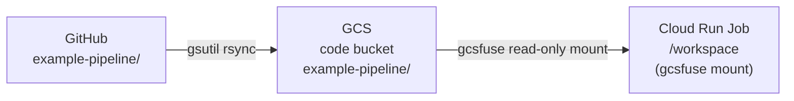

# Demo Resources (Trainer Reference)

This page is a reference for the trainer setting up and maintaining the workshop infrastructure. It is not needed by attendees — they receive the resource names directly from you on the day.

!!! warning "Do not publish real resource names"
    GCP project IDs, bucket names, and dataset names are omitted from this page intentionally. Publishing them in a public guide would invite unauthorised access to the project's BigQuery and GCS resources. Keep them in a private document and share them only with authorised attendees.

---

## Resources to set up before the workshop

| Resource | Type | Purpose |
|---|---|---|
| GCP project | GCP project | All workshop resources live here |
| BigQuery dataset | `amr_surveillance_demo` | Source data and pipeline outputs |
| BigQuery table | `amr_isolates` | 15,130 synthetic AMR isolate records (source) |
| GCS bucket | pipeline code bucket | Pipeline code synced from `example-pipeline/` |
| GCS bucket | outputs bucket | Per-attendee PDF charts |
| Cloud Run Job | `amr-pipeline` | Runs the ETL pipeline on demand |
| Service account | pipeline service account | Least-privilege identity for the Cloud Run Job |

---

## Granting attendee access

Each attendee authenticates locally using `gcloud auth application-default login` with their own Google account. Add each attendee's account to the project before the session:

```bash
PROJECT_ID=<your-project-id>
OUTPUT_BUCKET=<your-outputs-bucket>

# Run for each attendee
gcloud projects add-iam-policy-binding ${PROJECT_ID} \
  --member="user:attendee@example.com" \
  --role="roles/bigquery.dataViewer"

gcloud projects add-iam-policy-binding ${PROJECT_ID} \
  --member="user:attendee@example.com" \
  --role="roles/bigquery.jobUser"

gcloud storage buckets add-iam-policy-binding gs://${OUTPUT_BUCKET} \
  --member="user:attendee@example.com" \
  --role="roles/storage.objectAdmin"
```

!!! tip "Bulk invite from a list"
    ```bash
    while IFS= read -r email; do
      gcloud projects add-iam-policy-binding ${PROJECT_ID} \
        --member="user:${email}" \
        --role="roles/bigquery.dataViewer"
      gcloud projects add-iam-policy-binding ${PROJECT_ID} \
        --member="user:${email}" \
        --role="roles/bigquery.jobUser"
      gcloud storage buckets add-iam-policy-binding gs://${OUTPUT_BUCKET} \
        --member="user:${email}" \
        --role="roles/storage.objectAdmin"
    done < attendees.txt
    ```

---

## What to give attendees on the day

Hand each attendee a pre-filled `.env` file containing:

```bash
GCP_PROJECT_ID=<your-project-id>
BQ_DATASET=<your-dataset>
GCS_DATA_BUCKET=<your-outputs-bucket>
PIPELINE_SALT=<your-salt>
BQ_SOURCE_TABLE=amr_isolates
BQ_OUTPUT_TABLE=amr_monthly_rates
OUTPUT_PREFIX=your-name-here
```

Attendees fill in `OUTPUT_PREFIX` themselves as part of the exercise — this is deliberate. Editing `.env` is the first hands-on task in [Workshop Setup](workshop-setup.md).

Also share the workshop GCP project ID separately so attendees can run `gcloud config set project <PROJECT-ID>` in step 2.

---

## Triggering the Cloud Run Job manually

To run a demonstration execution from the command line:

```bash
gcloud run jobs execute amr-pipeline \
  --region europe-west2 \
  --update-env-vars OUTPUT_PREFIX=trainer-demo \
  --wait
```

`--update-env-vars` overrides the value for that execution only — it does not permanently change the job configuration.

To view all output folders after a session:

```bash
gsutil ls gs://<OUTPUT_BUCKET>/
```

---

## How the code gets into Cloud Run



The pipeline code is synced to the GCS code bucket and mounted read-only into the container at `/workspace`. Code changes are picked up automatically on the next execution — no container rebuild needed.

To sync updated code to GCS:

```bash
gsutil -m rsync -r example-pipeline/ gs://<CODE_BUCKET>/example-pipeline/
```

---

## One-time infrastructure setup reference

The following was run once to create the demo infrastructure. Keep this in a private document alongside the real resource names.

### BigQuery

```bash
bq mk --dataset --location=europe-west2 <PROJECT_ID>:<DATASET>
```

The `amr_isolates` source table is populated with synthetic data. Output tables are created automatically by the pipeline on first run.

### GCS buckets

```bash
gcloud storage buckets create gs://<CODE_BUCKET> \
  --location=europe-west2 \
  --uniform-bucket-level-access

gcloud storage buckets create gs://<OUTPUT_BUCKET> \
  --location=europe-west2 \
  --uniform-bucket-level-access
```

### Pipeline service account

```bash
gcloud iam service-accounts create <PIPELINE_SA_NAME> \
  --project=<PROJECT_ID> \
  --display-name="AMR Pipeline Cloud Run Job"

SA_EMAIL=<PIPELINE_SA_NAME>@<PROJECT_ID>.iam.gserviceaccount.com

gcloud storage buckets add-iam-policy-binding gs://<CODE_BUCKET> \
  --member="serviceAccount:${SA_EMAIL}" \
  --role="roles/storage.objectViewer"

gcloud storage buckets add-iam-policy-binding gs://<OUTPUT_BUCKET> \
  --member="serviceAccount:${SA_EMAIL}" \
  --role="roles/storage.objectAdmin"

gcloud projects add-iam-policy-binding <PROJECT_ID> \
  --member="serviceAccount:${SA_EMAIL}" \
  --role="roles/bigquery.dataEditor"

gcloud projects add-iam-policy-binding <PROJECT_ID> \
  --member="serviceAccount:${SA_EMAIL}" \
  --role="roles/bigquery.jobUser"

gcloud projects add-iam-policy-binding <PROJECT_ID> \
  --member="serviceAccount:${SA_EMAIL}" \
  --role="roles/secretmanager.secretAccessor"
```

### Cloud Run Job

```bash
gcloud run jobs replace example-pipeline/cloud-run-job.yml --region europe-west2
```

For the full deployment walkthrough, see [GCP Deployment](gcp-deployment.md).
