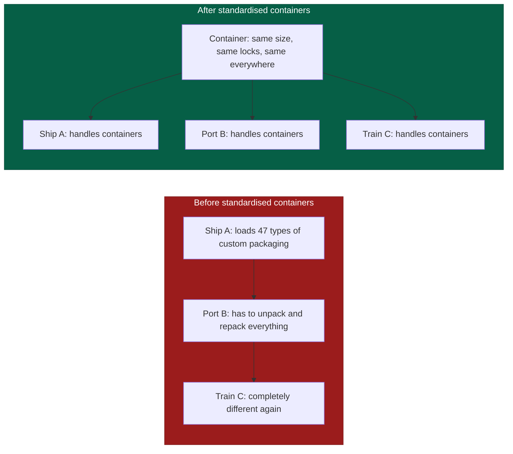
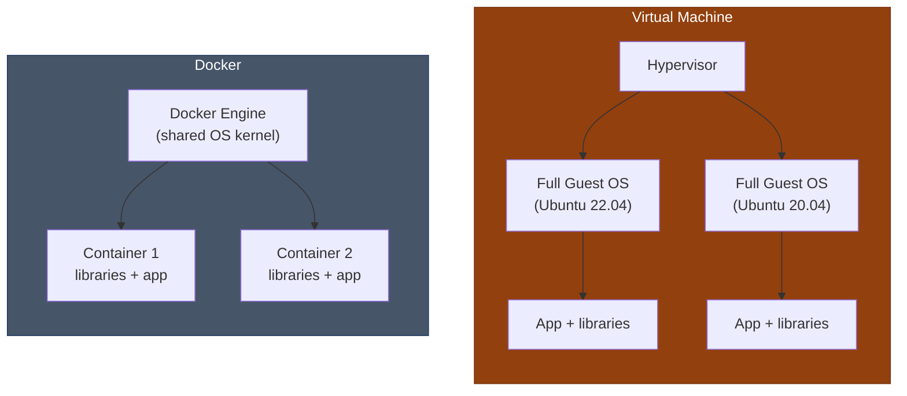
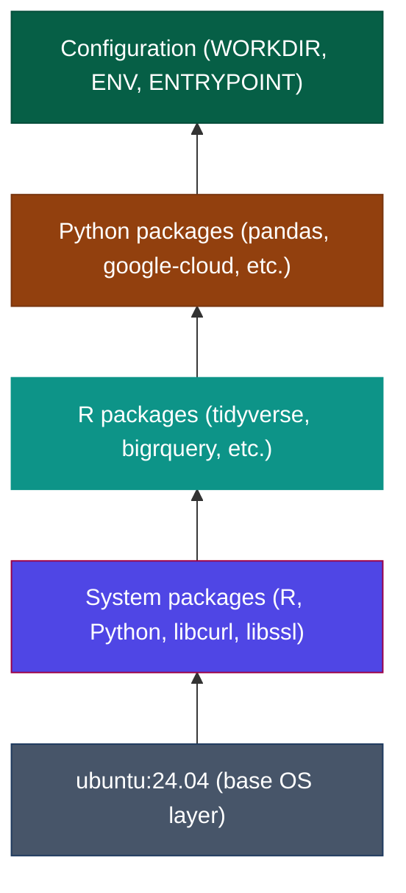
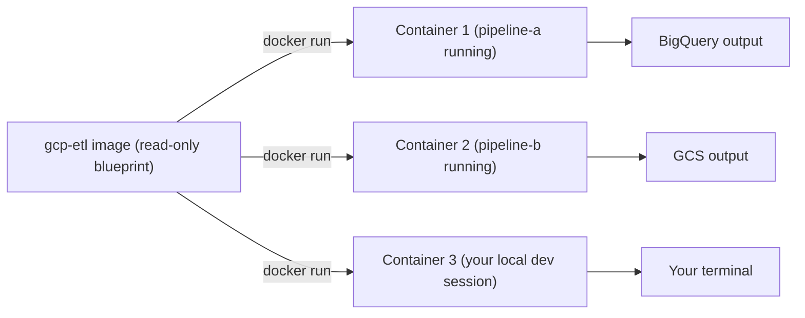
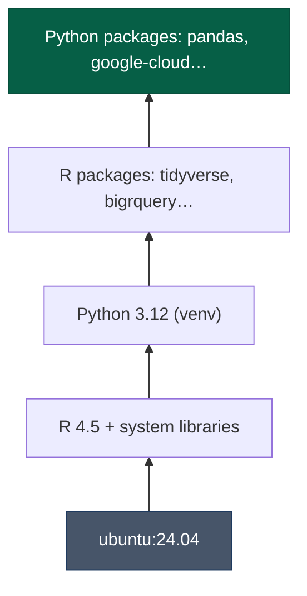
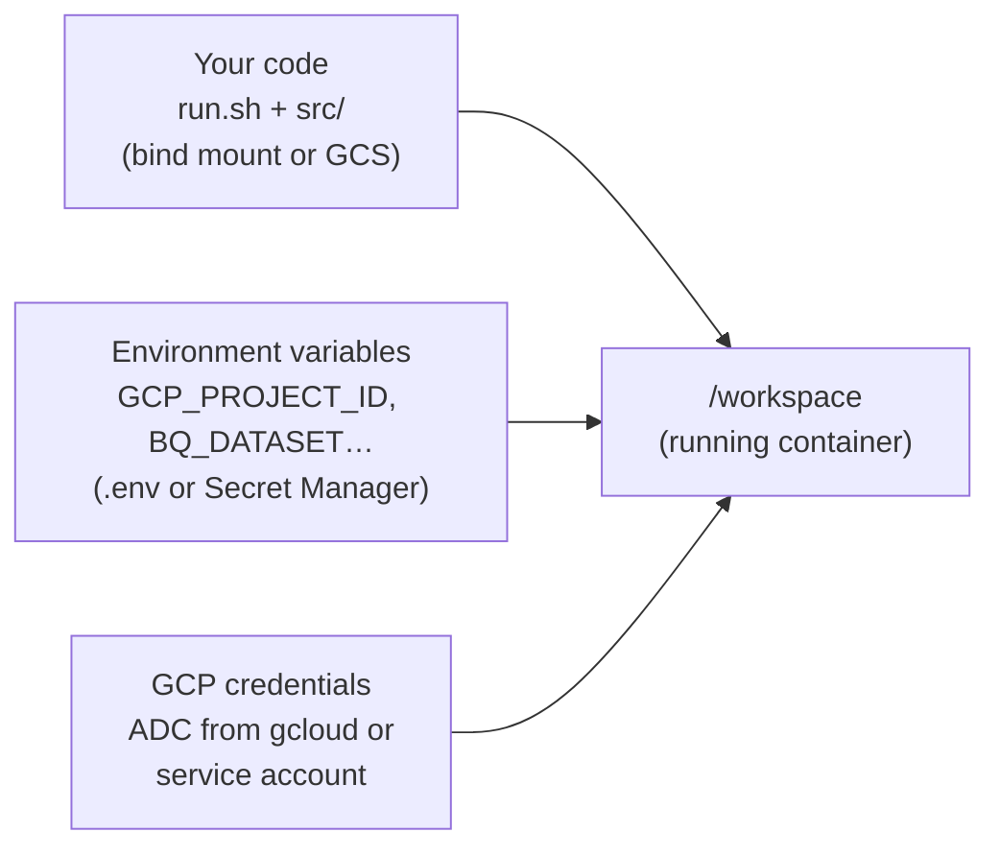
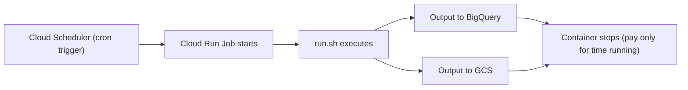
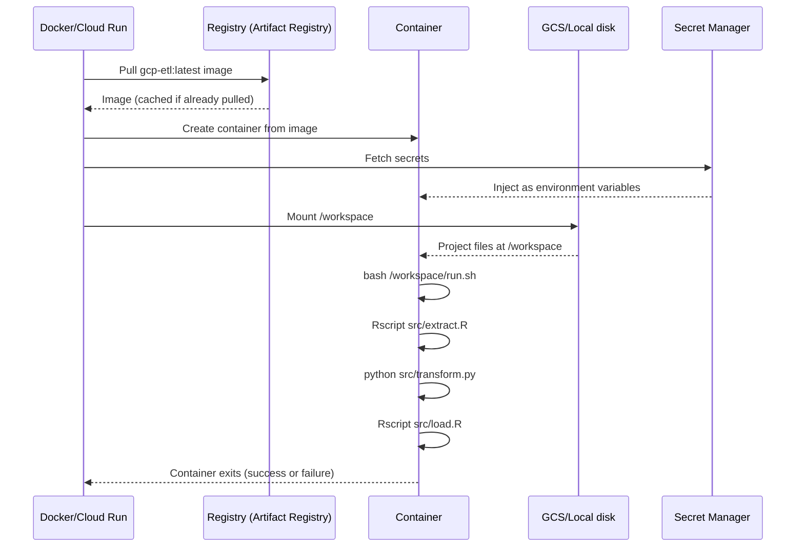

# Containers Explained

Docker containers are the foundation of the reproducibility story in this architecture. This page explains what they are, why they exist, and how they relate to the R and Python work you already do — using analogies before any technical detail.

---

## The problem Docker solves

### "It works on my machine"

You have almost certainly encountered this in its R form: a script that runs perfectly on your laptop produces an error on a colleague's machine. The error is cryptic: "object of type 'closure' is not subsettable", or "could not find function 'pivot_longer'", or a package that simply is not installed.

The root cause is usually one of:

1. **Different R version**: `dplyr 1.1.0` introduced breaking changes from `1.0.x`. If you have one and your colleague has the other, the same code produces different results.
2. **Different package versions**: `ggplot2` on your machine might be six months ahead of the version on the server.
3. **Missing system libraries**: some R packages depend on system-level libraries (`libgdal`, `libcurl`, etc.) that must be installed separately from R. These are rarely documented and rarely the same across machines.
4. **Different OS behaviour**: file encoding, locale settings, and path handling all differ between Windows, macOS, and Linux.

The traditional solution — a README that says "install these packages and make sure you have R 4.3.1" — breaks down quickly. Environments drift. READMEs get out of date. New team members spend hours getting set up.

### The Docker solution: package the environment

Docker containers package *everything* needed to run a piece of code: the operating system layer, the language runtime, system libraries, and packages. When someone runs your container, they get exactly the same environment you developed in — no setup required.

---

## The shipping container analogy

The name "container" comes from a deliberate analogy with shipping containers.

Before standardised shipping containers (invented in the 1950s), cargo was loaded and unloaded differently at every port. Goods were packed into sacks, crates, and barrels of different sizes. Each port had its own handling equipment. Loading and unloading was slow, labour-intensive, and prone to damage.

The standardised container changed everything. Same dimensions, same locking mechanism, same handling protocol. A container could transfer from a ship to a train to a lorry without ever being repacked. The port just needed to know how to handle "a container" — not the specifics of what was inside.



Software containers work the same way. The "container" is a standardised unit that:
- Contains everything needed to run the code inside it
- Looks the same to the host operating system regardless of what is inside
- Can run on any machine that supports Docker: a developer laptop, a CI server, a cloud platform

---

## Key vocabulary

| Term | Analogy | What it actually is |
|------|---------|---------------------|
| **Image** | The blueprint for a house | A read-only template describing the environment: OS, language versions, libraries, packages |
| **Container** | A house built from the blueprint | A running instance of an image — a process executing in that environment |
| **Dockerfile** | The architect's instructions | A text file that describes how to build an image, step by step |
| **Docker Hub / Artifact Registry** | A blueprint library | A registry where images are stored and can be downloaded |
| **Layer** | A floor added to a building | Each step in a Dockerfile adds a layer to the image; layers are cached and reused |

One image can spawn many containers. You might run ten containers from the same `gcp-etl` image simultaneously — one for each pipeline that is executing.

---

## Containers vs virtual machines

Both containers and virtual machines (VMs) provide isolated environments. The difference is in how much they isolate:



VMs virtualise the entire hardware and run a full copy of an OS for each guest. Containers share the host OS kernel and isolate only the application and its dependencies. This makes containers:

- **Much faster to start**: seconds vs minutes
- **Much smaller**: hundreds of megabytes vs tens of gigabytes
- **More efficient**: many containers can share one host, a VM is its own system

The tradeoff: containers share the host kernel, so they cannot run a different kernel (you cannot run a Windows kernel in a Linux container). In practice, this does not matter for our use case — we always want Linux.

---

## A Dockerfile explained

A Dockerfile is a recipe for building an image. Here is a simplified version of what our `gcp-etl` Dockerfile does:

```dockerfile
# Start from a base image (Ubuntu 24.04 with Python 3.12)
FROM ubuntu:24.04

# Install system dependencies
RUN apt-get update && apt-get install -y \
    r-base \           # R language runtime
    python3.12 \       # Python runtime
    libcurl4-openssl-dev \  # Required by R's curl package
    libssl-dev         # Required by R's httr package

# Install R packages (using renv for reproducibility)
COPY renv.lock /
RUN Rscript -e "renv::restore()"

# Install Python packages (with pinned versions)
COPY requirements.txt /
RUN pip install -r requirements.txt

# Set the working directory for the container
WORKDIR /workspace
```

Each `RUN` instruction creates a new **layer** in the image. Docker caches these layers — if you rebuild the image and only the `requirements.txt` changed, Docker reuses all the layers above it and only re-runs the `pip install` step. This makes rebuilds fast.

### The layer cake model



---

## Images vs containers: a concrete example

Think of it like a template document (image) and a filled-in copy of that document (container):



All three containers run simultaneously from the same image. Each is isolated from the others. When a container stops, it disappears — nothing is written back to the image.

---

## What lives inside vs outside the container

This is one of the most important design decisions in our architecture:

**Inside the image — built once, shared across all pipelines:**



**Injected at runtime — different for every pipeline run:**



**In the image**: everything that is the same for every pipeline — language versions, packages, system libraries. Built once, used by all.

**Mounted at runtime**: your actual pipeline code (`run.sh`, `src/`). This can be updated without rebuilding the image — you just push new code to GitHub, it syncs to GCS, and the next container run picks it up.

**Environment variables**: everything that differs between environments (project IDs, credentials, bucket names). Injected at runtime from `.env` files locally and from Secret Manager in GCP.

This separation is what makes the architecture work: the environment is stable and reproducible, but the code and configuration can change independently.

---

## Our two base images

This repository provides two images for different purposes:

### `gcp-etl` — for data pipelines

A Cloud Run **Job**: starts, runs, stops. Used for:

- Extract-Transform-Load pipelines
- Scheduled analytical scripts
- Report generation
- Model training runs



### `gcp-app` — for dashboards

A Cloud Run **Service**: always running, responds to HTTP requests. Used for:

- Shiny dashboards
- Dash (Python) dashboards

`gcp-app` extends `gcp-etl` by adding Shiny and Dash packages on top. The base environment (R version, system libraries, data packages) is identical.

---

## Running containers locally

The most common commands you will use:

```bash
# Build an image from the current directory's Dockerfile
docker build -t gcp-etl:local .

# Run a container interactively (drop into a bash shell)
docker run --rm -it gcp-etl:local bash

# Run a container with your project folder mounted and .env loaded
docker run --rm \
  --volume ~/projects/my-pipeline:/workspace \
  --env-file ~/projects/my-pipeline/.env \
  gcp-etl:local \
  bash /workspace/run.sh

# Use docker compose to do all of the above from docker-compose.yml
docker compose run --rm pipeline
docker compose run --rm pipeline bash   # open a shell instead of running the pipeline
```

### The `docker compose` shortcut

The `docker-compose.yml` file in each pipeline project pre-configures the volume mounts, environment variables, and image name. Instead of typing a long `docker run` command, you can:

```bash
# Equivalent to the long docker run above, but shorter
docker compose up

# Open an interactive shell inside the container
docker compose run --rm pipeline bash
```

Inside the container, you are in a Linux shell at `/workspace`. Your project files are there. You can run R scripts, Python scripts, and test commands exactly as they will run in Cloud Run.

---

## Understanding what happens at runtime

When you run `docker compose up` or when Cloud Run starts a container:

1. Docker pulls the image from the registry (or uses a cached version)
2. A new container is created from that image
3. Environment variables are injected (from `.env` or Secret Manager)
4. Your code directory is mounted at `/workspace` (from disk or GCS)
5. The container's entrypoint runs — usually `bash /workspace/run.sh`
6. Your scripts execute in sequence
7. The container exits and is destroyed



---

## Common Docker commands

```bash
# Images
docker images                     # list local images
docker pull ubuntu:24.04           # download an image
docker rmi gcp-etl:local           # remove a local image
docker build -t myimage:tag .      # build an image

# Containers
docker ps                          # list running containers
docker ps -a                       # list all containers including stopped
docker run --rm -it ubuntu:24.04 bash  # run interactively, remove when done
docker stop <container-id>         # stop a running container
docker rm <container-id>           # remove a stopped container

# Inspecting
docker logs <container-id>         # view container output
docker exec -it <container-id> bash # open a shell in a running container
docker inspect <container-id>      # detailed container metadata

# Docker Compose
docker compose up                  # start all services
docker compose down                # stop and remove containers
docker compose build               # rebuild images
docker compose run --rm <service> bash  # run a one-off command
```

---

!!! tip "Continue the guide"
    Next: [Managing R & Python Versions](version-management.md) — locking package versions so your container environment never drifts.

---

## Further reading

- **[Docker's official "Get Started" guide](https://docs.docker.com/get-started/)** — practical tutorials from the Docker team
- **[Play with Docker](https://labs.play-with-docker.com)** — free browser-based Docker playground, no installation needed
- **[Docker for Data Science](https://datasciencecampus.github.io/DSCA_introduction_to_docker/)** — the UK Government Data Science Campus's introduction to Docker for analysts, directly relevant to public sector R users
- **[Introduction to Containers — Google Cloud](https://cloud.google.com/learn/what-are-containers)** — Google's conceptual introduction to containers and their role in cloud computing
