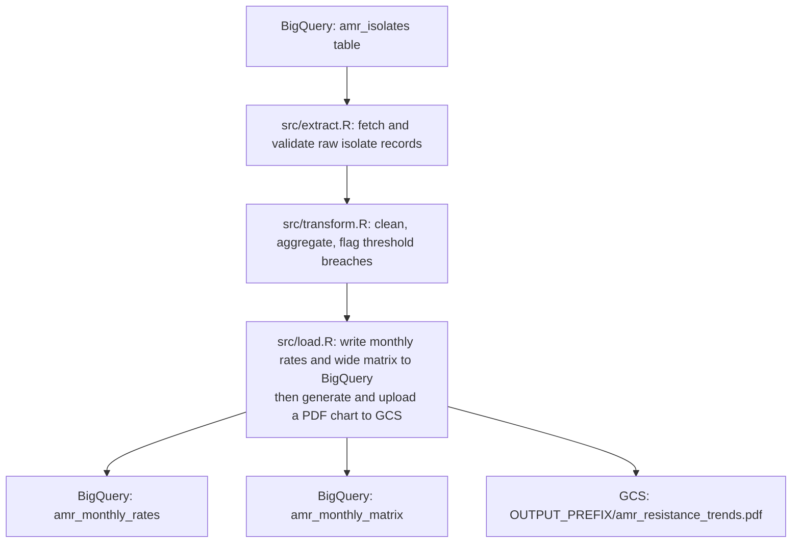

# Worked Example: AMR Surveillance Pipeline

This page walks through the [`example-pipeline/`](https://github.com/Ch3w3y/docker_gcp/tree/main/example-pipeline) directory in the repository — a complete, runnable AMR (antimicrobial resistance) surveillance pipeline that demonstrates every concept covered in this guide.

The pipeline calculates monthly resistance rates for five key organisms across five European countries, producing a 12-month time series for public health reporting.

---

## What the example does



**Organisms tracked**:

| Code | Organism | Clinical relevance |
|------|----------|-------------------|
| ECOLI | *Escherichia coli* | Leading cause of urinary tract and bloodstream infections |
| KPNEU | *Klebsiella pneumoniae* | Healthcare-associated infections, increasingly carbapenem-resistant |
| SAUR | *Staphylococcus aureus* (MRSA) | Major cause of hospital-acquired infections |
| PAER | *Pseudomonas aeruginosa* | Opportunistic pathogen, intrinsically resistant to many antibiotics |
| ABAUM | *Acinetobacter baumannii* | Critical-priority pathogen on the WHO priority list |

**Countries**: United Kingdom, Germany, France, Italy, Spain

---

## The R package functions in `R/`

The business logic lives in `R/`. These are pure functions — no database calls, no file I/O — which makes them easy to test.

### `R/extract.R`

Defines the surveillance constants and the extraction functions:

```r
# The two constants that define what we track
AMR_ORGANISMS  # named vector: code -> organism name
AMR_COUNTRIES  # named vector: ISO code -> country name

# Functions
fetch_isolates(project, dataset, table, months)  # queries BigQuery
validate_extract(df)                              # checks shape and content
```

The `validate_extract()` function is a good pattern to adopt in your own pipelines. It runs immediately after extraction and fails with a clear message if the data is missing organisms, countries, or has unexpected nulls — before any expensive processing has started.

### `R/transform.R`

All pure functions. The key design: each function does one thing and passes its result to the next:

```r
clean_isolates(df)                         # remove nulls, deduplicate, add year_month
calculate_resistance_rates(df, min_n = 10) # aggregate to rates by organism/country/month
flag_threshold_breaches(df, threshold = 50) # mark groups >= 50% resistant
pivot_to_wide(df)                           # reshape for dashboard consumption
```

These functions are pure because:

1. They take a data frame as input
2. They return a data frame as output
3. They make no external calls (no BigQuery, no file reads)

This design makes the transformation step fully testable without a cloud connection.

### `R/load.R`

Thin wrappers around the BigQuery write operations, plus one function that generates and uploads a chart:

```r
write_amr_summary(df, project, dataset, table)       # long format (primary output)
write_amr_matrix(df, project, dataset, table)        # wide format (dashboard input)
write_plot_to_gcs(df, bucket, prefix)                # ggplot2 PDF to GCS
```

`write_plot_to_gcs()` takes the monthly rates, builds a faceted ggplot2 line chart (one line per country, one panel per organism), saves it as a PDF to `/tmp`, then uploads it to GCS. The `prefix` argument controls which subfolder it lands in — this is how workshop attendees each get their own output without overwriting each other's files.

---

## The tests in `tests/testthat/`

The test suite has **32 tests** covering the key logic. None of them require a BigQuery connection — they use synthetic data created by helper functions in `setup.R`.

### What the test fixtures look like

`setup.R` provides three helper functions:

```r
make_test_isolates(n_per_group, months, resistant_fraction)
# Returns a realistic isolates data frame with configurable size and resistance rate

make_clean_isolates(...)
# Returns test_isolates already cleaned (with year_month added)

make_test_rates()
# Returns a pre-built resistance rates data frame for testing load/pivot functions
```

These allow tests to be precise about what they test:

```r
# Test that 100% resistance is handled correctly
test_that("calculate_resistance_rates handles all-resistant input", {
  df <- make_clean_isolates(n_per_group = 20, resistant_fraction = 1.0)
  result <- calculate_resistance_rates(df)
  expect_true(all(result$pct_resistant == 100))
})

# Test that low-count groups are correctly flagged
test_that("calculate_resistance_rates flags low_count groups correctly", {
  df <- make_clean_isolates(n_per_group = 5)  # 5 < min_isolates default of 10
  result <- calculate_resistance_rates(df, min_isolates = 10)
  expect_true(all(result$low_count))
})
```

Run the full test suite:

```bash
docker compose run --rm pipeline \
  Rscript -e "testthat::test_dir('tests/testthat', reporter='progress')"
```

---

## The orchestration scripts in `src/`

The `src/` scripts are thin — they call the `R/` functions but contain no business logic themselves. Each one does:

1. Source `config.R` (validates and assigns environment variables)
2. Source the `R/` files
3. Call the relevant functions in the right order
4. Write intermediate results to `/tmp/` for the next step

This separation means:

- The logic can be tested in isolation (via `R/` functions and `tests/`)
- The orchestration can change (e.g., different file paths, different calling order) without touching the logic
- A new analyst reading the code starts with `run.sh` → `src/extract.R` → `R/extract.R` and the structure is immediately clear

---

## The configuration pattern in `config.R`

`config.R` validates all required environment variables at startup and assigns them to named constants:

```r
required_env_vars <- c("GCP_PROJECT_ID", "BQ_DATASET", "GCS_DATA_BUCKET")

missing_vars <- required_env_vars[!nzchar(Sys.getenv(required_env_vars))]
if (length(missing_vars) > 0) {
  stop("Missing required environment variables: ", paste(missing_vars, collapse = ", "))
}

GCP_PROJECT_ID  <- Sys.getenv("GCP_PROJECT_ID")
BQ_DATASET      <- Sys.getenv("BQ_DATASET")
GCS_DATA_BUCKET <- Sys.getenv("GCS_DATA_BUCKET")

# Optional: a folder prefix for GCS outputs. Set to your name in a workshop.
# Outputs land at gs://{GCS_DATA_BUCKET}/{OUTPUT_PREFIX}/amr_resistance_trends.pdf
OUTPUT_PREFIX   <- Sys.getenv("OUTPUT_PREFIX", unset = "")
```

The fail-fast approach means you see a clear error at startup rather than a cryptic error halfway through a pipeline run.

---

## How the pieces fit the documentation

| Example code | Documentation page |
|---|---|
| `config.R` | [Sanitising Code for GitHub](code-sanitisation.md) — the config.R pattern |
| `R/extract.R` with constants | [Building R Packages](r-packages.md) — exported package objects |
| `R/transform.R` pure functions | [Organising Your R Code](code-organisation.md) — the pure function pattern |
| roxygen2 doc blocks | [Building R Packages](r-packages.md) — roxygen2 tags in detail |
| `tests/testthat/` | [Writing Tests](testing-guide.md) — testthat patterns |
| `src/` thin scripts | [Organising Your R Code](code-organisation.md) — thin orchestration |
| `.env.example` | [Making Code GitHub-Ready](code-readiness.md) — the .env pattern |
| `DESCRIPTION` | [Building R Packages](r-packages.md) — the DESCRIPTION file |
| `docker-compose.yml` | [How the Pipeline Works](architecture.md) — /workspace convention |

---

## Running the example with synthetic data

You do not need a live BigQuery connection to explore the example code. You can run the transform and test logic with synthetic data using the test fixtures:

```r
# In an R session (inside the Docker container):
source("/workspace/R/utils.R")
source("/workspace/R/extract.R")
source("/workspace/R/transform.R")

# Create synthetic data
set.seed(42)
raw <- make_test_isolates(n_per_group = 30, months = 12)

# Run through the pipeline
validate_extract(raw)
clean <- clean_isolates(raw)
rates <- calculate_resistance_rates(clean)
rates_flagged <- flag_threshold_breaches(rates, threshold = 40)
matrix <- pivot_to_wide(rates)

# Explore the output
head(rates_flagged)
tail(matrix)
```

This is useful for:
- Understanding how the functions work before connecting to real data
- Writing new tests
- Prototyping changes to the transform logic
