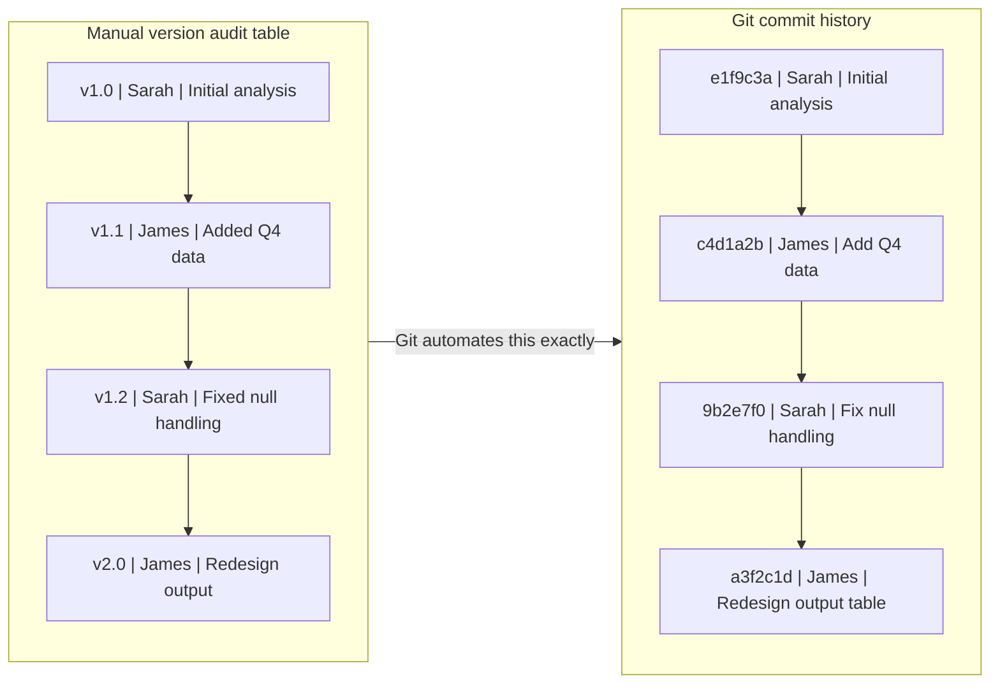
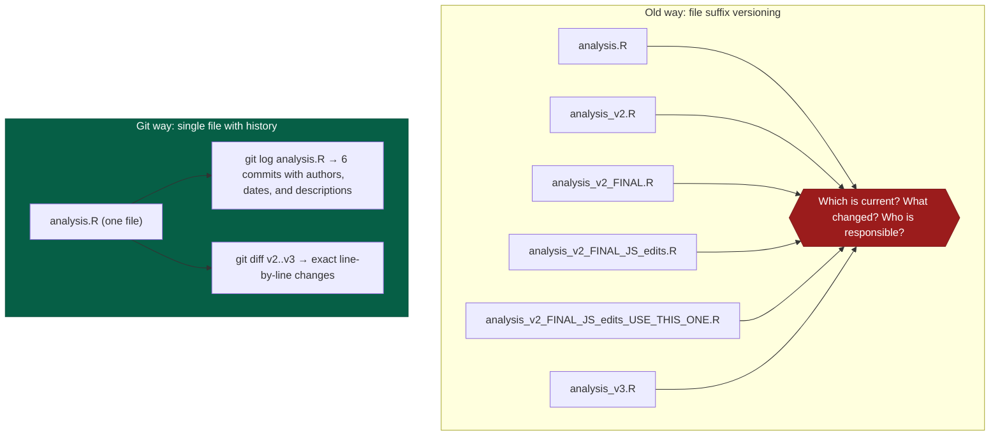
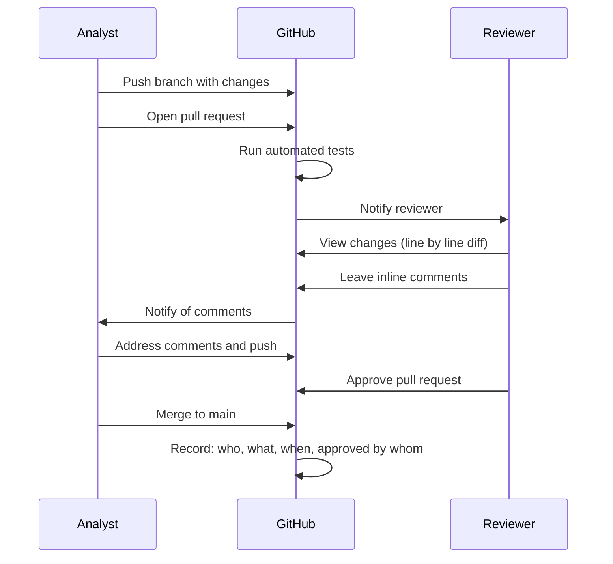
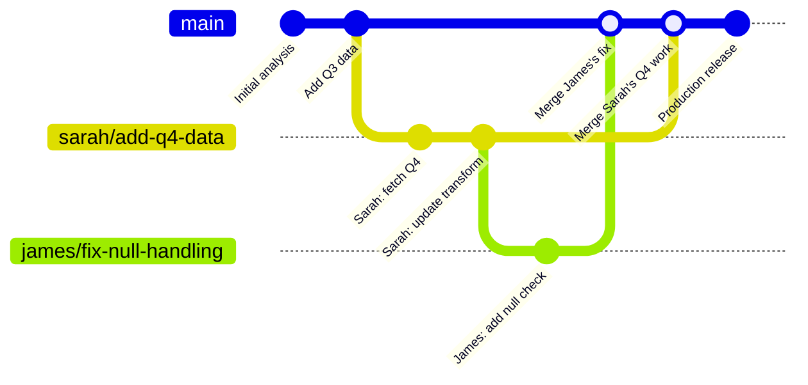

# From Shared Drives to Git

Git can seem alien at first — a whole new vocabulary, a command line interface, and a conceptual model that is nothing like anything else you have used. But if you look closely, Git is solving exactly the same problems you have been solving manually on your shared drive for years. It just solves them automatically, reliably, and completely.

This page draws a direct, detailed analogy between your current way of working and the Git model. By the end, Git should feel less like a foreign system and more like an automated version of something you already understand.

---

## The version audit table vs. `git log`

Many analytical teams maintain a spreadsheet or document to track changes to shared files — something like this:

| Version | Date | Changed by | Description of change |
|---------|------|------------|----------------------|
| v1.0 | 12/03/2024 | Sarah | Initial analysis |
| v1.1 | 15/03/2024 | James | Added Q4 data |
| v1.2 | 19/03/2024 | Sarah | Fixed null handling in extract |
| v2.0 | 02/04/2024 | James | Redesigned output table structure |

This is, fundamentally, a commit log. Every row is what Git calls a **commit**: a recorded snapshot of a change, with who made it, when, and why.

Now compare this to `git log --oneline` on a repository:

```
a3f2c1d (HEAD -> main) Redesign output table structure
9b2e7f0 Fix null handling in extract step
c4d1a2b Add Q4 data to extract query
e1f9c3a Initial analysis
```

Same information. Same structure. The difference: Git records this automatically and precisely with every change, rather than requiring someone to remember to update the spreadsheet. And Git's record includes the *exact diff* — every line that was added or removed — not just a human-written description.



---

## File suffixes vs. commit history

The most universal form of manual version control is the file suffix:

```
analysis.R
analysis_v2.R
analysis_v2_FINAL.R
analysis_v2_FINAL_JS_edits.R
analysis_v2_FINAL_JS_edits_USE_THIS_ONE.R
analysis_v3.R
analysis_v3_new_methodology.R
```

Every one of these files is trying to be a Git commit. Each filename is answering the questions: "What changed? Which one is current?"

The problem: these files accumulate. You end up with a folder full of versions, no clear indication of which is current, and no reliable way to see what changed between `analysis_v2_FINAL.R` and `analysis_v2_FINAL_JS_edits.R` without opening both and comparing them manually.

Git replaces this pattern entirely. There is **one file**: `analysis.R`. Its history is stored separately in the Git repository. To see what the file looked like at any point:

```bash
git log --oneline analysis.R          # see all commits that touched this file
git show 9b2e7f0:analysis.R           # see the file as it was at commit 9b2e7f0
git diff c4d1a2b 9b2e7f0 analysis.R  # see exactly what changed between two points
```

The folder stays clean. One file. Complete history. No suffix archaeology.



---

## Emailing "here's the latest" vs. pull requests

The current peer review process for analytical code often looks like this:

1. Analyst finishes a change
2. Analyst emails colleague: "Here's the updated script, can you have a look? Main changes are in the extract section."
3. Colleague opens the file, reads through it, replies with comments
4. Analyst makes changes, re-emails the file
5. Colleague approves
6. Analyst copies the "approved" file to the shared folder, renaming it appropriately

This works, but it has serious limitations:
- The review is ephemeral — it happens in email, not alongside the code
- There is no record that review happened, or what was discussed
- Two people cannot easily review the same change
- The approval is not linked to the specific version that was approved

A **pull request** on GitHub replaces this entire process:



The review is:
- **Inline**: comments are attached to specific lines of code
- **Permanent**: the discussion is stored in the pull request, searchable forever
- **Auditable**: the record shows who approved what version at what time
- **Linked**: the merge commit links directly to the pull request and all its discussion

---

## "Copying to the team folder" vs. merging and syncing

Your current deployment process for an approved piece of analysis might look like:

1. Analyst copies the approved file to the shared `live/` folder on the network drive
2. Colleague updates the shortcut or reference in another file
3. Send an email to say "new version is live"

In Git/GitHub/GCP:

1. Pull request is merged on GitHub
2. GitHub Actions automatically copies the code to a Google Cloud Storage bucket
3. The next time the Cloud Run Job runs, it picks up the new code automatically

No manual copy. No email. No risk of copying the wrong file. The automation is triggered by the merge event and runs the same way every time.

---

## The shared folder vs. the repository

Think of a Git repository as a supercharged version of a shared folder. It has all the things a shared folder has — files, subdirectories, a place to put your code — but it also has:

| Shared folder | Git repository |
|---------------|----------------|
| Files are whatever is currently there | Every previous state of every file is stored |
| Changes are invisible unless you manually track them | Every change is recorded as a commit with author and timestamp |
| No concept of "who is working on what" | Branches let people work in parallel without interfering |
| No peer review process | Pull requests provide structured code review |
| "Current" means the latest file saved | `main` branch is the definitive current version |
| Restoring an old version means finding a backup | `git checkout` restores any previous state instantly |
| No automated checks | CI runs tests automatically on every proposed change |

---

## Working on the same file simultaneously

One of the hardest problems with shared drives is simultaneous editing. If two people open and edit the same file at the same time:

- One person's changes are lost (last save wins)
- Or the application locks the file and the second person cannot open it
- Or you end up with a "conflict copy" that must be merged manually

Git solves this with **branches**. Each person works on their own copy (branch) of the code. Git can merge two independent sets of changes together automatically in most cases — and when it cannot (when two people edited the exact same line), it flags the conflict and asks you to resolve it explicitly. Nothing is silently lost.



Both sets of changes are preserved. The history shows exactly what each person contributed and in what order it was merged.

---

## The .gitignore file vs "don't put that in the shared folder"

Your shared folder probably has unwritten rules: "Don't put personal files in there", "Keep raw data separate", "Don't save your test outputs in the main folder". These rules live in people's heads and are enforced socially — or not at all.

Git has a file called `.gitignore` that explicitly lists files and folders that should *never* be included in the repository. Anything in `.gitignore` is invisible to Git — it will never be staged, committed, or pushed to GitHub, no matter what:

```gitignore
# Credentials — never commit these
.env
*.json

# Data files — too large for Git
data/
*.csv
*.xlsx

# R session artefacts
.RData
.Rhistory
```

This is not just tidiness — it is a security control. Database connection strings, API keys, and other secrets can be permanently excluded from the repository so that they can never accidentally be published to GitHub.

---

## Summary: the mental model shift

The core shift in thinking is this: **stop thinking of version control as something you do manually and start thinking of it as something that happens automatically as a consequence of how you save your work**.

| Old mental model | New mental model |
|-----------------|-----------------|
| Save file → rename with version suffix | Write code → commit with a message |
| Copy to shared folder | Push to GitHub |
| Email for review | Open a pull request |
| Check manually whether anything changed | `git diff` or `git log` |
| "Use the latest file" | Check out `main` |
| Restore old version from backup | `git checkout <commit>` |
| "Don't put credentials in the shared folder" | `.gitignore` |

Once this shift clicks, the Git commands start to feel obvious rather than arbitrary. The next section — [What Is Version Control?](git-fundamentals.md) — covers those commands in detail.

---

!!! tip "Continue the guide"
    Next: [What Is Version Control?](git-fundamentals.md) — the core Git concepts and commands behind the mental model you just built.
