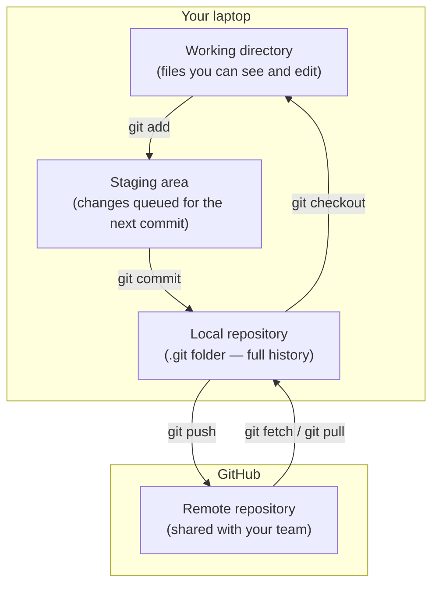
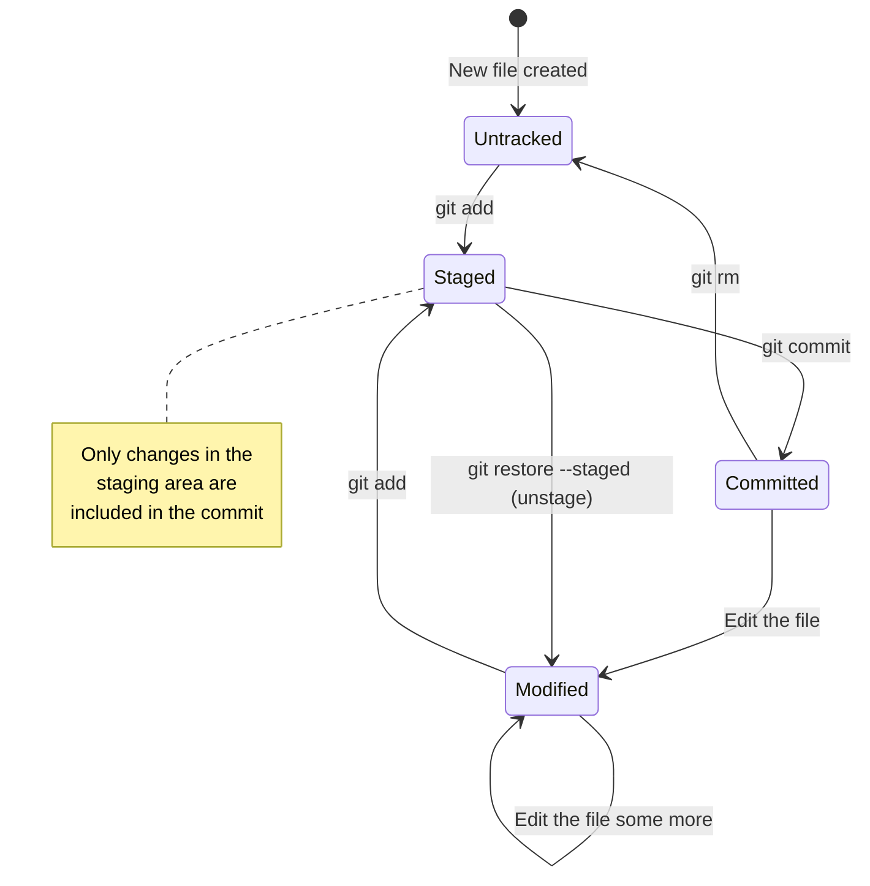
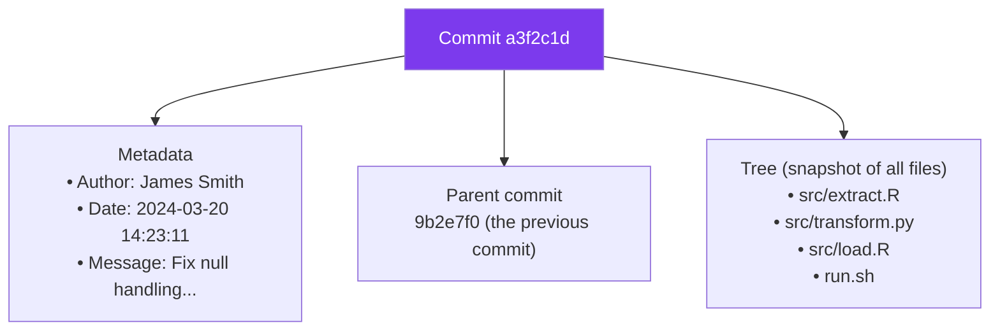
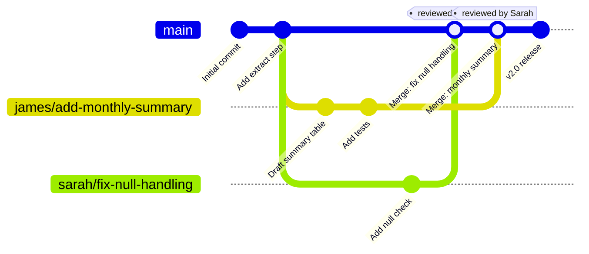
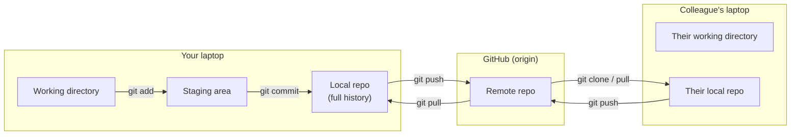
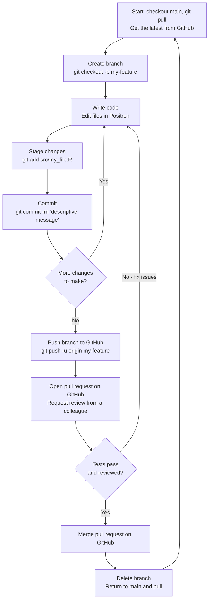

# What Is Version Control?

This page covers the core concepts of Git — the version control system underpinning everything in this workflow. Read [From Shared Drives to Git](from-shares-to-git.md) first if you have not already; it establishes the mental model. This page covers the mechanics.

---

## Contents

1. [What Git actually is](#what-git-actually-is)
2. [The three states of a file](#the-three-states-of-a-file)
3. [Your first repository](#your-first-repository)
4. [Commits: snapshots, not diffs](#commits-snapshots-not-diffs)
5. [Branches: parallel timelines](#branches-parallel-timelines)
6. [Remote repositories and GitHub](#remote-repositories-and-github)
7. [The fetch-merge-push cycle](#the-fetch-merge-push-cycle)
8. [Reading the history](#reading-the-history)
9. [Undoing things](#undoing-things)
10. [Essential command reference](#essential-command-reference)

---

## What Git actually is

Git is a **distributed version control system**. Let us unpack each word:

**Version control**: Git records every change you make to a set of files, along with who made it, when, and (if you write a good commit message) why. You can view any previous state of any file at any point in the history.

**Distributed**: Every person who works with a repository has a complete copy of it — including the full history. There is no single "server" that everyone must be connected to to work. You commit changes locally, then push them to GitHub when ready.

This is different from older systems like SVN where you checked out a single working copy from a central server and had to be connected to commit. With Git, the full repository is on your laptop.



---

## The three states of a file

Every file in a Git repository is always in one of three states. Understanding these states is the key to understanding why Git commands work the way they do.

### 1. Working directory (untracked / modified)

The working directory is the folder on your laptop — the files you can see, open, and edit in Positron or RStudio. When you create a new file or edit an existing one, it starts out in the **modified** state: Git knows the file has changed, but has not recorded that change yet.

### 2. Staging area (staged)

The staging area (also called the "index") is a preparation zone. When you run `git add`, you are saying "include this specific change in the next commit". This allows you to group related changes together into a single, logical commit, even if you have edited many files.

This is one of Git's most powerful concepts and one that confuses beginners: **you do not have to commit everything at once**. You can edit five files but only stage three of them for the next commit, leaving the other two for a later commit.

### 3. Repository (committed)

When you run `git commit`, Git takes everything in the staging area and creates a permanent snapshot — a **commit** — stored in the local repository (the `.git` folder). This commit has a unique identifier (a 40-character hash like `a3f2c1d...`), your name, the timestamp, and your commit message.



---

## Your first repository

### Option A: Start fresh (new project)

```bash
mkdir my-analysis && cd my-analysis
git init
```

This creates a `.git` folder inside `my-analysis`. That folder *is* the repository — every snapshot, every commit, the full history. The files in `my-analysis` are your working directory.

### Option B: Clone an existing repository (most common)

```bash
git clone https://github.com/yourorg/your-repo.git
cd your-repo
```

Cloning creates a complete local copy of the repository, including all its history. You are immediately ready to work.

---

## Commits: snapshots, not diffs

A common misconception is that a commit stores only what changed — a "diff" of the changes. In reality, Git stores a **snapshot** of the entire repository at the time of the commit. The ability to compare commits and show diffs is computed on the fly from those snapshots.

This distinction matters because it means:
- You can restore any commit instantly — Git does not need to "replay" a chain of diffs
- Every commit is self-contained — you can understand the repository state at any point without the full history

### Writing a good commit

```bash
git add src/extract.R
git commit -m "Fix null handling when BigQuery returns empty result"
```

**The commit message** is the most important part of a commit for your future self and your colleagues. The convention is:

- Write in the imperative mood: "Fix bug" not "Fixed bug" or "Fixes bug"
- The first line is a short summary (under 72 characters)
- If more detail is needed, leave a blank line after the summary, then add a body

```bash
git commit -m "Fix null handling when BigQuery returns empty result

The extract step was failing silently when the API returned an empty
result set. Added an explicit check and a warning message so that
downstream steps know to skip processing.

Fixes issue reported by Sarah on 2024-03-15."
```

### What a commit actually contains



---

## Branches: parallel timelines

A branch is an independent line of development. The default branch is called `main`. When you create a new branch, you create a new timeline that starts from the same point as `main` — but changes on your branch do not affect `main` until you explicitly merge them.

### Why branches matter

Without branches, any change you make immediately affects the shared codebase. If you are halfway through a change when a bug is reported, the broken state is visible to everyone. With branches:

- Your in-progress work is isolated from `main`
- Multiple people can work on different features simultaneously
- A broken branch never affects the production code

### Creating and switching branches

```bash
# Create a new branch and switch to it
git checkout -b add-monthly-summary

# Or, equivalently, in newer Git versions:
git switch -c add-monthly-summary

# Switch to an existing branch
git checkout main
git switch main        # newer syntax
```

### Visualising branches



Both sets of work proceed independently and are merged into `main` only after review.

### HEAD: where you are right now

`HEAD` is a pointer to the commit you are currently working from. Usually it points to the tip of a branch. When you switch branches, `HEAD` moves. When you commit, `HEAD` advances to the new commit.

```bash
git log --oneline   # the topmost commit is where HEAD points
```

---

## Remote repositories and GitHub

A **remote** is another copy of the repository, usually on GitHub. By convention it is named `origin`. When you clone a repository, `origin` is set automatically to the URL you cloned from.

```bash
git remote -v   # show configured remotes
# origin  https://github.com/yourorg/your-repo.git (fetch)
# origin  https://github.com/yourorg/your-repo.git (push)
```

### Push and fetch

```bash
git push origin main          # upload local commits to GitHub
git push -u origin my-branch  # push a new branch (sets upstream tracking)

git fetch origin              # download new commits from GitHub (does not merge)
git pull                      # fetch + merge (updates your current branch)
```

The `-u` flag in `git push -u origin my-branch` sets the *upstream tracking branch*. After this, you can just type `git push` or `git pull` on that branch without specifying the remote and branch name.

### The full picture: local and remote



---

## The fetch-merge-push cycle

The day-to-day rhythm of working with Git and GitHub:



---

## Reading the history

```bash
# One-line summary of recent commits
git log --oneline

# Detailed view with diffs
git log -p

# Graph view showing branches and merges
git log --oneline --graph --all

# History for a specific file
git log --oneline src/extract.R

# See what changed in a specific commit
git show a3f2c1d

# Compare two commits
git diff 9b2e7f0 a3f2c1d

# See what changed between your branch and main
git diff main...HEAD

# Who last changed each line of a file (and when)
git blame src/extract.R
```

`git blame` is particularly useful for understanding why a specific line of code exists — it shows you the commit that last modified each line, so you can look up the commit message and pull request for context.

---

## Undoing things

Git makes it safe to experiment because almost everything is reversible.

### Undo unstaged changes to a file

```bash
# Discard all uncommitted changes to a file (permanent!)
git restore src/extract.R
```

!!! warning "This is irreversible"
    `git restore` on an unstaged file discards your changes with no way to get them back. Use it carefully.

### Unstage a file (undo a `git add`)

```bash
# Remove a file from the staging area (does not touch your working directory)
git restore --staged src/extract.R
```

### Undo the last commit (not yet pushed)

```bash
# Move the commit back to staged (your changes are preserved)
git reset --soft HEAD~1

# Move the commit back to unstaged (your changes are preserved)
git reset HEAD~1
```

### Revert a commit that is already pushed

```bash
# Create a new commit that reverses the changes from a3f2c1d
# (Safe — does not rewrite history)
git revert a3f2c1d
```

`git revert` is the safe option when the commit is already on a shared branch. It creates a new commit that undoes the changes, so the history is preserved and your colleagues are not affected.

!!! danger "Never force-push to main"
    `git push --force` rewrites history on the remote. If someone has already pulled from main, their history will diverge. Force-pushing to a shared branch can destroy work. If you think you need it, ask first.

### Recover a deleted branch

```bash
# Find the commit the branch pointed to
git reflog

# Re-create the branch from that commit
git checkout -b my-recovered-branch <commit-hash>
```

`git reflog` is your emergency undo. It records every movement of `HEAD` — including branch deletions — and keeps that log for at least 30 days by default.

---

## Essential command reference

### Getting information

```bash
git status              # show current state: modified, staged, untracked files
git log --oneline       # compact history
git log --oneline --graph --all  # history with branch visualisation
git diff                # show unstaged changes
git diff --staged       # show staged changes (what will be in the next commit)
git show <commit>       # show a specific commit
git blame <file>        # show who last changed each line
```

### Branches

```bash
git branch              # list local branches
git branch -a           # list all branches including remote
git checkout -b <name>  # create and switch to new branch
git checkout <name>     # switch to existing branch
git branch -d <name>    # delete a branch (safe — checks for unmerged changes)
git merge <branch>      # merge a branch into current branch
```

### Staging and committing

```bash
git add <file>          # stage a specific file
git add -p              # interactively stage parts of a file (powerful)
git commit -m "message" # commit staged changes
git commit --amend      # modify the last commit (before pushing only)
```

### Remote operations

```bash
git remote -v           # show configured remotes
git fetch               # download new commits (does not merge)
git pull                # fetch and merge
git push                # push current branch
git push -u origin <branch>  # push new branch and set upstream
```

### Undoing

```bash
git restore <file>              # discard unstaged changes (irreversible)
git restore --staged <file>     # unstage a file
git reset HEAD~1                # undo last commit (keep changes unstaged)
git revert <commit>             # safely undo a pushed commit
git stash                       # temporarily save uncommitted changes
git stash pop                   # restore stashed changes
```

---

## Helpful resources

- **[Pro Git](https://git-scm.com/book/en/v2)** (Scott Chacon & Ben Straub) — the definitive free book on Git, available online in full
- **[Oh Shit, Git!](https://ohshitgit.com)** — how to recover from common Git mistakes, in plain English
- **[GitHub's Git guides](https://github.com/git-guides)** — short, practical walkthroughs for common tasks
- **[Visualising Git](https://git-school.github.io/visualizing-git/)** — an interactive tool that animates what Git commands do to the repository graph
- **[Learn Git Branching](https://learngitbranching.js.org/)** — an interactive browser-based Git tutorial with visualisations
