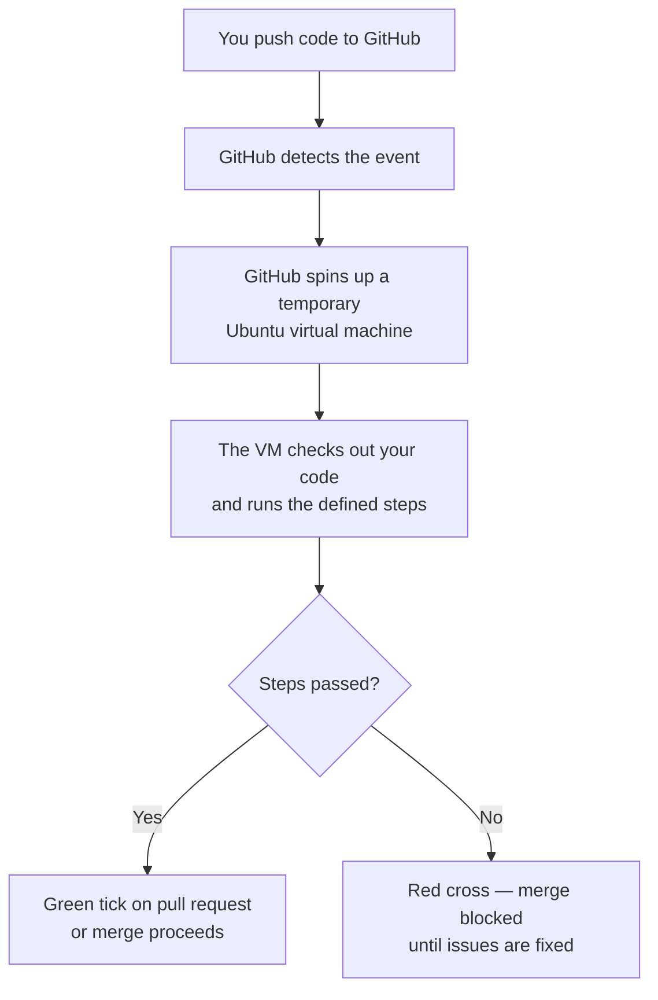
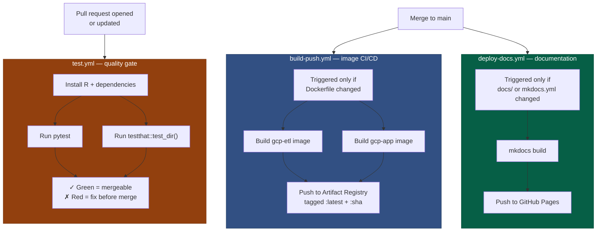

# GitHub Actions Explained

GitHub Actions is an automation service built into every GitHub repository. It lets you define sequences of steps that run automatically in response to events — a pull request being opened, a merge to main, a tag being created, or simply a schedule.

For R analysts, GitHub Actions is what makes the phrase "it deploys itself when I merge" true. This page explains how it works, how to read a workflow file, and how to interpret what you see in your pull requests.

---

## The core idea

Without automation, the path from "code on my laptop" to "code running in production" requires someone to manually run tests, check the outputs, and deploy. That is error-prone, slow, and unsustainable at scale.

GitHub Actions replaces those manual steps with a process that runs automatically:



The virtual machine is temporary — it is created fresh for each run and destroyed when finished. This means every run starts from a clean state.

---

## Anatomy of a workflow file

Workflows are defined in YAML files inside `.github/workflows/`. Here is the test workflow from this repository, annotated:

```yaml
# .github/workflows/test.yml

name: Run tests        # appears in GitHub's Actions tab

on:                    # what triggers this workflow
  pull_request:        # run when a pull request is opened or updated
    branches:
      - main           # only for PRs targeting main

jobs:                  # workflows have one or more jobs
  test:                # this job is called "test"
    runs-on: ubuntu-latest  # the OS for the temporary VM

    steps:             # the sequence of steps to run

      - name: Check out code
        uses: actions/checkout@v4
        # pulls your code from GitHub onto the VM

      - name: Set up R
        uses: r-lib/actions/setup-r@v2
        with:
          r-version: "4.5"

      - name: Install R dependencies
        run: |
          Rscript -e "install.packages('testthat')"
          Rscript -e "install.packages(c('dplyr', 'lubridate', 'tidyr', 'glue', 'rlang'))"

      - name: Run testthat
        run: |
          Rscript -e "testthat::test_dir('example-pipeline/tests/testthat', reporter = 'progress')"
```

**Key concepts:**

| YAML key | What it means |
|---|---|
| `on:` | The trigger(s) for this workflow |
| `jobs:` | Parallel groups of steps (jobs within a workflow run simultaneously by default) |
| `runs-on:` | The operating system for the VM |
| `steps:` | Sequential steps within a job |
| `uses:` | A pre-built action from the Actions marketplace |
| `run:` | Shell commands to run directly |
| `with:` | Parameters passed to a `uses` action |

---

## The three workflows in this repository

Here is how the three workflows relate to each other:



### `test.yml` — automated quality gate

**Trigger:** every pull request targeting `main`

**What it does:**

1. Checks out your code
2. Installs R and your pipeline's dependencies
3. Runs `testthat::test_dir()` against your test suite
4. Reports pass or fail back to the pull request

**What you see on GitHub:**

After opening a pull request, scroll to the bottom of the PR page. You will see a "Checks" section. A spinning circle means the tests are still running. A green tick means they passed. A red cross means at least one test failed — click "Details" to see the output.

Branch protection on `main` requires this check to pass before anyone can merge. This makes the test workflow an automated gatekeeper: code cannot reach production unless it passes tests.

---

### `build-push.yml` — Docker image CI/CD

**Trigger:** merge to `main` when either `gcp-etl/Dockerfile` or `gcp-app/Dockerfile` changes

**What it does:**

1. Authenticates to Google Artifact Registry using Workload Identity Federation
2. Builds the `gcp-etl` and `gcp-app` Docker images
3. Tags them with the commit SHA and `latest`
4. Pushes them to Artifact Registry (and GHCR)

**Why this matters:**

When a new R package needs to be added to the base environment, an analyst opens a pull request against this repo modifying `gcp-etl/install_base_packages.R`. After review, when it merges, this workflow automatically rebuilds and republishes the image. Every pipeline that uses the image gets the new package on its next Cloud Run execution — no manual image builds.

---

### `deploy-docs.yml` — documentation site

**Trigger:** merge to `main` when anything in `docs/` or `mkdocs.yml` changes

**What it does:**

1. Installs MkDocs Material
2. Runs `mkdocs build` to generate the static HTML site
3. Pushes the built site to GitHub Pages

**Result:** every change to the documentation is live at `https://ch3w3y.github.io/docker_gcp` within a few minutes of merging.

---

## Reading a failing workflow run

When the red cross appears on your pull request, here is how to diagnose it:

1. Click **Details** next to the failing check
2. In the Actions tab, click the failing step to expand its output
3. Read the output from the bottom up — R and Python errors are at the end

Common failure patterns:

| What you see | Likely cause |
|---|---|
| `Error in library(packagename) : there is no package called 'packagename'` | A package your code needs is not installed in the CI environment |
| `Error: Test failures: X` | One or more testthat tests failed — the test names are listed above the error |
| `Cannot find file: /workspace/...` | A path in a test references `/workspace/` but CI does not mount the container |
| `Error: unused argument (...)` | Function signature changed; a test is calling it with the old arguments |

**Reproduce it locally** before guessing at a fix:

```bash
# Inside the Docker container, run exactly what CI runs
docker compose run --rm pipeline \
  Rscript -e "testthat::test_dir('tests/testthat', reporter='progress')"
```

If it passes locally but fails in CI, the difference is usually in what packages are installed, not in your code.

---

## What analysts do not need to touch

You do not need to modify the workflow files in `.github/workflows/`. They are owned by the platform team. Your responsibilities with respect to GitHub Actions are:

- **Write tests** — the test workflow runs whatever is in `tests/testthat/`
- **Keep your tests green** — fix failing tests before asking for review
- **Understand the output** — be able to read a failing workflow run

You do not need to understand how Workload Identity Federation works, how Docker images are built, or how GCS syncs are triggered. Those are handled by the existing workflows.

!!! tip "Workflow files as documentation"
    Even though you do not need to modify them, reading `.github/workflows/test.yml` is a precise description of how your code is tested in CI. If you are not sure whether CI installs a particular package, read the workflow file — it tells you exactly what gets set up.

---

## Scheduling workflows

GitHub Actions also supports scheduled triggers — useful for generating regular reports independently of code changes:

```yaml
on:
  schedule:
    - cron: "0 7 * * 1"   # 07:00 every Monday
```

This is how the demo output generation workflow works — it regenerates charts from synthetic data on a schedule and uploads them to the public GCS bucket.

> **Further reading**: [GitHub Actions documentation](https://docs.github.com/en/actions) | [Cron syntax](https://crontab.guru)

---

## Common patterns you will encounter

### Secrets in workflows

Workflows access GitHub Secrets (stored in repository settings) as environment variables:

```yaml
env:
  GCP_PROJECT_ID: ${{ secrets.GCP_PROJECT_ID }}
```

You never see the secret value in logs — GitHub masks it automatically.

### Conditional steps

Steps can run conditionally based on which files changed:

```yaml
- name: Build and push image
  if: contains(github.event.head_commit.modified, 'gcp-etl/Dockerfile')
```

### Matrix builds

Test the same code against multiple configurations simultaneously:

```yaml
strategy:
  matrix:
    r-version: ["4.4", "4.5"]
```

This runs the test job once per R version in parallel, useful for checking backwards compatibility.
