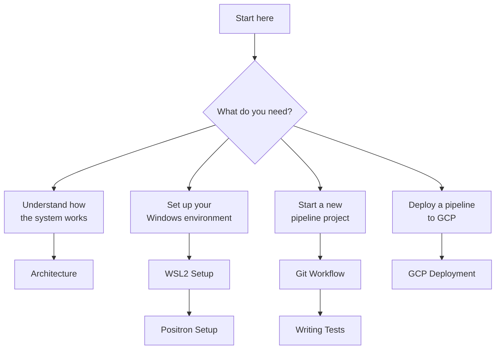
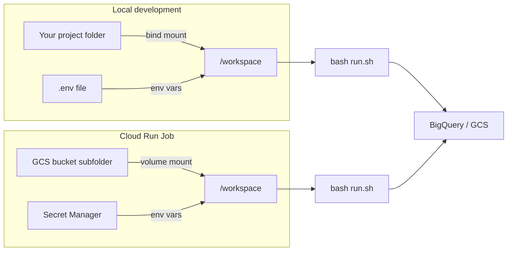

# GCP Pipeline Boilerplate

A practical starting point for deploying data pipelines to Google Cloud Platform
using Docker containers — written for public sector data analysts and data
scientists, not cloud engineers.

The goal is straightforward: write your R and Python scripts the same way you
always have, and have them run reliably on a schedule in the cloud without
managing servers, environments, or deployment steps manually.

---

## Who this is for

This boilerplate and documentation is intended for teams where:

- Analysts and data scientists write the pipeline logic (R, Python, or both)
- A small platform or infrastructure team manages the cloud environment
- Pipelines need to run on a schedule and produce outputs to BigQuery or GCS
- Reproducibility and peer review of code changes are required

No prior cloud or DevOps experience is assumed. The documentation is written
to be readable by someone who has used R or Python for analysis but has not
worked with containers or cloud infrastructure before.

---

## Where to start

Your starting point depends on what you need to do:

---

## Recommended reading order for new analysts

If you are setting up for the first time, work through the documentation in
this order:

1. [**Architecture**](architecture.md) — understand how the system fits together before touching anything. Start here even if you are eager to get going.
2. [**WSL2 Setup**](wsl-setup.md) — get Linux and Docker running on your Windows laptop.
3. [**Positron Setup**](positron-setup.md) — connect your IDE to the development container.
4. [**Git and GitHub**](git-workflow.md) — learn the branch-and-pull-request workflow used for all changes.
5. [**Writing Tests**](testing-guide.md) — write pytest and testthat tests for your pipeline functions.

Platform and infrastructure engineers should go directly to [GCP Deployment](gcp-deployment.md).

---

## The core idea in one diagram

Your code never lives inside the Docker image. The image holds the tools
(Python, R, packages). Your code is mounted in at runtime — from your laptop
locally, and from a GCS bucket in the cloud — always at the same path.

The same `run.sh`, the same scripts, the same environment — the only difference
is where the code comes from and where the credentials come from.

---

## What the repo contains

| Directory / File | Purpose |
|---|---|
| `gcp-etl/` | Dockerfile and dependencies for the ETL base image |
| `gcp-app/` | Dockerfile and dependencies for the Dash/Shiny base image |
| `pipeline-template/` | Template to copy when starting a new pipeline project |
| `docs/` | This documentation |
| `.github/workflows/` | CI/CD: automated tests, image builds, GCS sync |
| `.devcontainer/` | Devcontainer configuration for Positron/VS Code |

The [repository on GitHub](https://github.com/Ch3w3y/docker_gcp) holds all
source files. This site explains how to use them.
