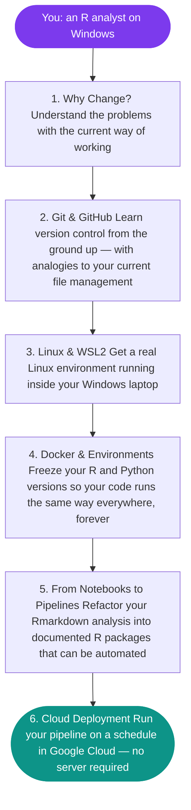

# R to the Cloud

**A practical guide for public sector analysts transitioning from local R and RStudio to modern, collaborative, cloud-ready workflows.**

---

You already know R. You have been doing real, valuable analytical work — building models, writing reports, cleaning messy datasets. This guide is not about replacing that skill. It is about giving your work a foundation that makes it **reproducible**, **reviewable**, and ready to **run automatically in the cloud** — without you sitting at your desk waiting for it to finish.

This guide is written for analysts, not engineers. Every concept is explained in plain language, with analogies drawn from tools and ways of working you already understand.

---

## Where you are now vs where you are going

```mermaid
flowchart LR
    subgraph NOW["Where you are now"]
        direction TB
        N1["R scripts on a Shared Network Drive"]
        N2["analysis_final_v2b_CONFIRMED.R"]
        N3["Works on my machine, fails on yours"]
        N4["Manual version audit table"]
        N5["Email outputs to colleagues"]
        N6["Copy-paste code between projects"]
    end

    subgraph FUTURE["Where you are going"]
        direction TB
        F1["R packages in a GitHub repository"]
        F2["Every change tracked with a clear message"]
        F3["Same environment everywhere — always"]
        F4["Complete automatic history of every change"]
        F5["Pipelines run on a schedule in the cloud"]
        F6["Modular, documented functions you can reuse"]
    end

    NOW -->|"This guide"| FUTURE

    style NOW fill:#fef3c7,stroke:#d97706
    style FUTURE fill:#d1fae5,stroke:#059669
```

---

## Who this guide is for

This guide is written for people who:

- Write R code for data analysis, and are reasonably comfortable with it
- Work on a Windows laptop, probably using RStudio
- Store code and outputs on a shared network drive (Samba/SMB)
- Have little or no experience with Git, Linux, Docker, or cloud platforms
- Work in a public sector organisation where governance, auditability, and reproducibility matter

You do **not** need prior experience with the command line, Linux, containers, or cloud platforms. Each concept is introduced from first principles.

---

## The learning journey

Work through this guide in order — each section builds on the previous one.

---

## Reading order

| Step | Page | What you will learn |
|:----:|------|---------------------|
| 1 | [The Case for Modern Workflows](case-for-change.md) | Why this change matters and what you gain from it |
| 2 | [From Shared Drives to Git](from-shares-to-git.md) | How Git maps onto your current file management habits |
| 3 | [What Is Version Control?](git-fundamentals.md) | Core Git concepts and commands, explained with diagrams |
| 4 | [The GitHub Workflow](git-workflow.md) | Day-to-day branch-and-pull-request workflow |
| 5 | [Making Code GitHub-Ready](code-readiness.md) | Removing secrets, hardcoded paths, and other blockers |
| 6 | [What Is Linux?](what-is-linux.md) | Linux and WSL2 explained with plain analogies |
| 7 | [Setting Up WSL2](wsl-setup.md) | Step-by-step environment setup on Windows |
| 8 | [Containers Explained](docker-containers.md) | What Docker is and why it solves the reproducibility problem |
| 9 | [Managing R & Python Versions](version-management.md) | Locking dependencies with `renv` and `requirements.txt` |
| 10 | [Organising Your R Code](code-organisation.md) | From ad-hoc scripts to structured, portable projects |
| 11 | [Sanitising Code for GitHub](code-sanitisation.md) | Patterns for safe, secrets-free, portable code |
| 12 | [Building R Packages](r-packages.md) | Functions, roxygen2 documentation, and package structure |
| 13 | [Writing Tests](testing-guide.md) | Automated testing with `testthat` and `pytest` |
| 14 | [How the Pipeline Works](architecture.md) | The full cloud architecture |
| 15 | [GCP Deployment](gcp-deployment.md) | Deploying to Cloud Run (platform team) |

---

## The tools you will use

| Tool | What it is | Why we use it |
|------|-----------|---------------|
| **Git** | Version control system | Tracks every change to your code with its full history |
| **GitHub** | Web platform for Git repositories | Enables collaboration, code review, and automation |
| **WSL2** | Linux running inside Windows | Matches the environment of our cloud servers |
| **Docker** | Container platform | Ensures code runs identically on any machine and in the cloud |
| **Positron** | IDE built on VS Code, from the RStudio team | R and Python in one editor, with excellent WSL2 support |
| **renv** | R package manager | Locks R package versions for reproducible environments |
| **GCP Cloud Run** | Serverless container platform | Runs pipelines on a schedule — no server to maintain |

---

## A note on pace

This material covers a lot of ground. Some concepts — especially around Linux and containers — may feel abstract at first. That is completely normal. The goal is not to make you an expert in any single tool, but to give you enough understanding to:

1. Use these tools with confidence day to day
2. Know what questions to ask when something goes wrong
3. Understand how your code gets from your laptop to a production cloud environment

Return to sections as you need them. This documentation is designed to serve as a reference as much as a tutorial.

---

## Getting help

- **Platform team** — for GCP access, Docker Desktop installation, or WSL2 setup issues
- **This repository** — the [GitHub repo](https://github.com/Ch3w3y/docker_gcp) contains all Dockerfiles, pipeline templates, and source code
- **Community resources** — linked at the bottom of each section
