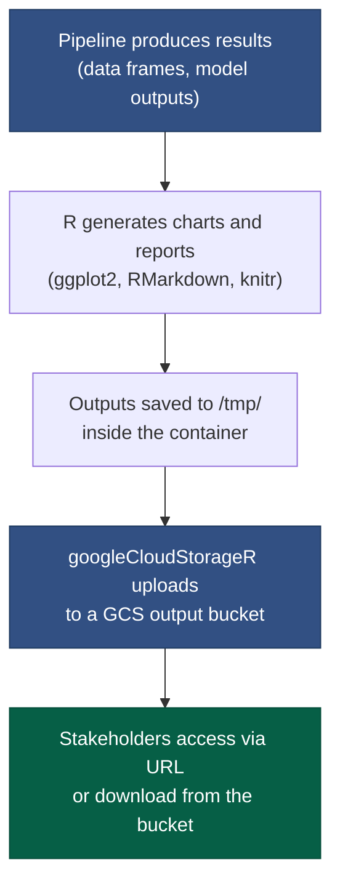

# Generating and Sharing Outputs

Your pipeline produces results. Getting those results to the people who need them — colleagues, managers, stakeholders — requires a deliberate pattern for how outputs are saved, formatted, and shared. This page covers generating publication-ready visualisations and reports from R, uploading them to Google Cloud Storage, and making them accessible via a public URL.

---

## The output problem in analytical pipelines

In a traditional workflow, you might:

1. Run your analysis in RStudio
2. Export a plot with `ggsave()` to your desktop
3. Attach it to an email
4. Hope the recipient is looking at the right version

In a cloud pipeline, none of that is available. The pipeline runs inside a container, at midnight, with no screen and no email client. You need a different pattern.

The solution:



The pipeline writes to `/tmp/` during execution, uploads to GCS at the end, and terminates. The outputs persist in GCS regardless of what happens to the container. Stakeholders access them via a stable URL.

---

## Publication-ready ggplot2 charts

### A consistent theme

Before building charts for sharing, establish a consistent theme. Apply it once and use it across all plots in your pipeline:

```r
library(ggplot2)

# Define a consistent theme for all pipeline outputs
pipeline_theme <- theme_minimal(base_size = 12) +
  theme(
    plot.title    = element_text(face = "bold", size = 14, margin = margin(b = 8)),
    plot.subtitle = element_text(colour = "grey40", size = 11, margin = margin(b = 12)),
    plot.caption  = element_text(colour = "grey60", size = 9, margin = margin(t = 8)),
    panel.grid.minor = element_blank(),
    legend.position  = "bottom",
    legend.title     = element_text(face = "bold")
  )

# Set as global default
theme_set(pipeline_theme)
```

### Saving to a file

Always specify dimensions and resolution explicitly when saving for sharing:

```r
# PNG for web and email (raster, fixed pixel dimensions)
ggsave(
  filename = "/tmp/resistance_trends.png",
  plot     = p,
  width    = 24,
  height   = 14,
  units    = "cm",
  dpi      = 150
)

# PDF for printed reports and presentations (vector, infinitely scalable)
ggsave(
  filename = "/tmp/resistance_trends.pdf",
  plot     = p,
  width    = 24,
  height   = 14,
  units    = "cm"
)
```

!!! tip "PDF vs PNG"
    Use **PDF** when outputs go into Word/PowerPoint presentations or printed reports — it scales without pixelation.
    Use **PNG** for dashboards, web pages, and email where file size matters.

---

## Uploading to GCS

### Installing the package

`googleCloudStorageR` is included in the `gcp-etl` base image. No installation required in Cloud Run.

For local development, make sure it is listed in your `DESCRIPTION` (if using a package) or available in your environment:

```r
# Local check
library(googleCloudStorageR)
```

### Authentication

Inside Cloud Run, authentication uses the attached service account automatically — no code required.

Locally, ensure you have run `gcloud auth application-default login` and that `~/.config/gcloud/` is mounted into the container (the provided `docker-compose.yml` already does this).

### Uploading a file

```r
library(googleCloudStorageR)

# Set the bucket from the environment (never hardcode)
output_bucket <- Sys.getenv("GCS_OUTPUT_BUCKET")

gcs_upload(
  file          = "/tmp/resistance_trends.png",
  bucket        = output_bucket,
  name          = "amr/2025-01/resistance_trends.png",   # path inside the bucket
  predefinedAcl = "bucketLevel"                           # use bucket-level IAM
)
```

### Uploading multiple outputs in a loop

```r
outputs <- list(
  list(file = "/tmp/resistance_trends.png",   gcs_path = "amr/2025-01/resistance_trends.png"),
  list(file = "/tmp/country_heatmap.pdf",     gcs_path = "amr/2025-01/country_heatmap.pdf"),
  list(file = "/tmp/threshold_breaches.png",  gcs_path = "amr/2025-01/threshold_breaches.png")
)

purrr::walk(outputs, function(o) {
  log_message("Uploading: ", o$gcs_path)
  gcs_upload(
    file          = o$file,
    bucket        = output_bucket,
    name          = o$gcs_path,
    predefinedAcl = "bucketLevel"
  )
})
```

### Including date-stamped paths

Use the pipeline run date to organise outputs chronologically:

```r
run_date <- format(Sys.Date(), "%Y-%m")  # e.g. "2025-01"

gcs_upload(
  file   = "/tmp/resistance_trends.png",
  bucket = output_bucket,
  name   = glue::glue("amr/{run_date}/resistance_trends.png")
)
```

This creates a clear folder structure in the bucket:

```
gs://your-output-bucket/
├── amr/
│   ├── 2024-11/
│   │   ├── resistance_trends.png
│   │   └── country_heatmap.pdf
│   ├── 2024-12/
│   │   ├── resistance_trends.png
│   │   └── country_heatmap.pdf
│   └── 2025-01/
│       ├── resistance_trends.png
│       └── country_heatmap.pdf
```

---

## Making outputs publicly accessible

By default, GCS objects are private — only authenticated users with the right IAM roles can access them. For sharing with stakeholders who do not have GCP accounts, you have two options.

### Option 1: Public bucket (simplest)

A public GCS bucket allows anyone with the URL to download objects. Suitable for demo outputs and non-sensitive summary reports.

The platform team sets this up once:

```bash
# Make the bucket publicly readable
gcloud storage buckets add-iam-policy-binding gs://your-output-bucket \
  --member="allUsers" \
  --role="roles/storage.objectViewer"
```

Once set, every object in the bucket is accessible at:

```
https://storage.googleapis.com/BUCKET_NAME/PATH/TO/FILE.png
```

For example:

```
https://storage.googleapis.com/amr-demo-outputs/amr/2025-01/resistance_trends.png
```

!!! warning "Only use public buckets for non-sensitive outputs"
    Do not make a bucket public if it contains any patient data, internal identifiers, or anything that should not be publicly visible.
    For summary statistics and aggregated outputs (like AMR resistance rates), public access is appropriate.

### Option 2: Signed URLs (access without full GCP access)

Signed URLs grant time-limited access to a private object. Useful for sharing internal reports with stakeholders who do not have GCP accounts.

```r
library(googleCloudStorageR)

# Generate a URL valid for 7 days
signed_url <- gcs_signed_url(
  object  = "amr/2025-01/resistance_trends.pdf",
  bucket  = output_bucket,
  expiry  = 7 * 24 * 60 * 60   # 7 days in seconds
)

cat("Shareable link (valid 7 days):\n", signed_url, "\n")
```

The URL can be pasted into an email or a Teams message. It expires automatically after the specified period.

---

## Automated RMarkdown reports

For stakeholders who prefer a full narrative report rather than individual images, RMarkdown can generate HTML or PDF documents incorporating both prose and visualisations.

### A minimal reporting script

```r
# src/report.R — runs at the end of the pipeline

library(rmarkdown)

# Pass pipeline outputs as parameters into the report template
render(
  input       = "/workspace/report_template.Rmd",
  output_file = "/tmp/amr_surveillance_report.html",
  params      = list(
    run_date   = format(Sys.Date(), "%B %Y"),
    rates_data = rates_flagged  # the processed data frame from earlier steps
  )
)

# Upload the report to GCS
gcs_upload(
  file   = "/tmp/amr_surveillance_report.html",
  bucket = Sys.getenv("GCS_OUTPUT_BUCKET"),
  name   = glue::glue("amr/{format(Sys.Date(), '%Y-%m')}/surveillance_report.html")
)
```

### `report_template.Rmd`

```markdown
---
title: "AMR Surveillance Report"
date: "`r params$run_date`"
params:
  run_date: ""
  rates_data: !r data.frame()
output:
  html_document:
    theme: flatly
    toc: true
---

## Summary

This report summarises antimicrobial resistance surveillance data for
`r params$run_date`.

## Resistance trends

```{r, echo=FALSE, fig.width=10, fig.height=6}
params$rates_data |>
  ggplot(aes(x = year_month, y = pct_resistant, colour = organism_code)) +
  geom_line() +
  facet_wrap(~country_code) +
  labs(title = "Monthly AMR resistance rates", x = NULL, y = "% resistant")
```
```

!!! note "RMarkdown execution inside Docker"
    Pandoc is required to render RMarkdown. The `gcp-etl` image includes it.
    If you add `knitr` and `rmarkdown` to your `DESCRIPTION`, they will be available at render time.

---

## Example: full output step

Here is what a complete `src/report.R` step looks like in the AMR example pipeline:

```r
#!/usr/bin/env Rscript
# src/report.R
# Generates ggplot2 outputs and uploads them to GCS.
# Reads from /tmp/amr_rates_flagged.rds (produced by src/transform.R).

source("/workspace/config.R")
source("/workspace/R/utils.R")

library(ggplot2)
library(googleCloudStorageR)
library(dplyr)
library(glue)

log_message("Report step started")

rates  <- readRDS("/tmp/amr_rates_flagged.rds")
bucket <- GCS_OUTPUT_BUCKET  # set in config.R from env var
period <- format(Sys.Date(), "%Y-%m")

# ---- Figure 1: Resistance trends by organism ----

p1 <- rates |>
  filter(!low_count) |>
  ggplot(aes(x = year_month, y = pct_resistant,
             colour = organism_code, group = organism_code)) +
  geom_line(linewidth = 0.8) +
  geom_point(size = 1.5, alpha = 0.7) +
  geom_hline(yintercept = 50, linetype = "dashed", colour = "firebrick", alpha = 0.5) +
  facet_wrap(~country_code, ncol = 5) +
  scale_y_continuous(limits = c(0, 100), labels = scales::percent_format(scale = 1)) +
  scale_colour_brewer(palette = "Set2") +
  labs(
    title    = "Antimicrobial Resistance Trends",
    subtitle = glue("12-month surveillance period ending {period}"),
    x        = NULL,
    y        = "% isolates resistant",
    colour   = "Organism",
    caption  = "Dashed line: 50% resistance alert threshold. Groups with <10 isolates excluded."
  )

path1 <- "/tmp/resistance_trends.pdf"
ggsave(path1, p1, width = 28, height = 16, units = "cm")
log_message("Figure 1 saved: ", path1)

# ---- Figure 2: Country heatmap ----

p2 <- rates |>
  filter(!low_count) |>
  group_by(organism_code, country_code) |>
  summarise(mean_pct = mean(pct_resistant, na.rm = TRUE), .groups = "drop") |>
  ggplot(aes(x = country_code, y = organism_code, fill = mean_pct)) +
  geom_tile(colour = "white", linewidth = 0.5) +
  geom_text(aes(label = sprintf("%.0f%%", mean_pct)), size = 3.5, fontface = "bold") +
  scale_fill_gradient2(
    low      = "#2166ac",
    mid      = "#f7f7f7",
    high     = "#d73027",
    midpoint = 50,
    limits   = c(0, 100),
    name     = "Mean % resistant"
  ) +
  labs(
    title    = "Mean Resistance Rate: Organism × Country",
    subtitle = glue("12-month period ending {period}"),
    x        = "Country",
    y        = "Organism"
  ) +
  theme(legend.position = "right")

path2 <- "/tmp/country_heatmap.pdf"
ggsave(path2, p2, width = 18, height = 12, units = "cm")
log_message("Figure 2 saved: ", path2)

# ---- Upload all outputs ----

uploads <- list(
  list(local = path1, gcs = glue("amr/{period}/resistance_trends.pdf")),
  list(local = path2, gcs = glue("amr/{period}/country_heatmap.pdf"))
)

purrr::walk(uploads, function(u) {
  log_message("Uploading: ", u$gcs)
  gcs_upload(u$local, bucket = bucket, name = u$gcs, predefinedAcl = "bucketLevel")
})

log_message("Report step complete. Outputs uploaded to gs://", bucket, "/amr/", period, "/")
```

---

## Adding the report step to `run.sh`

```bash
#!/bin/bash
set -euo pipefail

echo "[$(date -u +%Y-%m-%dT%H:%M:%SZ)] Starting AMR surveillance pipeline"

Rscript /workspace/src/extract.R
Rscript /workspace/src/transform.R
Rscript /workspace/src/load.R
Rscript /workspace/src/report.R    # <-- new step

echo "[$(date -u +%Y-%m-%dT%H:%M:%SZ)] Pipeline complete"
```

`set -euo pipefail` ensures the pipeline stops immediately if the report step fails, so a partial upload never silently replaces a complete one.

---

## Further reading

- [googleCloudStorageR documentation](https://code.markedmondson.me/googleCloudStorageR/)
- [ggplot2 themes documentation](https://ggplot2.tidyverse.org/reference/theme.html)
- [RMarkdown: The Definitive Guide](https://bookdown.org/yihui/rmarkdown/)
- [GCS signed URLs](https://cloud.google.com/storage/docs/access-control/signed-urls)
