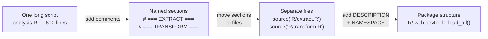
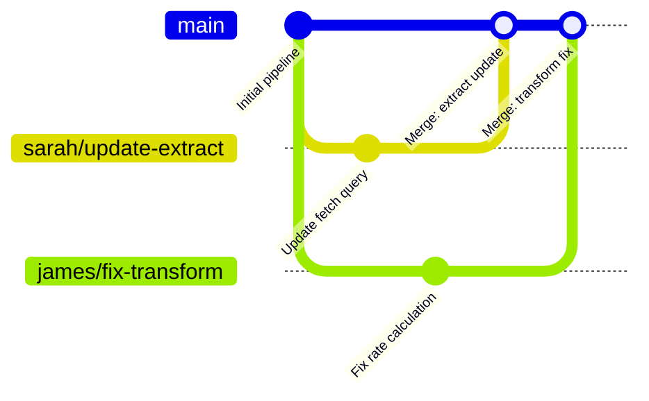
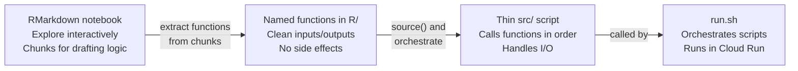
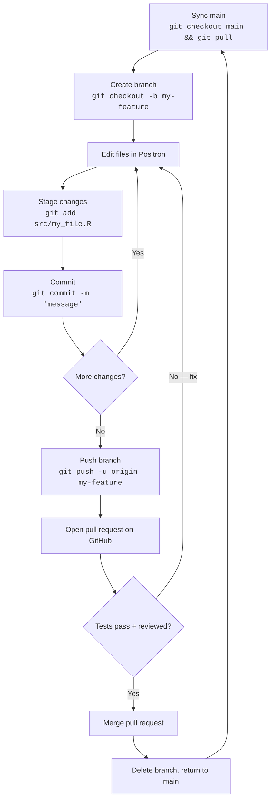
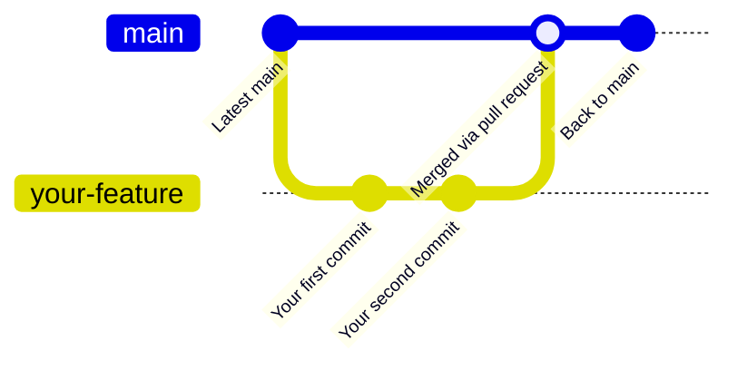
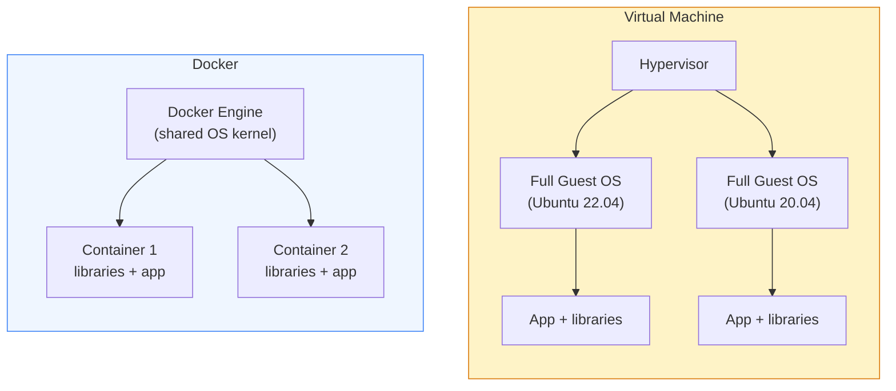
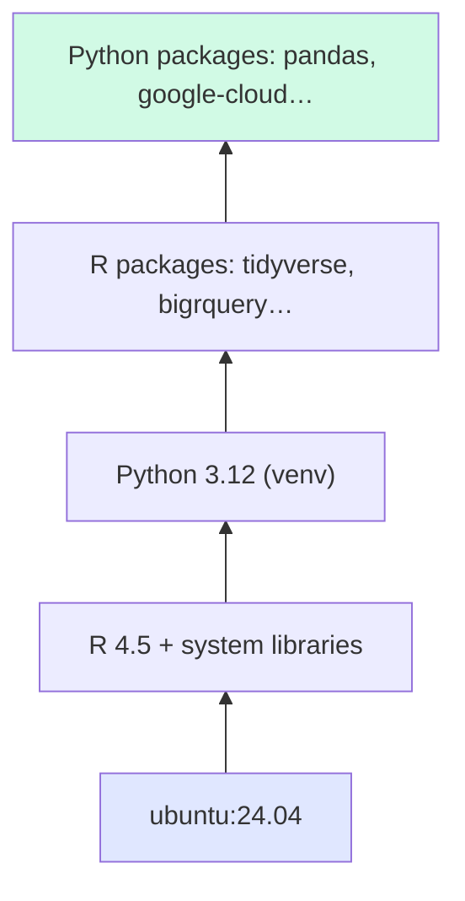
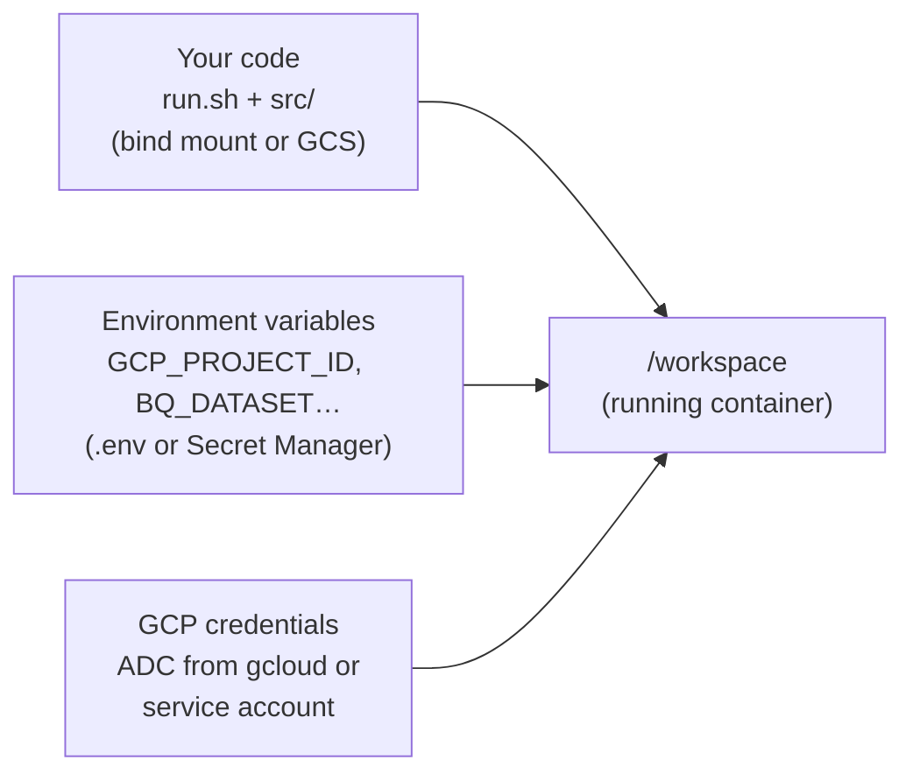
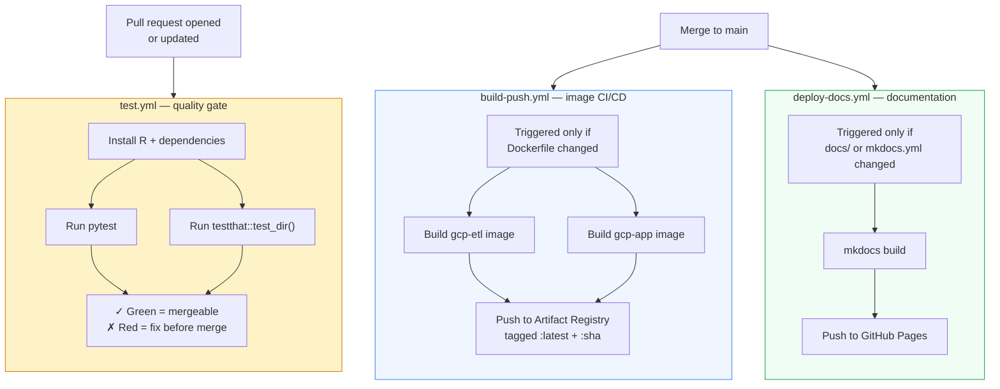
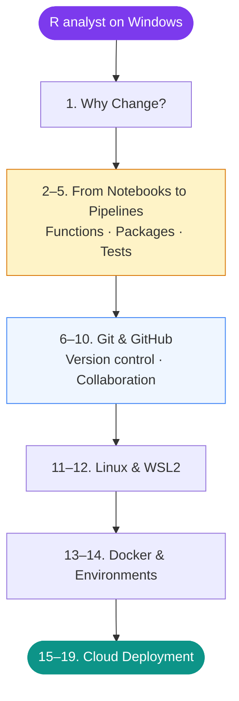

# Documentation Refinement Implementation Plan

> **For Claude:** REQUIRED SUB-SKILL: Use superpowers:executing-plans to implement this plan task-by-task.

**Goal:** Restructure the R to the Cloud guide so "From Notebooks to Pipelines" precedes "Git & GitHub", add a new Writing Functions page, expand three pages with new content, refine four pages' diagrams, and ship each change as a branch → PR → merge to main.

**Architecture:** Nine sequential PRs, each targeting `main`. Every merge triggers `deploy-docs.yml` (publishes to GitHub Pages) and `test.yml` (runs testthat + pytest on the example pipeline). The final PR reorders `mkdocs.yml` and `index.md` to wire everything together.

**Tech Stack:** MkDocs Material, Mermaid diagrams, Markdown, `gh` CLI for PR creation/merging, `git` for branching.

---

## Pre-flight checks (run once before starting)

```bash
cd /home/daryn/docker_gcp
git checkout main && git pull
gh auth status          # confirm gh CLI is authenticated
mkdocs build --strict 2>&1 | tail -5   # confirm site builds cleanly from main
```

Expected: clean build, no warnings. If warnings exist, note them — do not fix them as part of this plan.

---

## Task 1: Expand `code-organisation.md`

**Branch:** `feat/expand-code-organisation`

**Files:**
- Modify: `docs/code-organisation.md`

**What to add:** Three new sections at the bottom of the file (before "Further reading"):

### Step 1: Create branch

```bash
git checkout main && git pull
git checkout -b feat/expand-code-organisation
```

### Step 2: Add "The sourcing mental model" section

Open `docs/code-organisation.md`. Find the `## Further reading` heading (currently the last section). Insert the following **before** it:

```markdown
---

## The sourcing mental model

When you write `source("R/transform.R")` at the top of a script, R reads and executes that file exactly as if you had typed its entire contents at that point in the script. There is no magic — no import system, no compilation, no linking. The interpreter sees the same thing either way.

The benefit is entirely human: a named file with a single responsibility is easier to navigate, easier to review, and easier to maintain than one 600-line script that does everything.

```r
# These two are identical to the R interpreter:

# Option A — inline
clean_data <- function(df) {
  df |> dplyr::filter(!is.na(date))
}
raw <- fetch_data()
result <- clean_data(raw)

# Option B — sourced
source("R/transform.R")   # contains clean_data()
raw <- fetch_data()
result <- clean_data(raw)
```

The functions defined in `transform.R` are available in the calling script's environment just as if they had been defined there. Source files are not namespaced — they share the same global environment.

This means you can refactor a monolith into sourced files incrementally, one function at a time, without changing how anything works.

---

## From one script to many: a practical progression

Start where you are. Move one step at a time:



You do not need to reach step D for every pipeline. A small, infrequent pipeline can live happily at step C. The progression matters for pipelines that are maintained over time, worked on by more than one person, or need formal testing.

---

## Modularity and Git: fewer files edited means fewer conflicts

When two analysts work on the same pipeline simultaneously, what happens depends on how the code is organised.

**Monolith scenario:** Both analysts edit `analysis.R`. Git cannot merge their changes automatically if they touched overlapping lines. One of them has to resolve a conflict.

**Modular scenario:** One analyst edits `R/extract.R`, the other edits `R/transform.R`. Git merges both changes automatically — different files, no conflict possible.



Sarah and James worked in parallel on separate files. Both PRs merged cleanly. With a monolith, at least one of them would have spent time resolving conflicts instead of writing code.

This is one of the practical reasons the Git section follows immediately after this one: once your code is modular, the collaboration model that Git enables starts to make immediate sense.
```

### Step 3: Verify the page renders

```bash
mkdocs build --strict 2>&1 | grep -E "(WARNING|ERROR|code-organisation)"
```

Expected: no warnings or errors for this page.

### Step 4: Commit and push

```bash
git add docs/code-organisation.md
git commit -m "$(cat <<'EOF'
docs: expand code-organisation with sourcing mental model and modularity/Git section

Adds three new sections:
- The sourcing mental model (source() = inline, benefit is human)
- Progression from monolith to package structure (with Mermaid diagram)
- Modularity and Git: separate files = parallel work = fewer conflicts (with gitGraph)

Co-Authored-By: Claude Sonnet 4.6 <noreply@anthropic.com>
EOF
)"
git push -u origin feat/expand-code-organisation
```

### Step 5: Create and merge PR

```bash
gh pr create \
  --title "docs: expand code-organisation with sourcing mental model and Git modularity" \
  --body "$(cat <<'EOF'
## Changes

Adds three new sections to `code-organisation.md`:

- **The sourcing mental model** — explains that `source()` is identical to inline code, benefit is human readability and maintainability
- **From one script to many** — flowchart showing the incremental progression from monolith to package
- **Modularity and Git** — gitGraph showing how separate files enable parallel work with zero merge conflicts; bridges forward to the Git section

## Why

This page is now step 2 in the reading order (before Git). The new sections motivate *why* modularity matters before readers encounter Git branching and PRs.

🤖 Generated with [Claude Code](https://claude.com/claude-code)
EOF
)"

# Wait for CI, then merge
gh pr merge --squash --delete-branch
git checkout main && git pull
```

---

## Task 2: Create `writing-functions.md` (new page)

**Branch:** `feat/new-writing-functions`

**Files:**
- Create: `docs/writing-functions.md`

### Step 1: Create branch

```bash
git checkout main && git pull
git checkout -b feat/new-writing-functions
```

### Step 2: Write the new page

Create `docs/writing-functions.md` with this full content:

````markdown
# Writing Functions

Before this guide asks you to build packages and write tests, it asks you to do one thing: write functions. Functions are the unit everything else is built on. A package is a collection of functions. A test is a check that a function behaves correctly. A pipeline is a sequence of function calls.

This page shows you how to get there from where most analysts start — RMarkdown chunks and top-to-bottom scripts.

---

## A chunk is a function waiting to be named

If you have written RMarkdown, you have already written functions. You just have not named them yet.

Here is a typical analysis chunk:

````r
```{r clean-dates}
patient_data <- patient_data |>
  filter(!is.na(admission_date)) |>
  filter(admission_date <= Sys.Date()) |>
  mutate(year = lubridate::year(admission_date),
         month = lubridate::month(admission_date))
```
````

This chunk has inputs (the `patient_data` data frame in your environment), a transformation, and an output (an updated `patient_data`). That is exactly what a function is — except a function makes the inputs and outputs explicit:

```r
add_date_columns <- function(df) {
  df |>
    dplyr::filter(!is.na(admission_date)) |>
    dplyr::filter(admission_date <= Sys.Date()) |>
    dplyr::mutate(
      year  = lubridate::year(admission_date),
      month = lubridate::month(admission_date)
    )
}
```

The transformation is identical. The difference: the function can be called with any data frame, tested in isolation, and reused across pipelines.

---

## From RMarkdown to R scripts: the transition

RMarkdown is a superb development environment. You can run chunks interactively, see outputs inline, and annotate your thinking in prose. Use it to explore and plan.

The transition happens when the analysis needs to run automatically:



The prose and exploration in your notebook do not go away — keep the notebook as a development artefact. What you extract are the functions: the clean, reusable logic that the pipeline will call.

---

## When to write a function

A useful rule of thumb: write a function when you find yourself doing either of these things.

**1. Copying a block of code**

If you have written the same transformation twice in different places, that is a function. Copy-paste creates two things to maintain when requirements change.

**2. Giving a block of code a comment heading**

```r
# --- Remove invalid dates and add year/month columns ---
patient_data <- patient_data |>
  filter(!is.na(admission_date)) |>
  ...
```

If you are already naming what a block does, you are describing a function. Extract it:

```r
patient_data <- add_date_columns(patient_data)
```

The comment becomes the function name. The code becomes the function body. The calling script becomes self-documenting.

---

## Pure functions: the gold standard for pipeline logic

A **pure function** has two properties:

1. Given the same inputs, it always returns the same output
2. It has no side effects — it does not read from or write to disk, databases, or the network

```r
# Pure — testable, predictable, safe to call multiple times
calculate_resistance_rate <- function(df, organism, country) {
  df |>
    dplyr::filter(organism_code == organism, country_code == country) |>
    dplyr::summarise(
      n_tested    = dplyr::n(),
      n_resistant = sum(resistant),
      pct         = 100 * mean(resistant)
    )
}

# Impure — reads from BigQuery, cannot be unit tested without a live connection
fetch_isolates <- function(project, dataset) {
  con <- DBI::dbConnect(bigrquery::bigquery(), project = project)
  on.exit(DBI::dbDisconnect(con))
  DBI::dbGetQuery(con, glue::glue("SELECT * FROM `{project}.{dataset}.isolates`"))
}
```

The goal is to write your *logic* as pure functions and confine your *I/O* to thin wrappers. In a well-organised pipeline, the pure functions live in `R/transform.R` and are covered by unit tests. The I/O wrappers live in `src/extract.R` and `src/load.R` and are not unit tested directly.

---

## Anatomy of a well-written function

```r
#' Calculate monthly resistance rate for an organism and country
#'
#' Filters isolates to the specified organism and country, then computes
#' the percentage of resistant isolates for each year-month combination.
#' Groups with fewer than 10 isolates are flagged as low-count.
#'
#' @param df       A data frame with columns: organism_code, country_code,
#'                 year_month, resistant (logical).
#' @param organism Character. Organism code to filter to (e.g. "ECOL").
#' @param country  Character. Country code to filter to (e.g. "GBR").
#'
#' @return A data frame with columns: year_month, n_tested, n_resistant,
#'         pct_resistant, low_count.
#'
#' @export
calculate_resistance_rate <- function(df, organism, country) {
  stopifnot(
    is.data.frame(df),
    is.character(organism), length(organism) == 1,
    is.character(country),  length(country)  == 1
  )

  df |>
    dplyr::filter(organism_code == organism, country_code == country) |>
    dplyr::group_by(year_month) |>
    dplyr::summarise(
      n_tested    = dplyr::n(),
      n_resistant = sum(resistant),
      pct_resistant = 100 * mean(resistant),
      low_count   = dplyr::n() < 10,
      .groups     = "drop"
    )
}
```

Key elements:

| Part | Purpose |
|------|---------|
| `#'` roxygen2 comment block | Becomes the function's help page (`?calculate_resistance_rate`) |
| `@param` tags | Documents each argument: name, type, what it means |
| `@return` tag | Documents what the function produces |
| `@export` | Makes the function available when the package is loaded |
| `stopifnot()` | Validates inputs and fails loudly with a clear error if something is wrong |
| Named arguments | `organism = "ECOL"` is clearer than positional `"ECOL"` at the call site |

The `#'` documentation block is covered in depth in [Building R Packages](r-packages.md). You do not need to write it for every function immediately — start with just the code, add documentation when the function is stable.

---

## Argument design

**Give arguments sensible names.** The caller should be able to read `calculate_rate(df = isolates, organism = "ECOL", country = "GBR")` and understand what each argument does without reading the function body.

**Use defaults where they make sense.** Defaults should represent the most common case:

```r
fetch_isolates <- function(project, dataset, start_date = "2024-01-01") {
  ...
}
```

**Fail loudly on bad input.** A function that silently does the wrong thing with unexpected input is harder to debug than one that stops immediately with a clear message:

```r
clean_dates <- function(df, date_col = "admission_date") {
  if (!date_col %in% names(df)) {
    stop("Column '", date_col, "' not found in data frame. ",
         "Available columns: ", paste(names(df), collapse = ", "))
  }
  ...
}
```

---

## Modularity and parallel work

Functions map naturally onto files, and files map naturally onto how Git handles parallel work.

When `calculate_resistance_rate()` lives in `R/transform.R` and `fetch_isolates()` lives in `R/extract.R`, two colleagues can work on them simultaneously without any risk of conflict. Each function in its own file is an independent unit of work — in code, in testing, and in version control.

This is why writing functions before learning Git is intentional. By the time you reach [From Shared Drives to Git](from-shares-to-git.md), you will have a codebase that is naturally structured for parallel collaboration.

---

## Further reading

- **[Advanced R — Functions chapter](https://adv-r.hadley.nz/functions.html)** — Hadley Wickham's definitive treatment of R functions, environments, and scoping
- **[R for Data Science — Functions chapter](https://r4ds.hadley.nz/functions)** — practical introduction to writing functions in the tidyverse style
- **[The tidyverse style guide — Functions](https://style.tidyverse.org/functions.html)** — naming conventions, argument order, return values
````

### Step 3: Verify the page builds

```bash
mkdocs build --strict 2>&1 | grep -E "(WARNING|ERROR|writing-functions)"
```

Expected: no errors. (The page is not yet in the nav — it will build as an unreferenced page, which is fine at this stage. It will be wired in during Task 9.)

### Step 4: Commit and push

```bash
git add docs/writing-functions.md
git commit -m "$(cat <<'EOF'
docs: add new Writing Functions page (step 3 in reading order)

Covers:
- RMarkdown chunk → named function extraction (with side-by-side code)
- When to write a function (copy-paste rule and comment-heading rule)
- Pure functions vs I/O wrappers
- Anatomy of a well-written function with roxygen2 block
- Argument design and input validation
- Modularity → parallel Git work connection

Co-Authored-By: Claude Sonnet 4.6 <noreply@anthropic.com>
EOF
)"
git push -u origin feat/new-writing-functions
```

### Step 5: Create and merge PR

```bash
gh pr create \
  --title "docs: add Writing Functions page" \
  --body "$(cat <<'EOF'
## Changes

New page `docs/writing-functions.md` — step 3 in the restructured reading order.

Bridges the gap between "organise your scripts" (step 2) and "build a package" (step 4) by teaching the transition from RMarkdown chunks to named functions.

Key content:
- Chunk → function extraction pattern
- RMarkdown as development scratchpad → R scripts as deployment artefact
- When to write a function (two practical rules)
- Pure function design for testable pipeline logic
- Argument naming, defaults, and input validation
- Forward link to Git collaboration via modular files

Not yet wired into nav — that happens in the final reorder PR.

🤖 Generated with [Claude Code](https://claude.com/claude-code)
EOF
)"

gh pr merge --squash --delete-branch
git checkout main && git pull
```

---

## Task 3: Expand `r-packages.md`

**Branch:** `feat/expand-r-packages`

**Files:**
- Modify: `docs/r-packages.md`

**What to add:** Expand the existing `usethis` and `roxygen2` sections with concrete workflow steps and a `devtools` development loop section.

### Step 1: Create branch

```bash
git checkout main && git pull
git checkout -b feat/expand-r-packages
```

### Step 2: Find insertion points

Open `docs/r-packages.md`. Locate:
- The `## Creating a package with usethis` section (or equivalent)
- The section covering roxygen2

### Step 3: Expand the `usethis` section

Find the existing `usethis` section and replace or extend it to include this complete workflow:

```markdown
## Creating a package with usethis

`usethis` automates the boilerplate of package creation. Install it once:

```r
install.packages("usethis")
```

**Create a new package:**

```r
usethis::create_package("~/projects/my.pipeline")
```

This creates the `DESCRIPTION`, `NAMESPACE`, `R/` directory, and an RStudio project file. Open the project in Positron or RStudio.

**Add a new R file for a group of functions:**

```r
usethis::use_r("transform")
# Creates R/transform.R and opens it
```

**Set up the testing infrastructure:**

```r
usethis::use_testthat()
# Creates tests/testthat/ and tests/testthat.R
```

**Add a specific test file:**

```r
usethis::use_test("transform")
# Creates tests/testthat/test-transform.R and opens it
```

**Set up GitHub Actions for CI:**

```r
usethis::use_github_actions()
# Creates .github/workflows/R-CMD-check.yaml
```

**Declare a package dependency:**

```r
usethis::use_package("dplyr")
# Adds dplyr to Imports in DESCRIPTION
```

All of these commands update the right files automatically. You do not need to edit `DESCRIPTION` or `NAMESPACE` by hand.
```

### Step 4: Expand the roxygen2 section

Find the existing roxygen2 section and extend it with a complete example:

```markdown
## Documenting functions with roxygen2

roxygen2 turns specially formatted comments above your functions into help pages. The comments start with `#'` (hash-apostrophe, not a regular comment).

### A fully documented function

```r
#' Calculate monthly resistance rate
#'
#' Filters isolates to the specified organism and country, then computes
#' the percentage that were resistant for each year-month combination.
#'
#' @param df A data frame with columns: \code{organism_code}, \code{country_code},
#'   \code{year_month}, \code{resistant} (logical).
#' @param organism Character scalar. Organism code to filter to (e.g. \code{"ECOL"}).
#' @param country  Character scalar. Country code to filter to (e.g. \code{"GBR"}).
#'
#' @return A data frame with columns: \code{year_month}, \code{n_tested},
#'   \code{n_resistant}, \code{pct_resistant}, \code{low_count}.
#'
#' @examples
#' df <- data.frame(
#'   organism_code = c("ECOL", "ECOL"),
#'   country_code  = c("GBR", "GBR"),
#'   year_month    = c("2024-01", "2024-01"),
#'   resistant     = c(TRUE, FALSE)
#' )
#' calculate_resistance_rate(df, "ECOL", "GBR")
#'
#' @export
calculate_resistance_rate <- function(df, organism, country) {
  ...
}
```

The key tags:

| Tag | What it does |
|-----|-------------|
| `@param name` | Documents one argument: name, type, meaning |
| `@return` | Documents what the function returns |
| `@examples` | Runnable examples shown in the help page and checked by `R CMD check` |
| `@export` | Adds the function to `NAMESPACE` so it is available after `library(my.pipeline)` |

After writing or updating roxygen2 comments, regenerate the documentation:

```r
devtools::document()
# Rewrites NAMESPACE and man/*.Rd from your #' comments
```

Never edit `NAMESPACE` or files in `man/` by hand — they are always generated.

## The devtools development loop

When working on your package, use `devtools` rather than `source()`. The difference matters:

```r
# Do this — loads all functions from R/ cleanly, as if the package were installed
devtools::load_all()

# Not this — only loads one file, misses function interdependencies
source("R/transform.R")
```

The full loop:

```r
# 1. Load all functions from R/ into your session
devtools::load_all()        # keyboard shortcut: Ctrl+Shift+L

# 2. Develop and test interactively in the console
calculate_resistance_rate(test_df, "ECOL", "GBR")

# 3. Write or update tests
usethis::use_test("transform")

# 4. Run tests
devtools::test()            # keyboard shortcut: Ctrl+Shift+T

# 5. Regenerate documentation after changing roxygen2 comments
devtools::document()        # keyboard shortcut: Ctrl+Shift+D

# 6. Full check (what CRAN would run — catches many issues)
devtools::check()           # keyboard shortcut: Ctrl+Shift+E
```

`devtools::check()` is the gold standard. It runs your tests, checks your documentation, and validates your `DESCRIPTION`. Run it before every pull request.
```

### Step 5: Verify build

```bash
mkdocs build --strict 2>&1 | grep -E "(WARNING|ERROR|r-packages)"
```

### Step 6: Commit and push

```bash
git add docs/r-packages.md
git commit -m "$(cat <<'EOF'
docs: expand r-packages with usethis workflow, full roxygen2 example, devtools loop

- usethis: complete workflow from create_package() through use_github_actions()
- roxygen2: fully documented example function with all key tags explained
- devtools: load_all/test/document/check loop with keyboard shortcuts

Co-Authored-By: Claude Sonnet 4.6 <noreply@anthropic.com>
EOF
)"
git push -u origin feat/expand-r-packages
```

### Step 7: Create and merge PR

```bash
gh pr create \
  --title "docs: expand r-packages with usethis, roxygen2, and devtools content" \
  --body "$(cat <<'EOF'
## Changes

Expands `r-packages.md` with three concrete workflows:

- **usethis**: step-by-step from `create_package()` through `use_github_actions()`, `use_testthat()`, `use_package()`
- **roxygen2**: fully documented example function showing all key tags (`@param`, `@return`, `@examples`, `@export`) with a reference table
- **devtools loop**: `load_all()` → `test()` → `document()` → `check()` with keyboard shortcuts

🤖 Generated with [Claude Code](https://claude.com/claude-code)
EOF
)"

gh pr merge --squash --delete-branch
git checkout main && git pull
```

---

## Task 4: Expand `testing-guide.md`

**Branch:** `feat/expand-testing-guide`

**Files:**
- Modify: `docs/testing-guide.md`

### Step 1: Create branch

```bash
git checkout main && git pull
git checkout -b feat/expand-testing-guide
```

### Step 2: Add testthat patterns section

Open `docs/testing-guide.md`. Find the existing `## Writing tests with testthat` section (or equivalent). After the basic `test_that()` introduction, add:

```markdown
## testthat expectation patterns

Each `expect_*` function checks one thing. The most common:

```r
# Exact equality (use for numbers with tolerance, not floating point)
expect_equal(calculate_rate(df), 0.5)
expect_equal(nrow(result), 3L)

# True/false conditions
expect_true(all(result$pct_resistant >= 0))
expect_false(any(is.na(result$organism_code)))

# Error and warning checking
expect_error(
  calculate_rate(df = "not a dataframe"),
  regexp = "is.data.frame"   # matches against the error message
)
expect_warning(
  clean_dates(df_with_future_dates),
  regexp = "future dates"
)

# Column existence and types
expect_named(result, c("year_month", "pct_resistant", "n_tested"))
expect_s3_class(result, "data.frame")

# Snapshot tests — stores the output and flags any future change
expect_snapshot(print(result))
```

### One test_that per behaviour

Each `test_that()` block should test exactly one behaviour. If a test fails, you want to know *what* broke, not that *something* broke.

```r
# Good — one assertion per block, clear names
test_that("records with NA admission_date are removed", {
  df <- data.frame(
    patient_id     = c(1L, 2L, 3L),
    admission_date = as.Date(c("2024-01-15", NA, "2024-03-20"))
  )
  result <- clean_admission_dates(df)
  expect_equal(nrow(result), 2L)
  expect_false(any(is.na(result$admission_date)))
})

test_that("future dates are removed and a warning is raised", {
  df <- data.frame(
    patient_id     = c(1L, 2L),
    admission_date = as.Date(c("2024-01-15", "2099-01-01"))
  )
  expect_warning(result <- clean_admission_dates(df), "future")
  expect_equal(nrow(result), 1L)
})
```

## Test fixtures with setup.R

For pipeline tests, you often need the same synthetic data frame in multiple test files. Define it once in `tests/testthat/setup.R`:

```r
# tests/testthat/setup.R
# Functions defined here are available in all test files automatically.

make_test_isolates <- function(n = 20) {
  data.frame(
    organism_code = rep(c("ECOL", "KLEB"), each = n / 2),
    country_code  = rep(c("GBR", "DEU"), times = n / 2),
    year_month    = rep("2024-01", n),
    resistant     = sample(c(TRUE, FALSE), n, replace = TRUE),
    stringsAsFactors = FALSE
  )
}

make_clean_isolates <- function(n = 20) {
  df <- make_test_isolates(n)
  df$year_month <- as.Date(paste0(df$year_month, "-01"))
  df
}
```

Then in any test file:

```r
# tests/testthat/test-transform.R
test_that("calculate_resistance_rate returns one row per year_month", {
  df     <- make_clean_isolates(20)
  result <- calculate_resistance_rate(df, "ECOL", "GBR")
  expect_equal(nrow(result), length(unique(df$year_month)))
})
```

No BigQuery connection needed. The test creates its own data, calls the pure function, and checks the output.

## What a good pipeline unit test looks like

The three properties of a good unit test for pipeline code:

| Property | Why it matters |
|---|---|
| **Deterministic** | No `sample()` without `set.seed()`, no `Sys.Date()` without mocking — the test must produce the same result every time |
| **No external calls** | No BigQuery, GCS, or network access — the test must pass in a CI environment with no GCP credentials |
| **Tests one thing** | One `test_that()` per behaviour — when something breaks, you know exactly what |

## The GitHub Actions connection

When you open a pull request, GitHub runs:

```yaml
- name: Run testthat
  run: Rscript -e "testthat::test_dir('tests/testthat', reporter = 'progress')"
```

This is *identical* to what you run locally:

```bash
# Inside your Docker container or R session:
Rscript -e "testthat::test_dir('tests/testthat', reporter = 'progress')"
```

If your tests pass locally, they will pass in CI. If they fail in CI but not locally, the difference is almost always a missing package installation — check what `install.packages()` calls are in the workflow file.

The test workflow is a gatekeeper: code cannot be merged unless the tests pass. Writing tests is not extra work — it is the mechanism that lets you and your colleagues make changes confidently.
```

### Step 3: Verify build

```bash
mkdocs build --strict 2>&1 | grep -E "(WARNING|ERROR|testing-guide)"
```

### Step 4: Commit and push

```bash
git add docs/testing-guide.md
git commit -m "$(cat <<'EOF'
docs: expand testing-guide with testthat patterns, fixtures, and CI connection

- Full expect_* pattern reference with pipeline-relevant examples
- One test_that per behaviour principle with before/after examples
- setup.R fixtures pattern (make_test_isolates / make_clean_isolates)
- Three properties of a good pipeline unit test
- GitHub Actions connection: local command = CI command

Co-Authored-By: Claude Sonnet 4.6 <noreply@anthropic.com>
EOF
)"
git push -u origin feat/expand-testing-guide
```

### Step 5: Create and merge PR

```bash
gh pr create \
  --title "docs: expand testing-guide with testthat patterns, fixtures, and CI integration" \
  --body "$(cat <<'EOF'
## Changes

Expands `testing-guide.md` with:

- **testthat expectation reference**: `expect_equal`, `expect_true/false`, `expect_error`, `expect_warning`, `expect_named`, `expect_snapshot` with pipeline-relevant examples
- **One test_that per behaviour**: before/after showing why narrow blocks are better
- **setup.R fixtures**: `make_test_isolates()` pattern for shared synthetic data across test files
- **Good unit test properties**: deterministic, no external calls, tests one thing
- **GitHub Actions connection**: shows that `test_dir()` in CI is identical to local — demystifies CI failures

🤖 Generated with [Claude Code](https://claude.com/claude-code)
EOF
)"

gh pr merge --squash --delete-branch
git checkout main && git pull
```

---

## Task 5: Refine `git-fundamentals.md`

**Branch:** `feat/refine-git-fundamentals`

**Files:**
- Modify: `docs/git-fundamentals.md`

**What to change:** Rewrite the fetch-merge-push cycle flowchart node labels from multi-sentence blobs to short phrases. Each node should be one line: action verb + command.

### Step 1: Create branch

```bash
git checkout main && git pull
git checkout -b feat/refine-git-fundamentals
```

### Step 2: Replace the fetch-merge-push flowchart

Open `docs/git-fundamentals.md`. Find the `## The fetch-merge-push cycle` section. Replace the existing flowchart with:

```markdown
## The day-to-day cycle

The rhythm of working with Git and GitHub follows the same pattern for every change, however small:


```

### Step 3: Verify build

```bash
mkdocs build --strict 2>&1 | grep -E "(WARNING|ERROR|git-fundamentals)"
```

### Step 4: Commit, push, PR, merge

```bash
git add docs/git-fundamentals.md
git commit -m "$(cat <<'EOF'
docs: refine git-fundamentals fetch-merge-push flowchart node labels

Replace multi-sentence cramped node labels with short action + command format.
Rename section to 'The day-to-day cycle' for clarity.

Co-Authored-By: Claude Sonnet 4.6 <noreply@anthropic.com>
EOF
)"
git push -u origin feat/refine-git-fundamentals

gh pr create \
  --title "docs: refine git-fundamentals cycle flowchart labels" \
  --body "Rewrites cramped multi-sentence node labels in the day-to-day cycle flowchart to short action + command format. Improves readability significantly at normal diagram sizes.

🤖 Generated with [Claude Code](https://claude.com/claude-code)"

gh pr merge --squash --delete-branch
git checkout main && git pull
```

---

## Task 6: Refine `git-workflow.md`

**Branch:** `feat/refine-git-workflow`

**Files:**
- Modify: `docs/git-workflow.md`

**What to change:**
1. Remove the "Core concepts" table (duplicates `git-fundamentals.md`)
2. Replace the ASCII art timeline with a `gitGraph`
3. Add a cross-link sentence referencing `git-fundamentals.md`

### Step 1: Create branch

```bash
git checkout main && git pull
git checkout -b feat/refine-git-workflow
```

### Step 2: Remove the Core concepts table

Open `docs/git-workflow.md`. Find the `## Core concepts` section with the `| Term | What it means |` table. Replace the entire section with a single cross-link paragraph:

```markdown
## Before you start

This page covers the day-to-day workflow — branching, committing, opening pull requests, and merging. The underlying concepts (what a commit is, how branches work, what HEAD means) are covered in [What Is Version Control?](git-fundamentals.md). Read that first if anything here feels unclear.
```

### Step 3: Replace ASCII timeline with gitGraph

Find the ASCII art section:

```
main ──────────────────────────────────────────── (protected)
         │                             │
         └── your-branch ── commits ──┘
                                  (merged via pull request)
```

Replace with:

```markdown
Every piece of work — however small — follows this pattern:



`main` is protected — the only way code reaches it is through a pull request that has passed automated tests and been approved by a reviewer.
```

### Step 4: Verify build

```bash
mkdocs build --strict 2>&1 | grep -E "(WARNING|ERROR|git-workflow)"
```

### Step 5: Commit, push, PR, merge

```bash
git add docs/git-workflow.md
git commit -m "$(cat <<'EOF'
docs: refine git-workflow — remove duplicate concepts table, replace ASCII art with gitGraph

- Remove Core concepts table (covered in git-fundamentals.md)
- Add cross-link paragraph replacing the table
- Replace ASCII timeline art with a proper gitGraph diagram

Co-Authored-By: Claude Sonnet 4.6 <noreply@anthropic.com>
EOF
)"
git push -u origin feat/refine-git-workflow

gh pr create \
  --title "docs: refine git-workflow — remove duplicate table, replace ASCII art with gitGraph" \
  --body "- Removes the Core concepts table that duplicates git-fundamentals.md content
- Replaces it with a single cross-link sentence
- Replaces ASCII art timeline with a proper Mermaid gitGraph diagram

🤖 Generated with [Claude Code](https://claude.com/claude-code)"

gh pr merge --squash --delete-branch
git checkout main && git pull
```

---

## Task 7: Refine `docker-containers.md`

**Branch:** `feat/refine-docker-containers`

**Files:**
- Modify: `docs/docker-containers.md`

**What to change:**
1. Simplify the VM vs containers diagram — replace the tall vertical stacks with a horizontal comparison
2. Split the "what lives inside vs outside" diagram into two smaller diagrams

### Step 1: Create branch

```bash
git checkout main && git pull
git checkout -b feat/refine-docker-containers
```

### Step 2: Replace the VM vs containers diagram

Open `docs/docker-containers.md`. Find the `## Containers vs virtual machines` section and replace the flowchart with:

```markdown


VMs include a full copy of an operating system for each guest. Containers share the host OS kernel, isolating only the application layer. Containers start in seconds rather than minutes and use a fraction of the disk space.
```

### Step 3: Split the "what lives inside vs outside" diagram

Find the large combined diagram in `## What lives inside vs outside the container`. Replace it with two separate diagrams:

```markdown
**Inside the image — built once, shared across all pipelines:**



**Injected at runtime — different for every pipeline run:**



The image is stable and reproducible — it never changes between runs. The runtime injection is flexible — your code and configuration can be updated independently of the image.
```

### Step 4: Verify build

```bash
mkdocs build --strict 2>&1 | grep -E "(WARNING|ERROR|docker-containers)"
```

### Step 5: Commit, push, PR, merge

```bash
git add docs/docker-containers.md
git commit -m "$(cat <<'EOF'
docs: refine docker-containers diagrams — simplify VM comparison, split inside/outside diagram

- VM vs Docker: replace tall vertical stacks with cleaner side-by-side subgraphs
- What lives inside/outside: split one dense diagram into two focused diagrams
  (image layers vs runtime injection)

Co-Authored-By: Claude Sonnet 4.6 <noreply@anthropic.com>
EOF
)"
git push -u origin feat/refine-docker-containers

gh pr create \
  --title "docs: refine docker-containers diagrams" \
  --body "- Simplifies VM vs Docker diagram (removes redundant hardware/OS layers, cleaner layout)
- Splits the 'what lives inside vs outside' diagram into two: image layer cake + runtime injection

🤖 Generated with [Claude Code](https://claude.com/claude-code)"

gh pr merge --squash --delete-branch
git checkout main && git pull
```

---

## Task 8: Refine `github-actions.md`

**Branch:** `feat/refine-github-actions`

**Files:**
- Modify: `docs/github-actions.md`

**What to add:** A summary diagram showing all three workflows, their triggers, and outcomes — placed before the per-workflow detail sections.

### Step 1: Create branch

```bash
git checkout main && git pull
git checkout -b feat/refine-github-actions
```

### Step 2: Add the summary diagram

Open `docs/github-actions.md`. Find `## The three workflows in this repository`. Insert this block immediately before the `### test.yml` subsection:

```markdown
Here is how the three workflows relate to each other:


```

### Step 3: Verify build

```bash
mkdocs build --strict 2>&1 | grep -E "(WARNING|ERROR|github-actions)"
```

### Step 4: Commit, push, PR, merge

```bash
git add docs/github-actions.md
git commit -m "$(cat <<'EOF'
docs: add three-workflow summary diagram to github-actions

Adds a Mermaid flowchart before the per-workflow detail sections showing
all three workflows (test.yml, build-push.yml, deploy-docs.yml), their
triggers, and their outcomes in a single view.

Co-Authored-By: Claude Sonnet 4.6 <noreply@anthropic.com>
EOF
)"
git push -u origin feat/refine-github-actions

gh pr create \
  --title "docs: add three-workflow summary diagram to github-actions" \
  --body "Adds a summary flowchart before the per-workflow detail sections, giving readers a single view of all three workflows, their triggers, and their outcomes before diving into detail.

🤖 Generated with [Claude Code](https://claude.com/claude-code)"

gh pr merge --squash --delete-branch
git checkout main && git pull
```

---

## Task 9: Reorder `mkdocs.yml` and `index.md`

**Branch:** `feat/reorder-index`

**Files:**
- Modify: `mkdocs.yml`
- Modify: `docs/index.md`

This is the final PR. It wires the new reading order into the nav and updates the index page reading table. All content changes are already merged; this PR only changes structure and navigation.

### Step 1: Create branch

```bash
git checkout main && git pull
git checkout -b feat/reorder-index
```

### Step 2: Update `mkdocs.yml` nav

Open `mkdocs.yml`. Find the `nav:` section. Reorder the sections so **"From Notebooks to Pipelines"** comes before **"Git & GitHub"**, and add `writing-functions.md` to the Notebooks section:

```yaml
nav:
  - Home: index.md

  - "Why Change?":
    - "The Case for Modern Workflows": case-for-change.md
    - "The IT & Governance Toolkit": it-governance.md

  - "From Notebooks to Pipelines":
    - "Organising Your R Code": code-organisation.md
    - "Writing Functions": writing-functions.md
    - "Building R Packages": r-packages.md
    - "Writing Tests": testing-guide.md
    - "Generating and Sharing Outputs": outputs-and-reporting.md

  - "Git & GitHub":
    - "From Shared Drives to Git": from-shares-to-git.md
    - "What Is Version Control?": git-fundamentals.md
    - "The GitHub Workflow": git-workflow.md
    - "Making Code GitHub-Ready": code-readiness.md
    - "Sanitising Code for GitHub": code-sanitisation.md
    - "Data Security for Cloud RAP": data-security.md

  - "Linux & WSL2":
    - "What Is Linux?": what-is-linux.md
    - "Setting Up WSL2": wsl-setup.md
    - "Positron IDE": positron-setup.md

  - "Docker & Environments":
    - "Containers Explained": docker-containers.md
    - "Managing R & Python Versions": version-management.md

  - "Worked Example":
    - "AMR Surveillance Pipeline": example-walkthrough.md
    - "Implementation Examples in R": r-implementation.md
    - "Workshop Setup": workshop-setup.md

  - "Cloud Deployment":
    - "How the Pipeline Works": architecture.md
    - "GitHub Actions Explained": github-actions.md
    - "GCP Deployment": gcp-deployment.md
    - "Demo Resources Setup": demo-setup.md
```

### Step 3: Update `index.md` reading order table and journey diagram

Open `docs/index.md`. Replace the `## Reading order` table with the new 19-step structure:

```markdown
## Reading order

| Step | Page | What you will learn |
|:----:|------|---------------------|
| 1 | [The Case for Modern Workflows](case-for-change.md) | Why this change matters and what you gain from it |
| 2 | [Organising Your R Code](code-organisation.md) | Sourcing mental model, script modules, and how modularity helps Git |
| 3 | [Writing Functions](writing-functions.md) | From RMarkdown chunks to named functions; pure functions for testable pipelines |
| 4 | [Building R Packages](r-packages.md) | usethis, roxygen2 documentation, devtools workflow |
| 5 | [Writing Tests](testing-guide.md) | testthat patterns, fixtures, and the GitHub Actions connection |
| 6 | [From Shared Drives to Git](from-shares-to-git.md) | How Git maps onto your current file management habits |
| 7 | [What Is Version Control?](git-fundamentals.md) | Core Git concepts and commands, explained with diagrams |
| 8 | [The GitHub Workflow](git-workflow.md) | Day-to-day branch-and-pull-request workflow |
| 9 | [Making Code GitHub-Ready](code-readiness.md) | Removing secrets, hardcoded paths, and other blockers |
| 10 | [Sanitising Code for GitHub](code-sanitisation.md) | Patterns for safe, secrets-free, portable code |
| 11 | [What Is Linux?](what-is-linux.md) | Linux and WSL2 explained with plain analogies |
| 12 | [Setting Up WSL2](wsl-setup.md) | Step-by-step environment setup on Windows |
| 13 | [Containers Explained](docker-containers.md) | What Docker is and why it solves the reproducibility problem |
| 14 | [Managing R & Python Versions](version-management.md) | Locking dependencies with `renv` and `requirements.txt` |
| 15 | [Generating and Sharing Outputs](outputs-and-reporting.md) | ggplot2 reports to GCS, public URLs, scheduled outputs |
| 16 | [AMR Surveillance Pipeline](example-walkthrough.md) | See every concept applied to a complete, runnable R pipeline |
| 17 | [How the Pipeline Works](architecture.md) | The full cloud architecture — commit to production |
| 18 | [GitHub Actions Explained](github-actions.md) | CI/CD demystified: how automated tests and deployments work |
| 19 | [GCP Deployment](gcp-deployment.md) | Deploying to Cloud Run (platform team guide) |
```

Also update the `## The learning journey` Mermaid flowchart to reflect the new section order:

```markdown

```

### Step 4: Verify full site build

```bash
mkdocs build --strict 2>&1 | tail -10
```

Expected: `INFO - Documentation built in X.X seconds` with no warnings or errors.

### Step 5: Commit, push, PR, merge

```bash
git add mkdocs.yml docs/index.md
git commit -m "$(cat <<'EOF'
docs: reorder guide to 19-step structure — Notebooks to Pipelines before Git

- mkdocs.yml: move 'From Notebooks to Pipelines' section before 'Git & GitHub'
- mkdocs.yml: add writing-functions.md to Notebooks section
- index.md: update reading order table to 19 steps
- index.md: update learning journey diagram to reflect new section order

Co-Authored-By: Claude Sonnet 4.6 <noreply@anthropic.com>
EOF
)"
git push -u origin feat/reorder-index

gh pr create \
  --title "docs: reorder guide to 19-step structure — Notebooks to Pipelines before Git" \
  --body "$(cat <<'EOF'
## Changes

Final structural PR. All content changes were merged in previous PRs.

- **mkdocs.yml**: moves 'From Notebooks to Pipelines' section before 'Git & GitHub'; adds `writing-functions.md` to that section
- **index.md**: updates reading order table to the new 19-step structure; updates the learning journey flowchart to show section groups

## New reading order

1. Why Change?
2–5. From Notebooks to Pipelines (code-organisation → writing-functions → r-packages → testing-guide)
6–10. Git & GitHub
11–12. Linux & WSL2
13–14. Docker & Environments
15–19. Cloud Deployment

## Rationale

Readers now learn how to write modular, testable R code before they learn version control. When they reach the Git section, they have something worth versioning — and the modularity/parallel-work connection from code-organisation.md makes the branching model immediately intuitive.

🤖 Generated with [Claude Code](https://claude.com/claude-code)
EOF
)"

gh pr merge --squash --delete-branch
git checkout main && git pull
```

---

## Done

Verify the live site reflects the new structure:

```bash
gh run list --limit 5   # confirm deploy-docs CI ran on each merge
```

Open `https://ch3w3y.github.io/docker_gcp` and confirm:
- Nav shows "From Notebooks to Pipelines" before "Git & GitHub"
- "Writing Functions" appears as step 3 in the reading order table
- All nine PRs appear in the GitHub PR history as a clean audit trail
