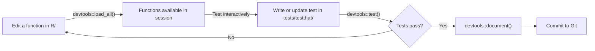

# Building R Packages

The jump from "a folder of R scripts" to "an R package" sounds more intimidating than it actually is. An R package is just a standardised folder structure with a few specific files — and the payoff is enormous: automatic documentation, formal testing infrastructure, version control of the code interface, and compatibility with the R ecosystem's tooling.

This page shows you how to make that jump, step by step.

---

## Why write an R package for a pipeline?

You might be thinking: "It is a data pipeline, not a software library. Why would I package it?"

The answer is that a package is not just for distributing code to other people. It is a structure that forces good practices:

| Without a package | With a package |
|---|---|
| Functions defined inline in scripts | Functions in `R/` with consistent namespacing |
| Documentation in comments (or not at all) | Rendered HTML docs from roxygen2 tags |
| No formal testing infrastructure | `tests/testthat/` with auto-discovery |
| No dependency declaration | `DESCRIPTION` lists every dependency |
| `source()` to load functions | `devtools::load_all()` loads everything cleanly |
| `install.packages()` guesswork | `renv` knows exactly what to install |

Even if your package will never be submitted to CRAN or shared outside your team, the package structure gives you all of these for free.

---

## Package structure overview

A minimal R package looks like this:

```
my.pipeline/
│
├── DESCRIPTION          # package metadata and dependencies
├── NAMESPACE            # which functions are exported (generated by roxygen2)
│
├── R/                   # all function definitions
│   ├── extract.R
│   ├── transform.R
│   ├── load.R
│   └── utils.R
│
├── tests/
│   └── testthat/
│       ├── setup.R
│       ├── test-extract.R
│       ├── test-transform.R
│       └── test-load.R
│
├── man/                 # documentation (generated by roxygen2 — do not edit)
│   ├── fetch_records.Rd
│   └── clean_records.Rd
│
├── renv.lock
├── .Rprofile
├── .gitignore
└── README.md
```

The most important thing to understand: the `NAMESPACE` and `man/` directories are **generated** by `roxygen2` — you never edit them by hand. You write documentation in special comments above each function, and `devtools::document()` generates those files automatically.

---

## The DESCRIPTION file

`DESCRIPTION` is the manifest for your package. Here is an example:

```
Package: my.pipeline
Title: Monthly Patient Records Analysis Pipeline
Version: 0.1.0
Authors@R: person("James", "Smith", email = "j.smith@nhs.net",
    role = c("aut", "cre"))
Description: Extracts patient records from BigQuery, calculates monthly
    rates by region, and loads results to the analytics dataset.
License: MIT + file LICENSE
Encoding: UTF-8
Roxygen: list(markdown = TRUE)
RoxygenNote: 7.3.1
Imports:
    bigrquery (>= 1.5.0),
    DBI (>= 1.2.0),
    dplyr (>= 1.1.0),
    glue (>= 1.7.0),
    lubridate (>= 1.9.0),
    tidyr (>= 1.3.0)
Suggests:
    testthat (>= 3.0.0),
    withr (>= 3.0.0)
```

Key fields:

| Field | Purpose |
|-------|---------|
| `Package` | The package name — use `.` or `_` not spaces, all lowercase |
| `Version` | Semantic version: `MAJOR.MINOR.PATCH` |
| `Imports` | Packages your code needs to run — installed when users install yours |
| `Suggests` | Packages needed for development/testing only |
| `Roxygen` | Tells `devtools::document()` to use markdown in roxygen tags |

The `Imports` field is the formal dependency declaration. When `renv` sees your `DESCRIPTION`, it knows what to install.

---

## roxygen2 documentation

roxygen2 lets you write function documentation as special comments directly above the function definition. These comments are processed into `.Rd` files in `man/` — the standard R documentation format that appears when you run `?function_name`.

### The anatomy of a roxygen2 block

```r
#' Fetch patient records from BigQuery
#'
#' Queries the patient records table for a given date range and returns
#' a data frame. Requires `bigrquery` authentication to be set up via
#' [bigrquery::bq_auth()] or Application Default Credentials.
#'
#' @param project GCP project ID (string). Usually set via the
#'   `GCP_PROJECT_ID` environment variable.
#' @param dataset BigQuery dataset name (string).
#' @param start_date Start of date range, inclusive (Date or string "YYYY-MM-DD").
#'   Defaults to the first day of the current year.
#' @param end_date End of date range, inclusive (Date or string "YYYY-MM-DD").
#'   Defaults to today.
#'
#' @return A data frame with columns:
#'   \describe{
#'     \item{patient_id}{Character. Anonymous patient identifier.}
#'     \item{date}{Date. Date of encounter.}
#'     \item{region}{Character. NHS region code.}
#'     \item{diagnosis_code}{Character. ICD-10 diagnosis code.}
#'   }
#'
#' @examples
#' \dontrun{
#' records <- fetch_patient_records(
#'   project    = Sys.getenv("GCP_PROJECT_ID"),
#'   dataset    = Sys.getenv("BQ_DATASET"),
#'   start_date = "2024-01-01"
#' )
#' }
#'
#' @export
fetch_patient_records <- function(project,
                                   dataset,
                                   start_date = paste0(format(Sys.Date(), "%Y"), "-01-01"),
                                   end_date   = Sys.Date()) {
  sql <- glue::glue("
    SELECT patient_id, date, region, diagnosis_code
    FROM `{project}.{dataset}.patient_records`
    WHERE date BETWEEN '{start_date}' AND '{end_date}'
  ")

  con <- DBI::dbConnect(bigrquery::bigquery(), project = project)
  on.exit(DBI::dbDisconnect(con), add = TRUE)

  DBI::dbGetQuery(con, sql)
}
```

### Runnable examples with test data

When a function works on plain data frames — no database connection required — you can write `@examples` that R actually runs when checking the package. This is better than `\dontrun{}` because the examples serve as lightweight tests.

Using the AMR pipeline example from [Writing Functions](writing-functions.md):

````r
#' Calculate resistance rate for an antibiotic
#'
#' Computes the proportion of isolates that are resistant, ignoring
#' intermediate results. Returns `NA_real_` when \code{n_tested} is zero
#' to avoid division by zero.
#'
#' @param n_resistant Integer. Number of resistant isolates.
#' @param n_tested Integer. Total number of isolates tested.
#'
#' @return A numeric value between 0 and 1, or \code{NA_real_} if
#'   \code{n_tested} is zero.
#'
#' @examples
#' calculate_resistance_rate(30, 100)   # 0.3
#' calculate_resistance_rate(0, 50)     # 0.0
#' calculate_resistance_rate(0, 0)      # NA_real_
#'
#' @export
calculate_resistance_rate <- function(n_resistant, n_tested) {
  stopifnot(is.numeric(n_resistant), is.numeric(n_tested))
  if (n_tested == 0) return(NA_real_)
  n_resistant / n_tested
}
````

The `\code{}` notation in `@return` and `@param` renders as inline code in the HTML docs — use it for literal values, function names, and argument names referenced in prose.

### Key roxygen2 tags

| Tag | Purpose | Example |
|-----|---------|---------|
| `@param` | Document a parameter | `@param x A numeric vector.` |
| `@return` | Document the return value | `@return A data frame with columns...` |
| `@examples` | Provide usage examples | `@examples clean_nulls(df, "id")` |
| `@export` | Make the function available to users | `@export` |
| `@importFrom` | Import a function from another package | `@importFrom dplyr filter` |
| `@seealso` | Link to related functions | `@seealso [clean_records()]` |
| `@family` | Group related functions | `@family extract functions` |
| `@note` | Add a note section | `@note Requires ADC authentication` |

### The `@export` tag

Only add `@export` to functions you want users of your package to call directly. Internal helper functions — things like `validate_date_range()` that are only called by other functions in your package — should not be exported. They stay internal (accessible within the package, but not visible to users).

### Markdown in roxygen2

With `Roxygen: list(markdown = TRUE)` in your `DESCRIPTION`, you can use markdown in your documentation:

```r
#' Clean and standardise a data frame
#'
#' Applies the following transformations in sequence:
#'
#' 1. Removes rows where `patient_id` is `NA`
#' 2. Converts `diagnosis_code` to uppercase and strips whitespace
#' 3. Filters out dates in the future
#'
#' See the [NHS data standards](https://digital.nhs.uk/data-standards) for
#' diagnosis code formatting rules.
#'
#' @param df A data frame with columns `patient_id`, `date`, `diagnosis_code`.
#' @return The cleaned data frame.
#' @export
clean_patient_records <- function(df) { ... }
```

---

## The `devtools` workflow

`devtools` provides the essential commands for package development. Install it once:

```r
install.packages("devtools")
install.packages("usethis")
```

### Core commands

```r
# Create documentation from roxygen2 comments
devtools::document()

# Load all functions from R/ into the current session (like source() for everything)
devtools::load_all()   # keyboard shortcut: Ctrl+Shift+L in RStudio/Positron

# Run all tests
devtools::test()       # keyboard shortcut: Ctrl+Shift+T

# Check the package for common problems
devtools::check()

# Install the package locally
devtools::install()
```

### The development loop



### Creating a new package from scratch

```r
# Create the package structure
usethis::create_package("my.pipeline")

# Set up testing
usethis::use_testthat()

# Set up renv
renv::init()

# Add a new R file
usethis::use_r("extract")    # creates R/extract.R and opens it

# Add a new test file
usethis::use_test("extract") # creates tests/testthat/test-extract.R

# Add a package dependency
usethis::use_package("dplyr")       # adds to Imports
usethis::use_package("testthat", type = "Suggests")

# Add GitHub Actions CI
usethis::use_github_actions()       # creates .github/workflows/R-CMD-check.yml
```

---

## Converting an existing script to package functions

This is the practical challenge most people face. You have a working analysis script. Here is how to systematically convert it.

### Step 1: Identify the logical units

Read through your script and mark the natural boundaries between phases. Each boundary is a candidate function:

```r
# ---- EXTRACT ----
# Lines 1-45: query BigQuery, return raw data frame
# → function: fetch_patient_records()

# ---- CLEAN ----
# Lines 46-80: remove nulls, standardise codes
# → function: clean_patient_records()

# ---- TRANSFORM ----
# Lines 81-120: calculate rates by region
# → function: calculate_regional_rates()

# ---- VALIDATE ----
# Lines 121-135: check output has expected columns and row counts
# → function: validate_output()

# ---- LOAD ----
# Lines 136-165: write to BigQuery
# → function: write_monthly_rates()
```

### Step 2: Extract each unit into a function

For each unit, identify:
- **Inputs**: what data does it need? (these become parameters)
- **Output**: what does it return? (the return value)
- **Side effects**: does it read from or write to disk/database? (I/O functions should be thin wrappers)

```r
# Before: inline in a script
# Lines 46-80
df <- raw_data |>
  filter(!is.na(patient_id)) |>
  mutate(diagnosis_code = toupper(trimws(diagnosis_code))) |>
  filter(date <= Sys.Date())

# After: a function in R/transform.R
#' Clean and standardise patient records
#'
#' @param df Raw data frame from [fetch_patient_records()].
#' @return Cleaned data frame.
#' @export
clean_patient_records <- function(df) {
  df |>
    dplyr::filter(!is.na(patient_id)) |>
    dplyr::mutate(diagnosis_code = toupper(trimws(diagnosis_code))) |>
    dplyr::filter(date <= Sys.Date())
}
```

### Step 3: Write a test for each function

As soon as you extract a function, write a test. Start with the happy path (normal input), then add edge cases:

```r
# tests/testthat/test-transform.R

test_that("clean_patient_records removes rows with NA patient_id", {
  df <- data.frame(
    patient_id     = c("A001", NA, "A002"),
    date           = as.Date(c("2024-01-01", "2024-01-02", "2024-01-03")),
    diagnosis_code = c("j45", "j22", "r05")
  )
  result <- clean_patient_records(df)
  expect_equal(nrow(result), 2)
  expect_false(any(is.na(result$patient_id)))
})

test_that("clean_patient_records uppercases diagnosis codes", {
  df <- data.frame(
    patient_id     = c("A001"),
    date           = as.Date("2024-01-01"),
    diagnosis_code = c("j45")
  )
  result <- clean_patient_records(df)
  expect_equal(result$diagnosis_code, "J45")
})

test_that("clean_patient_records strips whitespace from diagnosis codes", {
  df <- data.frame(
    patient_id     = c("A001"),
    date           = as.Date("2024-01-01"),
    diagnosis_code = c("  j45  ")
  )
  result <- clean_patient_records(df)
  expect_equal(result$diagnosis_code, "J45")
})

test_that("clean_patient_records removes future dates", {
  df <- data.frame(
    patient_id     = c("A001", "A002"),
    date           = c(Sys.Date() - 1, Sys.Date() + 1),
    diagnosis_code = c("J45", "R05")
  )
  result <- clean_patient_records(df)
  expect_equal(nrow(result), 1)
})
```

### Step 4: Replace the script with a thin orchestrator

Once all the functions are extracted and tested, your `src/extract.R` (or `run.sh`-called script) becomes very thin:

```r
# src/main.R — thin orchestration
source("/workspace/R/extract.R")
source("/workspace/R/transform.R")
source("/workspace/R/load.R")
source("/workspace/config.R")

bigrquery::bq_auth()

message("Extracting...")
raw <- fetch_patient_records(GCP_PROJECT_ID, BQ_DATASET)
message("  Fetched ", nrow(raw), " records")

message("Cleaning...")
clean <- clean_patient_records(raw)
message("  Retained ", nrow(clean), " records after cleaning")

message("Calculating rates...")
rates <- calculate_regional_rates(clean)

message("Validating output...")
validate_output(rates)

message("Loading to BigQuery...")
write_monthly_rates(GCP_PROJECT_ID, BQ_DATASET, rates)

message("Done.")
```

The logic has moved entirely into functions. The orchestration script is just sequencing — easy to read, easy to modify.

---

## Common gotchas

### `R CMD check` warnings about global variables

When you use `dplyr`-style code inside a package, R's `check` will warn about "no visible binding for global variable" for column names used in `filter()`, `mutate()`, etc.:

```r
# This will warn: "no visible binding for global variable 'patient_id'"
clean_patient_records <- function(df) {
  df |> dplyr::filter(!is.na(patient_id))
}
```

Fix with `.data$` pronoun:

```r
# This is clean
clean_patient_records <- function(df) {
  df |> dplyr::filter(!is.na(.data$patient_id))
}
```

Or add a `.data` import at the top of the file:

```r
#' @importFrom rlang .data
NULL
```

### Explicit package references in package code

In a package, you should always use explicit `package::function()` references rather than loading packages with `library()`. `library()` in package code is an error:

```r
# Wrong in package code
library(dplyr)
filter(df, value > 0)

# Correct in package code
dplyr::filter(df, value > 0)
```

Then declare the dependency in `DESCRIPTION`:

```r
# In DESCRIPTION
Imports:
    dplyr
```

Or use `@importFrom` in your roxygen2 block and rely on `NAMESPACE` (more precise):

```r
#' @importFrom dplyr filter mutate group_by summarise
```

---

## Further reading

- **[R Packages (2e)](https://r-pkgs.org)** (Hadley Wickham and Jenny Bryan) — the definitive free book on R package development, available in full online. Read chapters 1-5 to get started.
- **[devtools documentation](https://devtools.r-lib.org)** — reference for all devtools functions
- **[usethis documentation](https://usethis.r-lib.org)** — helper functions for setting up and modifying packages
- **[roxygen2 documentation](https://roxygen2.r-lib.org)** — complete reference for all roxygen2 tags and markdown support
- **[testthat documentation](https://testthat.r-lib.org)** — the testing framework used throughout this guide
