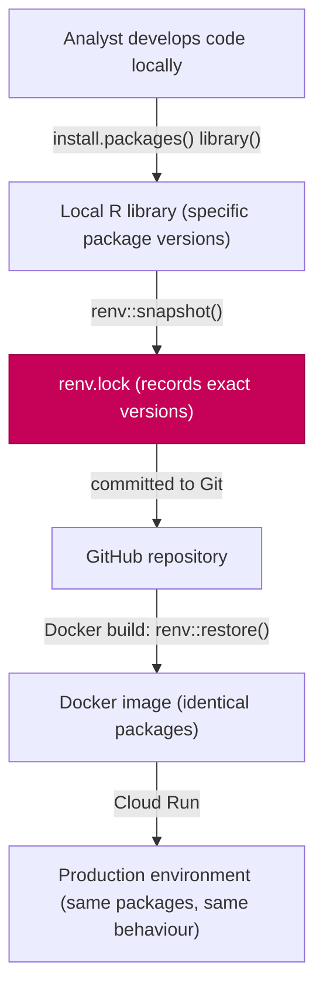
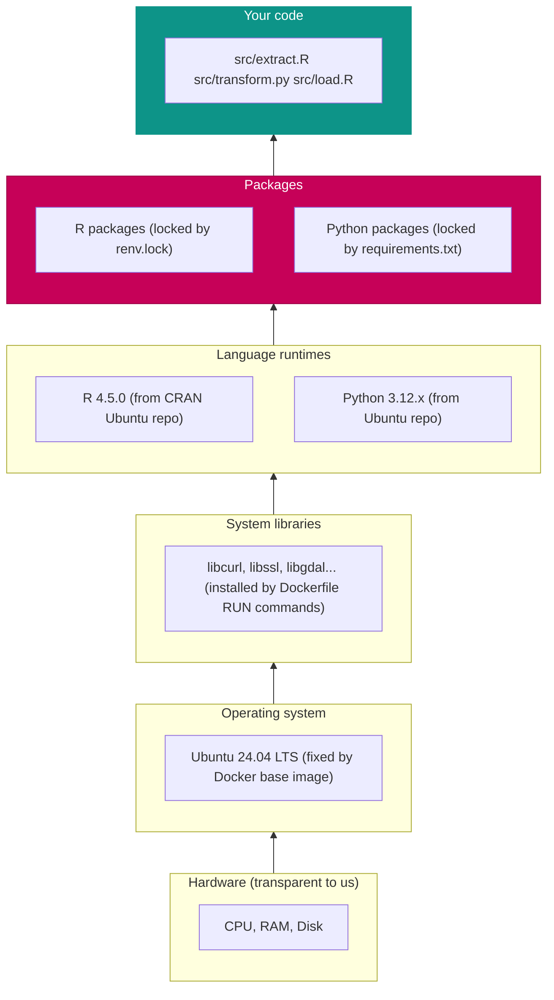

# Managing R & Python Versions

One of the most common causes of analytical pipeline failure is an environment that has changed since the code was written. A package is updated, a function is deprecated, a default argument changes — and code that worked perfectly six months ago now produces different results, or fails entirely. This page explains how we prevent this using lock files.

---

## The dependency problem

### Packages update constantly

The CRAN ecosystem is actively maintained. Packages release new versions regularly. Updates often bring bug fixes and new features — but also breaking changes. `dplyr` 1.0.0 changed how `across()` works. `ggplot2` 3.4.0 changed the `size` aesthetic. `httr` was effectively replaced by `httr2`.

If your analysis depends on a specific behaviour, and that behaviour changes in a new package version, your code silently breaks. Worse: if it breaks at runtime rather than producing wrong results, you might not notice until a report goes out with incorrect numbers.

### The "works on my machine" problem, again

When you install R packages on your laptop, you get whatever is current today. When a colleague installs the same packages next month, they get newer versions. Your environments diverge silently. Your code starts behaving differently on different machines.

### The traditional answer: documentation

The traditional solution is to document: "this analysis requires `dplyr >= 1.1.0`, `lubridate >= 1.9.0`, etc." But documentation goes out of date, is ignored, and does not handle indirect dependencies (the packages that *your* packages depend on).

### The modern answer: lock files

A **lock file** records the exact version of every package (including indirect dependencies), its source, and a hash to verify its integrity. When you or anyone else installs from the lock file, they get byte-for-byte the same packages you were using. No drift, no surprises.

---

## R package management with `renv`

`renv` (Reproducible Environments) is the standard tool for managing R package versions. It was developed by Posit (formerly RStudio) and integrates tightly with RStudio and Positron.

### How renv works



### The `renv.lock` file

`renv.lock` is a JSON file that records every R package installed in the project. Here is what an entry looks like:

```json
{
  "R": {
    "Version": "4.5.0",
    "Repositories": [
      { "Name": "CRAN", "URL": "https://cloud.r-project.org" }
    ]
  },
  "Packages": {
    "dplyr": {
      "Package": "dplyr",
      "Version": "1.1.4",
      "Source": "Repository",
      "Repository": "CRAN",
      "Hash": "fedd9d00c2944f2a52bf3d02f16f3a45"
    },
    "ggplot2": {
      "Package": "ggplot2",
      "Version": "3.5.1",
      "Source": "Repository",
      "Repository": "CRAN",
      "Hash": "544df48e5acb0bc2a1f2e2a4a68dd5f0"
    }
  }
}
```

This file is committed to Git. It means anyone who clones the repository and runs `renv::restore()` gets exactly `dplyr 1.1.4` and `ggplot2 3.5.1` — the versions you were using.

### Core renv commands

```r
# Initialise renv in an existing project
renv::init()

# Install a package and update the lock file
install.packages("dplyr")
renv::snapshot()    # record the current state of the library

# Install packages from the lock file (what Docker does)
renv::restore()

# Update a specific package
renv::update("dplyr")
renv::snapshot()    # update the lock file

# Check the status of your library vs the lock file
renv::status()

# See what packages are installed
renv::dependencies()
```

### renv in a project

When renv is active in a project, each project has its own private library — packages installed for one project do not affect another. This is analogous to virtual environments in Python.

```
my-pipeline/
├── renv/
│   ├── activate.R        # auto-loaded by .Rprofile
│   └── library/          # project-specific package library
├── renv.lock             # the lock file (committed to Git)
├── .Rprofile             # tells R to use renv (committed to Git)
└── src/
    └── extract.R
```

`.Rprofile` is sourced automatically when R starts in the project directory. It activates renv, which redirects package loading to the project library.

### renv in Docker

In our Dockerfile, the `renv.lock` is copied into the image and restored:

```dockerfile
# Copy the lock file into the image
COPY renv.lock /renv.lock

# Restore packages from the lock file
RUN Rscript -e "renv::restore(project = '/', library = '/renv/library')"
```

Every package installed in the image is exactly what is in `renv.lock`. When you update a package and push a new `renv.lock`, the next Docker build installs the updated version — and so does everyone who pulls the new image.

---

## Python package management

### `requirements.txt`

The traditional Python approach is a `requirements.txt` file with pinned version numbers:

```text
# requirements.txt
pandas==2.2.3
numpy==1.26.4
google-cloud-bigquery==3.27.0
google-cloud-storage==2.18.2
scikit-learn==1.5.2
python-dotenv==1.0.1
requests==2.32.3
```

The `==` operator pins the exact version. This is simple and widely supported. Install from it with:

```bash
pip install -r requirements.txt
```

**The limitation of requirements.txt**: it only lists *direct* dependencies. If `google-cloud-bigquery` depends on `google-auth`, and `google-auth` gets updated, your environment can change even though `requirements.txt` has not. For more precise reproducibility, use `pip freeze`:

```bash
# Generate requirements.txt from current environment (includes all transitive deps)
pip freeze > requirements.txt
```

`pip freeze` produces a complete snapshot of every package installed, including indirect dependencies. This is more reproducible but also more verbose.

### `pyproject.toml` and `uv` (modern approach)

The modern Python packaging ecosystem has moved towards `pyproject.toml` for project metadata and tools like `uv` for fast, deterministic installs. For our purposes, `requirements.txt` is sufficient and simpler to explain.

### In Docker

```dockerfile
COPY requirements.txt /requirements.txt
RUN pip install --no-cache-dir -r requirements.txt
```

`--no-cache-dir` prevents pip from caching downloaded packages in the image, keeping the image smaller.

---

## R version management

Package compatibility often depends on the R version. `renv` records the R version in `renv.lock`, so you can see what version the code was developed with:

```json
{
  "R": {
    "Version": "4.5.0"
  }
}
```

In our Docker images, the R version is pinned by the base image. The `Dockerfile` starts from a specific Ubuntu version which includes a specific R version from the CRAN Ubuntu repository. This means:

- The R version is fixed by the `Dockerfile`
- The package versions are fixed by `renv.lock`
- The system library versions are fixed by the Ubuntu version

Together, these three form a completely reproducible software stack.

### Checking your R version locally

```r
R.version.string
# [1] "R version 4.5.0 (2025-04-11)"

# Check a specific package version
packageVersion("dplyr")
# [1] '1.1.4'
```

---

## Python version management

Python version management is more complex because multiple Python versions coexist on the same system. The standard tools are:

| Tool | What it does |
|------|-------------|
| **System Python** | The Python installed by the OS — don't use for projects |
| **Virtual environment (venv)** | An isolated Python environment per project |
| **pyenv** | Manages multiple Python versions on one machine |
| **conda** | An all-in-one package/environment manager popular in data science |

In our architecture, the Python version is fixed by the Docker image. You do not manage Python versions directly — the `Dockerfile` installs a specific Python version, and your `requirements.txt` pins your packages.

Inside a container, there is exactly one Python version (the one in the image). The environment is already isolated — no venv needed.

For local development *outside* Docker (if you prefer), use a virtual environment:

```bash
python3.12 -m venv .venv
source .venv/bin/activate
pip install -r requirements.txt
```

---

## The full reproducibility stack



Every layer is pinned. The code at the top always runs on the same foundation.

---

## Updating packages

Packages need to be updated occasionally — for bug fixes, security patches, and new features. The process is deliberate and goes through Git:

### Updating an R package

```r
# Update a specific package
renv::update("dplyr")

# Snapshot the new state
renv::snapshot()
```

Then commit `renv.lock` and open a pull request. The PR triggers a test run — if your tests pass with the new version, the update is safe to merge. The Docker image is rebuilt with the new lock file when merged.

### Updating a Python package

```bash
pip install --upgrade google-cloud-bigquery
pip freeze > requirements.txt
```

Commit `requirements.txt` and open a pull request with the updated lock.

---

## Further reading

- **[renv documentation](https://rstudio.github.io/renv/)** — comprehensive reference for the renv package
- **[renv: Project Environments for R](https://www.tidyverse.org/blog/2019/11/renv-0-9-0/)** — Kevin Ushey's original introduction to renv on the tidyverse blog
- **[pip documentation — requirements files](https://pip.pypa.io/en/stable/reference/requirements-file-format/)** — the pip reference for requirements.txt format
- **[Reproducible Environments — The Turing Way](https://the-turing-way.netlify.app/reproducible-research/renv)** — a broader discussion of reproducible research environments
