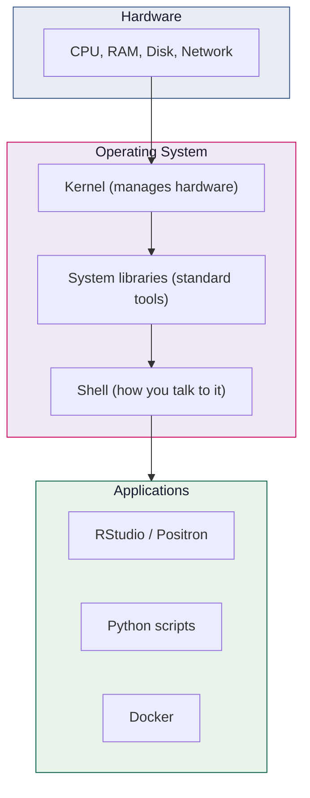
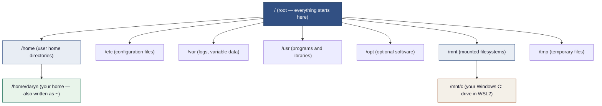

# What Is Linux?

Before you start following setup instructions and running commands, it helps to understand *what you are actually setting up* and *why*. This page explains Linux, the command line, and WSL2 using analogies from the world you already work in.

---

## The short version

Linux is a free, open-source operating system — the same kind of thing as Windows, but different in almost every other way. Our cloud servers run Linux. Our Docker containers run Linux. To develop code that runs in those environments, you need a Linux environment on your laptop. WSL2 gives you that — a genuine Linux system running *inside* Windows, without replacing it.

---

## What is an operating system?

An operating system (OS) is the software layer between your hardware (processor, memory, disks) and the applications you run. It manages resources, provides services (file access, networking, process management), and presents a consistent interface to programs.



Windows, macOS, and Linux are all operating systems. They each present a different interface to applications and to users, which is why the same software often cannot run on all three without modification.

---

## What makes Linux different?

### It is the operating system of servers

Approximately 96% of the world's web servers run Linux[^1]. The reason is primarily reliability, licensing cost (Linux is free), and the ecosystem of server tools built around it. Cloud platforms — AWS, GCP, Azure — all run Linux under the hood. When your code runs on Cloud Run, it is running on Linux.

[^1]: [W3Techs Web Technology Surveys, 2024](https://w3techs.com/technologies/details/os-linux)

### It is the operating system of containers

Docker containers are built from Linux. A Docker image contains a minimal Linux filesystem. Even if you build and run a Docker container on a Windows or macOS machine, what runs *inside* the container is Linux.

### It is free and open source

Unlike Windows, Linux is free. The full source code is publicly available. Anyone can modify it, distribute it, and use it for any purpose. This is why it dominates server infrastructure — organisations do not pay per-server licensing fees.

### It is not a single thing

"Linux" refers to the kernel — the core of the operating system. On top of that kernel, many different organisations have built their own distributions ("distros") by adding their own tools, package managers, and defaults. The most popular for servers and developer machines are:

| Distribution | Used for |
|---|---|
| **Ubuntu** | Developer laptops, cloud servers, Docker containers — what we use |
| **Debian** | Servers; Ubuntu is based on Debian |
| **Red Hat / CentOS** | Enterprise servers |
| **Alpine** | Tiny Docker base images |
| **Fedora** | Developer laptops |

---

## The command line: your new tool

On Windows, you probably interact primarily through graphical interfaces — clicking buttons, navigating folders in Explorer. Linux is designed to be operated primarily through the **command line** (also called the shell, terminal, or bash).

This feels alien at first, but the command line is not a step backwards — it is a more powerful and precise interface. When you click buttons in a GUI, you are performing an action that someone designed a button for. On the command line, you can perform *any* action the operating system supports, compose them together, automate them, and put them in scripts.

Think of it like this:

| GUI (Windows Explorer) | Command line (bash) |
|---|---|
| Navigate to a folder by clicking | `cd path/to/folder` |
| Create a folder with right-click | `mkdir new-folder` |
| Copy a file by dragging | `cp source.R destination/` |
| Search for files in the search box | `find . -name "*.R"` |
| Can only do what buttons are designed for | Can do anything — and automate it |

The commands in this guide will become fluent with practice. Initially, think of them as vocabulary to look up rather than memorise.

### The shell prompt

When you open an Ubuntu terminal, you see something like:

```
daryn@LAPTOP-ABC123:~$
```

Breaking this down:

```
daryn          @LAPTOP-ABC123  :  ~    $
↑               ↑                 ↑    ↑
your username   your computer     your current   you're a
                name              directory      normal user
                                  (~ = home)
```

Everything you type appears after the `$`. Press `Enter` to run the command. The output appears below, then a new prompt appears.

---

## The Linux filesystem

The Linux filesystem looks different from Windows. Understanding a few key locations will save you confusion later.



Key locations you will use:

| Path | Meaning |
|------|---------|
| `/home/daryn` or `~` | Your Linux home directory — where you keep your projects |
| `~/projects/` | Where you should keep all your project folders |
| `/workspace` | Inside our Docker containers — where your project code lives |
| `/mnt/c/Users/daryn` | Your Windows home directory, accessible from Linux (but slow — avoid for project files) |

!!! warning "Keep project files in your Linux home directory"
    Files under `/mnt/c/` cross the WSL2 boundary on every read and write, which is significantly slower and can cause issues with Docker volume mounts. Always keep your project files at `~/projects/`, not in your Windows folders.

---

## WSL2: Linux inside Windows

**WSL2** (Windows Subsystem for Linux, version 2) is a Microsoft-developed technology that runs a genuine Linux kernel inside a lightweight virtual machine on your Windows laptop. This is not a Linux *emulator* — it is a real Linux kernel, running real Linux binaries.

### The analogy: a house with two floors

Think of your Windows laptop as a house with two floors:

```
┌────────────────────────────────────────┐
│  UPSTAIRS: Windows                     │
│  • Your desktop, Explorer, Office      │
│  • Outlook, Teams, browser             │
│  • Everything you normally do          │
│                                        │
│  ┌─────────────────────────────────┐   │
│  │  DOWNSTAIRS: Ubuntu (WSL2)      │   │
│  │  • bash terminal                │   │
│  │  • git, docker, gcloud          │   │
│  │  • Your project code            │   │
│  │  • R, Python, development tools │   │
│  └─────────────────────────────────┘   │
│                                        │
│  Staircase: you can access Windows     │
│  files from Linux (/mnt/c/...) and     │
│  Linux files from Windows (\\wsl$\...) │
└────────────────────────────────────────┘
```

The two floors coexist on the same machine. You use Windows for your day-to-day work and the Linux floor for development. They can exchange files, but your project files should live downstairs (in Ubuntu) for performance and compatibility.

### Why not just use Windows tools?

You could run R and RStudio on Windows and write your analysis there. The problems arise when you try to:

1. **Run Docker containers**: Docker containers are Linux. Running them on Windows involves a compatibility layer that can cause subtle differences between local and cloud behaviour.

2. **Use the command-line tools**: Many development tools (git hooks, shell scripts, package managers) assume a Unix-like environment. Behaviour can differ on Windows in ways that are hard to predict.

3. **Match the cloud environment**: Your Cloud Run container runs Ubuntu Linux. Developing on Linux locally means your code runs in the same environment both locally and in production.

4. **Avoid path problems**: Windows uses backslashes (`\`) in file paths; Linux uses forward slashes (`/`). R code with hardcoded Windows paths will not run on Linux. Developing on Linux forces you to write portable path code.

### WSL2 vs WSL1

WSL1 (the original version) was a compatibility layer that translated Linux system calls to Windows system calls. It worked for many things but was slower and had incompatibilities.

WSL2 runs a genuine Linux kernel in a lightweight Hyper-V virtual machine. It is faster, more compatible, and able to run Docker containers. Always use WSL2.

```bash
# Verify you have WSL2, not WSL1
wsl --list --verbose
# NAME      STATE           VERSION
# * Ubuntu    Running         2    ← must be 2
```

---

## Essential Linux commands for analysts

You will use a small set of commands repeatedly. Here are the most important ones:

### Navigation

```bash
pwd              # print working directory (where am I?)
ls               # list files in current directory
ls -la           # list files with details and hidden files
cd projects      # change into the 'projects' subdirectory
cd ..            # go up one level
cd ~             # go to home directory
cd ~/projects/my-pipeline  # go to a specific directory
```

### Files and folders

```bash
mkdir analysis           # create a directory
mkdir -p data/raw/2024   # create nested directories
cp file.R backup.R       # copy a file
mv old-name.R new-name.R # rename (move) a file
rm file.R                # delete a file (no recycle bin!)
rm -r old-folder/        # delete a folder and its contents
cat file.R               # print a file's contents
head -20 file.R          # print the first 20 lines
```

### Searching

```bash
grep "pattern" file.R         # find lines matching a pattern in a file
grep -r "pattern" src/        # search all files in a directory
find . -name "*.R"            # find files by name
find . -name "*.csv" -size +1M # find CSV files over 1MB
```

### Processes and system

```bash
ps aux | grep R     # see running R processes
kill 12345          # stop a process by ID
ctrl+c              # interrupt (stop) the current command
ctrl+z              # suspend (pause) the current command
```

### Pipes and redirection

The `|` character (pipe) sends the output of one command to the input of another. This is one of the most powerful features of the command line:

```bash
ls -la | grep ".R"           # list only files with .R in their name
cat analysis.R | grep "Sys.getenv"  # find all environment variable reads
git log --oneline | head -10  # show only the last 10 commits
```

---

## Getting help on the command line

```bash
man ls       # manual page for the 'ls' command (press q to quit)
ls --help    # quick help for most commands
which python # show where a program is installed
type git     # show how git resolves
```

---

## Further reading

- **[The Linux Command Line](https://linuxcommand.org/tlcl.php)** (William Shotts) — a comprehensive free book on the bash command line, well-written for beginners
- **[Ubuntu tutorials for beginners](https://ubuntu.com/tutorials)** — official Ubuntu tutorials including a [command line for beginners](https://ubuntu.com/tutorials/command-line-for-beginners) guide
- **[Microsoft WSL2 documentation](https://learn.microsoft.com/en-us/windows/wsl/)** — official Microsoft documentation including setup, tips, and best practices
- **[ExplainShell](https://explainshell.com)** — paste any shell command and see an explanation of every part of it

Continue to [Setting Up WSL2](wsl-setup.md) to get your Linux environment running.
