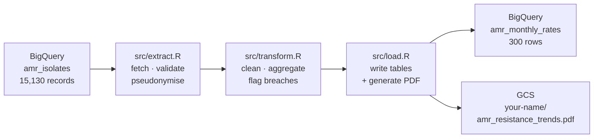

# Workshop: Running the AMR Pipeline Locally

This page guides you through running the AMR surveillance pipeline on your own machine. By the end, you will have executed a real data pipeline that reads isolate records from BigQuery, calculates monthly resistance rates, and writes a PDF chart to Google Cloud Storage — all from your laptop.

The trainer has already set up the shared GCP infrastructure (BigQuery dataset, GCS buckets, and a Cloud Run Job). Your task is to configure your local environment with the details your trainer provides, run the pipeline, and verify your personal output in the shared bucket.

!!! important "Your trainer will give you a `.env` file"
    You do not need to look up any GCP resource names yourself. Your trainer will hand out a pre-filled `.env` file at the start of the session. The only value you add yourself is your name as `OUTPUT_PREFIX` — that is what gives you your own output folder.

---

## Before you start

Check that you have the following installed and working in WSL2:

| Requirement | How to check | Guide |
|---|---|---|
| WSL2 installed | Open a WSL2 terminal | [Setting Up WSL2](wsl-setup.md) |
| Docker Desktop with WSL2 integration enabled | `docker --version` | [Containers Explained](docker-containers.md) |
| `git` available | `git --version` | |
| `gcloud` CLI installed | `gcloud --version` | |

!!! important "GCP project access"
    Your trainer will have added your Google account to the workshop GCP project before the session. If in doubt, ask — you will see a permission error in step 3 if access has not been granted.

---

## Step 1: Clone the repository

Open a WSL2 terminal and clone the repository to your home directory:

```bash
git clone https://github.com/Ch3w3y/docker_gcp.git
cd docker_gcp/example-pipeline
```

!!! tip "What you are cloning"
    The `example-pipeline/` directory is the complete AMR surveillance pipeline — the same code that runs automatically in the cloud. You are not writing any code today; you are running it locally to see how it works end to end.

---

## Step 2: Authenticate with Google Cloud

The pipeline reads from BigQuery and writes to GCS. Your local Docker container authenticates using your Google account via Application Default Credentials (ADC).

Run these three commands in WSL2, substituting the project ID your trainer gives you:

```bash
# Log in to gcloud with your Google account
gcloud auth login

# Point gcloud at the workshop project (your trainer will give you the project ID)
gcloud config set project <PROJECT-ID>

# Create credentials that R libraries can use to talk to GCP APIs
gcloud auth application-default login
```

After `gcloud auth application-default login`, your browser will open and ask you to approve access. Once complete, credentials are saved at `~/.config/gcloud/application_default_credentials.json`. The `docker-compose.yml` mounts this file into the container automatically — you do not need to copy it anywhere.

!!! note "Why two login commands?"
    `gcloud auth login` authenticates *you* to use `gcloud` CLI commands. `gcloud auth application-default login` creates a separate credentials file for *application code* (the R libraries `bigrquery` and `googleCloudStorageR`). Both are needed.

---

## Step 3: Configure your environment

Copy the example environment file:

```bash
cp .env.example .env
```

Your trainer will give you a `.env` file with all the shared values pre-filled. Copy those values in, then add your own name as `OUTPUT_PREFIX`:

```bash
GCP_PROJECT_ID=<provided by trainer>
BQ_DATASET=<provided by trainer>
GCS_DATA_BUCKET=<provided by trainer>
PIPELINE_SALT=<provided by trainer>
BQ_SOURCE_TABLE=amr_isolates
BQ_OUTPUT_TABLE=amr_monthly_rates

# Set this to your own name — no spaces, hyphens are fine (e.g. alice-smith)
OUTPUT_PREFIX=your-name-here
```

!!! important "OUTPUT_PREFIX gives you your own output folder"
    The pipeline saves its chart to:

    ```
    gs://<GCS_DATA_BUCKET>/your-name-here/amr_resistance_trends.pdf
    ```

    Using your name means every attendee gets their own folder in the shared bucket. Outputs will not overwrite each other, even when everyone runs the pipeline at the same time.

!!! warning "Keep your `.env` private"
    The `.env` file contains values your trainer has shared for this workshop only. Do not commit it to GitHub, post it in chat, or share it beyond the session. It is already listed in `.gitignore` to help prevent accidental commits.

---

## Step 4: Build the Docker image

The pipeline runs inside the `gcp-etl` Docker image. Build it once from the repo root:

```bash
# Run this from docker_gcp/ (one level above example-pipeline/)
docker build -t gcp-etl:local gcp-etl/
```

This takes about 10–15 minutes the first time, as it installs R, Python, and all locked package versions. Docker caches each layer, so subsequent builds are much faster.

!!! tip "Pull the pre-built image instead"
    Your trainer may have pushed a pre-built image. If so, they will give you a pull command that looks like:

    ```bash
    gcloud auth configure-docker <REGION>-docker.pkg.dev
    docker pull <REGION>-docker.pkg.dev/<PROJECT-ID>/docker-images/gcp-etl:latest
    docker tag  <REGION>-docker.pkg.dev/<PROJECT-ID>/docker-images/gcp-etl:latest gcp-etl:local
    ```

---

## Step 5: Run the pipeline

From the `example-pipeline/` directory:

```bash
docker compose run --rm pipeline
```

You will see log output as each step executes:

```
--- Step 1/3: Extract ---
[...] Fetching isolates from BigQuery
[...] Fetched 15130 isolate records
[...] Pseudonymisation complete. Identifiable 'patient_id' dropped.
[...] === EXTRACT COMPLETE: 15130 rows ===

--- Step 2/3: Transform ---
[...] Produced 300 organism-country-month rate estimates
[...] Found 106 organism-country-month combinations above threshold
[...] === TRANSFORM COMPLETE ===

--- Step 3/3: Load ---
[...] Writing 300 rows to amr_monthly_rates
[...] Uploading plot to GCS: your-name-here/amr_resistance_trends.pdf
[...] Plot uploaded.
[...] === LOAD COMPLETE ===
```

The full run takes approximately 2–3 minutes.

---

## Step 6: Verify your output

Check that your PDF landed in the shared GCS bucket (substitute the bucket name your trainer gave you):

```bash
gsutil ls gs://<GCS_DATA_BUCKET>/your-name-here/
```

Expected output:

```
gs://<GCS_DATA_BUCKET>/your-name-here/amr_resistance_trends.pdf
```

Download and open it from Windows:

```bash
gsutil cp gs://<GCS_DATA_BUCKET>/your-name-here/amr_resistance_trends.pdf ~/amr_chart.pdf

# Open in Windows Explorer from WSL2
explorer.exe ~/amr_chart.pdf
```

The PDF contains a 12-month resistance trend chart for five organisms across five European countries, generated from the AMR surveillance data in BigQuery.

---

## What just happened



| Step | Script | What it does |
|---|---|---|
| Extract | `src/extract.R` | Fetches 12 months of isolate records from BigQuery. Validates shape and content. Pseudonymises patient IDs before any other code touches them. |
| Transform | `src/transform.R` | Removes nulls and duplicates. Calculates monthly resistance rates per organism and country. Flags combinations above 50% resistance. |
| Load | `src/load.R` | Writes long-format rates and a wide pivot matrix to BigQuery. Generates a ggplot2 chart and uploads it as a PDF to your folder in GCS. |

The code you just ran is identical to what runs in Cloud Run. The only difference is how `/workspace` is populated: locally, `docker-compose.yml` bind-mounts your project directory there; in Cloud Run, a GCS bucket is mounted there via gcsfuse.

---

## Running the tests (optional)

You can run the full test suite without a BigQuery connection. The 32 tests cover the transform logic using synthetic data:

```bash
docker compose run --rm pipeline \
  Rscript -e "testthat::test_dir('tests/testthat', reporter='progress')"
```

This is the same check that runs automatically in GitHub Actions on every pull request.

---

## Troubleshooting

| Symptom | Likely cause | Fix |
|---|---|---|
| `does not have permission` error | Your Google account is not in the GCP project | Ask your trainer to grant you access |
| `Missing required environment variables` | `.env` file is missing or incomplete | Confirm `.env` exists in `example-pipeline/` and all values are set |
| `Error in library(bigrquery)` | Docker image not built correctly | Re-run `docker build -t gcp-etl:local gcp-etl/` from the repo root |
| `Non-interactive session and no authentication` | `gcloud auth application-default login` not run | Run it in WSL2, then re-run the pipeline |
| No PDF in bucket after a successful run | `OUTPUT_PREFIX` left as `your-name-here` | Edit `.env` and set a real name |
| `gcloud: command not found` inside the container | `gcloud` is not installed in the container — this is expected | Run `gsutil` and `gcloud` commands in your WSL2 terminal, not inside the container |

For more detailed diagnosis, see [Troubleshooting](troubleshooting.md).
