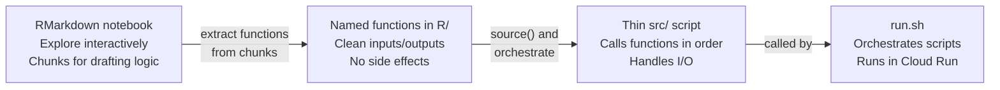

# Writing Functions

Before this guide asks you to build packages and write tests, it asks you to do one thing: write functions. Functions are the unit everything else is built on. A package is a collection of functions. A test is a check that a function behaves correctly. A pipeline is a sequence of function calls.

This page shows you how to get there from where most analysts start — RMarkdown chunks and top-to-bottom scripts.

---

## A chunk is a function waiting to be named

If you have written RMarkdown, you have already written functions. You just have not named them yet.

Here is a typical analysis chunk:

````r
```{r clean-dates}
patient_data <- patient_data |>
  filter(!is.na(admission_date)) |>
  filter(admission_date <= Sys.Date()) |>
  mutate(year = lubridate::year(admission_date),
         month = lubridate::month(admission_date))
```
````

This chunk has inputs (the `patient_data` data frame in your environment), a transformation, and an output (an updated `patient_data`). That is exactly what a function is — except a function makes the inputs and outputs explicit:

```r
add_date_columns <- function(df) {
  df |>
    dplyr::filter(!is.na(admission_date)) |>
    dplyr::filter(admission_date <= Sys.Date()) |>
    dplyr::mutate(
      year  = lubridate::year(admission_date),
      month = lubridate::month(admission_date)
    )
}
```

The transformation is identical. The difference: the function can be called with any data frame, tested in isolation, and reused across pipelines.

---

## From RMarkdown to R scripts: the transition

RMarkdown is a superb development environment. You can run chunks interactively, see outputs inline, and annotate your thinking in prose. Use it to explore and plan.

The transition happens when the analysis needs to run automatically:



The prose and exploration in your notebook do not go away — keep the notebook as a development artefact. What you extract are the functions: the clean, reusable logic that the pipeline will call.

---

## When to write a function

A useful rule of thumb: write a function when you find yourself doing either of these things.

**1. Copying a block of code**

If you have written the same transformation twice in different places, that is a function. Copy-paste creates two things to maintain when requirements change.

**2. Giving a block of code a comment heading**

```r
# --- Remove invalid dates and add year/month columns ---
patient_data <- patient_data |>
  filter(!is.na(admission_date)) |>
  filter(admission_date <= Sys.Date()) |>
  mutate(year = lubridate::year(admission_date),
         month = lubridate::month(admission_date))
```

If you are already naming what a block does, you are describing a function. Extract it:

```r
patient_data <- add_date_columns(patient_data)
```

The comment becomes the function name. The code becomes the function body. The calling script becomes self-documenting.

---

## Pure functions: the gold standard for pipeline logic

A **pure function** has two properties:

1. Given the same inputs, it always returns the same output
2. It has no side effects — it does not read from or write to disk, databases, or the network

```r
# Pure — testable, predictable, safe to call multiple times
calculate_resistance_rate <- function(df, organism, country) {
  df |>
    dplyr::filter(organism_code == organism, country_code == country) |>
    dplyr::summarise(
      n_tested    = dplyr::n(),
      n_resistant = sum(resistant),
      pct         = 100 * mean(resistant)
    )
}

# Impure — reads from BigQuery, cannot be unit tested without a live connection
fetch_isolates <- function(project, dataset) {
  con <- DBI::dbConnect(bigrquery::bigquery(), project = project)
  on.exit(DBI::dbDisconnect(con))
  DBI::dbGetQuery(con, glue::glue("SELECT * FROM `{project}.{dataset}.isolates`"))
}
```

The goal is to write your *logic* as pure functions and confine your *I/O* to thin wrappers. In a well-organised pipeline, the pure functions live in `R/transform.R` and are covered by unit tests. The I/O wrappers live in `src/extract.R` and `src/load.R` and are not unit tested directly.

---

## Anatomy of a well-written function

```r
#' Calculate monthly resistance rate for an organism and country
#'
#' Filters isolates to the specified organism and country, then computes
#' the percentage of resistant isolates for each year-month combination.
#' Groups with fewer than 10 isolates are flagged as low-count.
#'
#' @param df       A data frame with columns: organism_code, country_code,
#'                 year_month, resistant (logical).
#' @param organism Character. Organism code to filter to (e.g. "ECOL").
#' @param country  Character. Country code to filter to (e.g. "GBR").
#'
#' @return A data frame with columns: year_month, n_tested, n_resistant,
#'         pct_resistant, low_count.
#'
#' @export
calculate_resistance_rate <- function(df, organism, country) {
  stopifnot(
    is.data.frame(df),
    is.character(organism), length(organism) == 1,
    is.character(country),  length(country)  == 1
  )

  df |>
    dplyr::filter(organism_code == organism, country_code == country) |>
    dplyr::group_by(year_month) |>
    dplyr::summarise(
      n_tested      = dplyr::n(),
      n_resistant   = sum(resistant),
      pct_resistant = 100 * mean(resistant),
      low_count     = dplyr::n() < 10,
      .groups       = "drop"
    )
}
```

Key elements:

| Part | Purpose |
|------|---------|
| `#'` roxygen2 comment block | Becomes the function's help page (`?calculate_resistance_rate`) |
| `@param` tags | Documents each argument: name, type, what it means |
| `@return` tag | Documents what the function produces |
| `@export` | Makes the function available when the package is loaded |
| `stopifnot()` | Validates inputs and fails loudly with a clear error if something is wrong |
| Named arguments | `organism = "ECOL"` is clearer than positional `"ECOL"` at the call site |

The `#'` documentation block is covered in depth in [Building R Packages](r-packages.md). You do not need to write it for every function immediately — start with just the code, add documentation when the function is stable.

---

## Argument design

**Give arguments sensible names.** The caller should be able to read `calculate_rate(df = isolates, organism = "ECOL", country = "GBR")` and understand what each argument does without reading the function body.

**Use defaults where they make sense.** Defaults should represent the most common case:

```r
fetch_isolates <- function(project, dataset, start_date = "2024-01-01") {
  # ...
}
```

**Fail loudly on bad input.** A function that silently does the wrong thing with unexpected input is harder to debug than one that stops immediately with a clear message:

```r
clean_dates <- function(df, date_col = "admission_date") {
  if (!date_col %in% names(df)) {
    stop("Column '", date_col, "' not found in data frame. ",
         "Available columns: ", paste(names(df), collapse = ", "))
  }
  # ...
}
```

---

## Modularity and parallel work

Functions map naturally onto files, and files map naturally onto how Git handles parallel work.

When `calculate_resistance_rate()` lives in `R/transform.R` and `fetch_isolates()` lives in `R/extract.R`, two colleagues can work on them simultaneously without any risk of conflict. Each function in its own file is an independent unit of work — in code, in testing, and in version control.

This is why writing functions before learning Git is intentional. By the time you reach [From Shared Drives to Git](from-shares-to-git.md), you will have a codebase that is naturally structured for parallel collaboration.

---

## Further reading

- **[Advanced R — Functions chapter](https://adv-r.hadley.nz/functions.html)** — Hadley Wickham's definitive treatment of R functions, environments, and scoping
- **[R for Data Science — Functions chapter](https://r4ds.hadley.nz/functions)** — practical introduction to writing functions in the tidyverse style
- **[The tidyverse style guide — Functions](https://style.tidyverse.org/functions.html)** — naming conventions, argument order, return values
