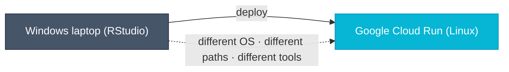
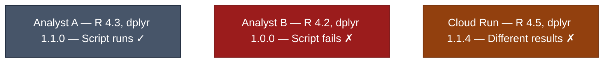
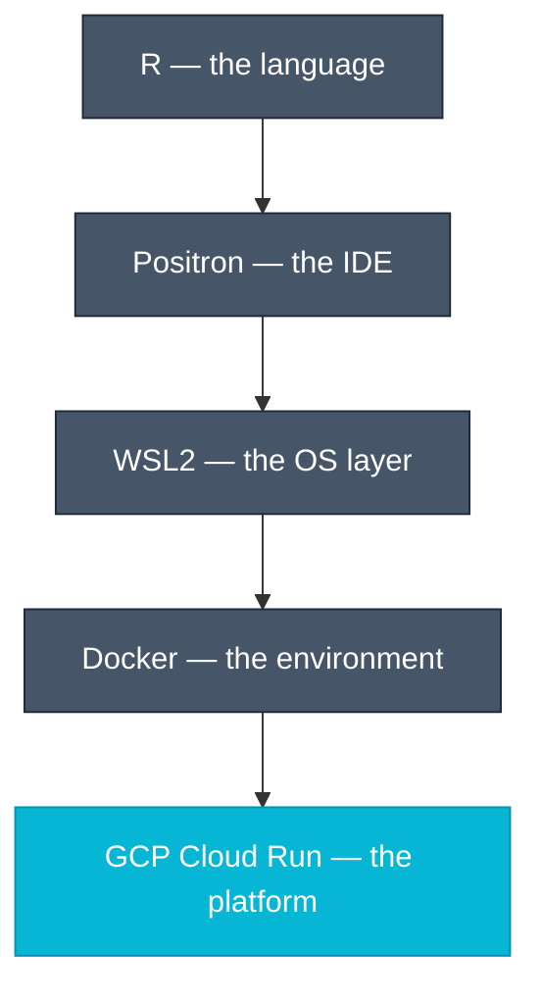

# Your Development Environment

RStudio is in daily use across the department. It is a capable, well-supported tool for R analysis — and nothing in this guide changes that. But as analytical work moves toward version-controlled code, reproducible environments, and cloud-based pipelines, a set of questions tends to arise:

- Why are we being asked to install Linux on a Windows laptop?
- What does a container have to do with running R?
- What is Positron, and why not just keep using RStudio?

This page answers those questions in order, starting from what you already know.

---

## What is an IDE?

RStudio is an **IDE** — an Integrated Development Environment. The term sounds technical but the concept is simple: an IDE is a workshop. The workbench has a place for your code (the editor), a place to run it (the console), a place to see your variables (the environment pane), and a place to see your plots. Everything a developer needs is arranged in one window.

The key thing to understand about an IDE is what it is *not*: it is not the programming language. R and RStudio are two separate things.

---

## R and RStudio are not the same thing

**R** is the programming language — the engine. It is a piece of software that reads R code and executes it. It runs entirely from a command line and has no interface of its own.

**RStudio** is one application for working with R — the dashboard. It makes R more accessible by wrapping it in a visual interface, but R itself does not know or care whether RStudio is involved.

This distinction matters because the rest of this guide introduces a different application for working with R — one that is better suited to the kind of work cloud-based analytical pipelines require. R continues to be the language throughout. The workshop changes.

---

## The first friction point: your laptop runs Windows, the cloud runs Linux

RStudio on Windows works well for writing and running R code locally. The problem appears when that code needs to run in the cloud.

Cloud servers — including the Google Cloud Run jobs this guide builds toward — run **Linux**, not Windows. Linux and Windows are different operating systems. File paths look different (`/workspace/data` vs `C:\Users\name\data`). The available command-line tools differ. Behaviour that works on one can silently fail on the other.

The traditional solution — "test locally on Windows, deploy to Linux and hope it works" — is the source of a large proportion of pipeline failures that are difficult to diagnose.

**WSL2 closes this gap.** WSL2 (Windows Subsystem for Linux) runs a real Linux environment directly inside Windows. When you develop inside WSL2, your file paths, your shell, and your tools all behave identically to the cloud server. The OS gap disappears.

---

## The second friction point: packages drift, environments diverge

Closing the OS gap does not close the environment gap.

Analytical pipelines depend on specific versions of R packages. `dplyr 1.1.0` and `dplyr 1.0.0` behave differently. When a colleague's machine has a different version — or when a package is updated automatically — results can change without any code changing. Over time, team members' environments drift apart, and a script that works for one person fails for another.

This is the **reproducibility problem**: the environment a script runs in is as important as the script itself, but traditional tools do not capture or enforce it.

**Docker closes this gap.** A Docker container packages the exact environment a pipeline needs — the Linux version, the R version, every R and Python package down to the patch release — into a single, reproducible unit. That container runs identically on any machine and on Cloud Run. There is no "works on my machine" because every machine runs the same container.

---

## The third friction point: analytical work is no longer just R files

When pipelines are simple R scripts, RStudio is sufficient. But a cloud-based pipeline involves more than R:

- A `Dockerfile` that defines the container environment
- A `run.sh` bash script that orchestrates the pipeline steps
- A `cloud-run-job.yml` YAML file that defines the Cloud Run Job
- Python scripts for data engineering tasks
- Configuration files, test files, CI workflow files

RStudio was built for R. It opens R files well. For everything else — Dockerfiles, bash, YAML, Python — it offers little help: no syntax highlighting, no linting, no language-aware completion.

**Positron closes this gap.** Positron is an IDE built by Posit (the makers of RStudio) on the VS Code platform. It has first-class support for R and Python in the same window, and handles every other file type in a cloud pipeline with the full VS Code extension ecosystem behind it. More importantly, Positron has built-in support for *devcontainers* — a feature that lets the editor open inside the Docker container, so the environment you develop in is identical to the environment that runs in Cloud Run.

---

## The stack, assembled

Each tool in this guide was introduced above as the solution to a specific problem. Assembled together, they form a coherent development stack:

| Layer | What it solves |
|---|---|
| **R** | The language the team already knows |
| **Positron** | A single editor for the full range of file types in a cloud pipeline |
| **WSL2** | OS parity between Windows development and Linux production |
| **Docker** | Environment reproducibility — same packages, same R version, everywhere |
| **GCP Cloud Run** | Automated, scheduled execution without infrastructure to manage |

The rest of this guide works through each layer in turn, starting with the Linux foundation that everything else builds on.

---

## A note on RStudio and Positron

Posit continues to support and develop RStudio. For teams doing pure R analysis work — no cloud deployment, no containers, no Python — it remains a strong choice and there is no pressing reason to change.

For teams moving toward cloud-based, reproducible pipelines — which is what this guide is about — Positron is the better fit. It is built on the same VS Code foundation used by the devcontainer and remote development tooling this guide relies on, and it is where Posit is concentrating new development for the kind of bilingual, cloud-connected analytical work this guide describes. The investment in learning Positron is an investment in a platform with a large, maintained ecosystem behind it.

!!! tip "Continue the guide"
    Next: [What Is Linux?](what-is-linux.md) — the operating system that underpins WSL2, Docker, and Cloud Run.
